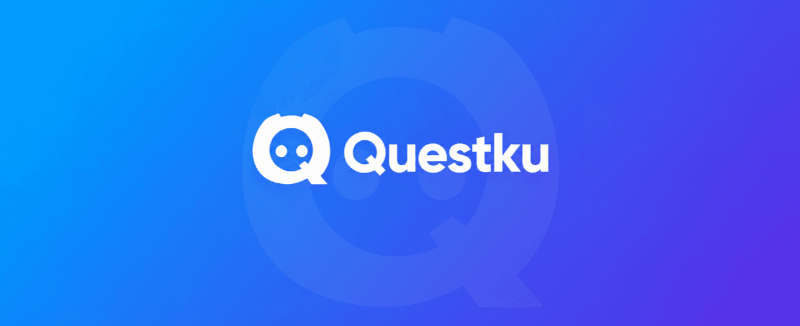
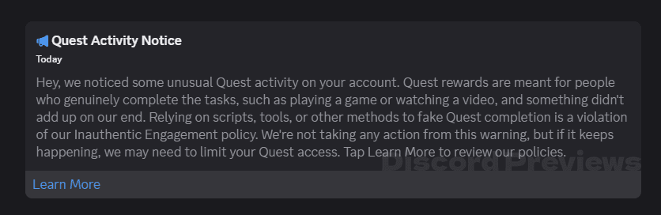
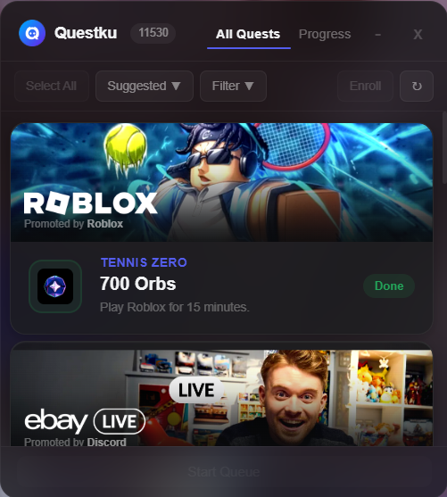
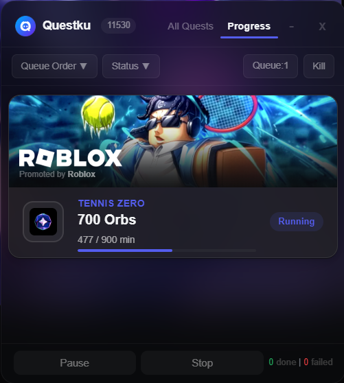
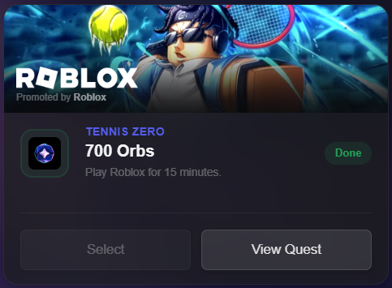
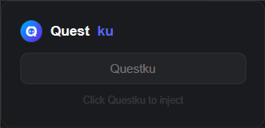
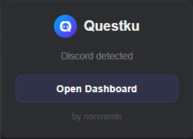
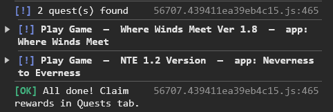

<p align="center">
  
</p>

<p align="center">
  <a href="#cara-pakai">Cara Pakai</a> •
  <a href="#fitur">Fitur</a> •
  <a href="#dashboard">Dashboard</a> •
  <a href="#faq">FAQ</a> •
  <a href="#troubleshooting">Troubleshooting</a>
</p>

<p align="center">
  
  
  
</p>

---

Selesaikan quest Discord secara otomatis — cukup paste script ke DevTools atau pakai Chrome Extension.

---

> [!CAUTION]
> Per April 2026, Discord menyatakan akan menindak pengguna yang mengotomatiskan quest. Beberapa pengguna sudah mendapat peringatan.
>
> 

---

## Cara Pakai

1. Terima quest di bawah tab Quests.
2. Tekan Ctrl + Shift + I untuk membuka DevTools.
3. Buka tab Console.
4. Ketik allow pasting dan tekan Enter.
5. Salin kode dari `questku.js` ([raw](questku.js) atau buka blok kode di bawah ini).

<details>
<summary>Click to expand questku.js</summary>

```javascript
(function questku() {

    let wpRequire = webpackChunkdiscord_app.push([[Symbol()], {}, r => r]);
    webpackChunkdiscord_app.pop();
    let Q = {};
    Q.Streaming = Object.values(wpRequire.c).find(x => x?.exports?.A?.__proto__?.getStreamerActiveStreamMetadata)?.exports?.A;
    Q.Game = Object.values(wpRequire.c).find(x => x?.exports?.Ay?.getRunningGames)?.exports?.Ay;
    Q.Quest = Object.values(wpRequire.c).find(x => x?.exports?.A?.__proto__?.getQuest)?.exports?.A;
    Q.Channel = Object.values(wpRequire.c).find(x => x?.exports?.A?.__proto__?.getAllThreadsForParent)?.exports?.A;
    Q.Guild = Object.values(wpRequire.c).find(x => x?.exports?.Ay?.getSFWDefaultChannel)?.exports?.Ay;
    Q.Flux = Object.values(wpRequire.c).find(x => x?.exports?.h?.__proto__?.flushWaitQueue)?.exports?.h;
    Q.api = Object.values(wpRequire.c).find(x => x?.exports?.Bo?.get)?.exports?.Bo;

    if (!Q.Quest || !Q.api) { console.log('[!] Discord internals not found. Refresh & try again.'); return; }

    let originalProps = {
        getRunningGames: Q.Game?.getRunningGames,
        getGameForPID: Q.Game?.getGameForPID,
        getStreamerActiveStreamMetadata: Q.Streaming?.getStreamerActiveStreamMetadata
    };

    let discordHistory;
    try { discordHistory = Object.values(wpRequire.c).find(m => m?.exports?.default?.listen)?.exports?.default; } catch {}

    async function getUserOrbs() {
        try { let r = await Q.api.get({ url: '/users/@me/virtual-currency/balance' }); return r?.body?.totalBalance || r?.body?.balance || 0; } catch { return 0; }
    }

    let isBrowser = !navigator.userAgent.includes('Electron');

    const TASKS = ['WATCH_VIDEO', 'PLAY_ON_DESKTOP', 'STREAM_ON_DESKTOP', 'PLAY_ACTIVITY', 'WATCH_VIDEO_ON_MOBILE'];
    const TASK_NAMES = { WATCH_VIDEO: 'Watch Video', WATCH_VIDEO_ON_MOBILE: 'Watch Video', PLAY_ON_DESKTOP: 'Play Game', STREAM_ON_DESKTOP: 'Stream', PLAY_ACTIVITY: 'Activity' };
    const COLORS = { accent: '#545ded', bg: '#313338', panel: '#2b2d31', text: '#dbdee1', muted: '#80848e', border: '#1e1f22', green: '#23a55a', red: '#f23f42', amber: '#f0b232' };

    let set = { autoEnroll: true, autoClaim: true, maxRetries: 3 };
    let uiState = { sort: 'suggested', filter: {}, progSort: 'order', progFilter: {} };
    let sortLabel = { suggested:'Suggested',reward:'Highest Reward',expires:'Ending Soon',progress:'Progress',name:'Alphabetical (A-Z)' };
    let progSortLabel = { order:'Queue Order', name:'Alphabetical', status:'Status', pct:'Progress' };
    let progStatusLabels = { pending:'Pending', running:'Running', done:'Done', failed:'Failed', paused:'Paused' };
    let st = { allQuests: [], queue: [], running: false, paused: false, completed: 0, failed: 0, currentTask: null, _cleanups: [] };
    let appCache = {};
    let appFetching = {};
    let debugMode = false;

    const dlog = (fn, msg) => { if (debugMode) console.log('[Questku:' + fn + '] ' + msg); };

    const fmtDur = s => s < 60 ? Math.floor(s) + 's' : Math.floor(s / 60) + 'm ' + Math.floor(s % 60) + 's';
    const pct = (c, t) => t > 0 ? Math.floor(c / t * 100) : 0;
    const sleep = ms => new Promise(r => setTimeout(r, ms));
    const sleepSec = s => sleep(s * 1000);

    let log = {
        _s: null, start() { this._s = Date.now() }, _el() { return this._s ? (Date.now() - this._s) / 1000 : 0 },
        h(m) { console.log('%c[!]%c' + m, 'color:#7289da;font-weight:bold', '') },
        i(m) { console.log('%c[..]%c' + m, 'color:#faa61a', '') },
        e(m) { console.log('%c[!!]%c' + m, 'color:red;font-weight:bold', '') },
        ok(m) { console.log('%c[OK]%c' + m, 'color:#43b581;font-weight:bold', '') },
        dn(n) { console.log('%c[✓]%c' + n + ',%c' + fmtDur(this._el()), 'color:#43b581;font-weight:bold', '', 'color:#95a5a6') },
        gr(t) { console.groupCollapsed('%c[!]%c' + t, 'color:#7289da;font-weight:bold', '') },
        ge() { console.groupEnd() },
        d(fn, m) { if (debugMode) console.log('%c[DBG:' + fn + ']%c ' + m, 'color:#545ded', ''); }
    };

    async function apiReq(method, url, body) {
        for (let i = 0; i <= set.maxRetries; i++) {
            try {
                let res = method === 'GET' ? await Q.api.get({ url }) : await Q.api.post({ url, body });
                if (res.status === 429) {
                    let w = (res.body?.retry_after || 30) + Math.random() * 5;
                    log.i('Rate limited — waiting ' + Math.ceil(w) + 's');
                    await sleepSec(w); continue;
                }
                if (res.status >= 400 && res.status < 500) return res;
                return res;
            } catch (e) {
                if (e?.status === 429) {
                    let w = (e.body?.retry_after || 30) + Math.random() * 5;
                    log.i('Rate limited — waiting ' + Math.ceil(w) + 's');
                    await sleepSec(w); continue;
                }
                if (i === set.maxRetries) throw e;
                log.i('Retry ' + (i + 1) + '/' + set.maxRetries);
                await sleepSec(2 + i * 3);
            }
        }
    }

    async function refreshQuests() {
        log.d('refreshQuests', 'start');
        st.allQuests = [...Q.Quest.quests.values()]
            .filter(x => new Date(x.config.expiresAt).getTime() > Date.now() &&
                TASKS.find(y => Object.keys((x.config.taskConfig ?? x.config.taskConfigV2).tasks).includes(y)))
            .map((q, i) => { q._i = i; q._sel = false; return q; });
        let orb = await getUserOrbs();
        if (D && D.ob) D.ob.textContent = orb;
        renderAllQuests();
        updateAddqBtn();
        fetchAllAppIcons();
        log.d('refreshQuests', 'done, total: ' + st.allQuests.length);
    }

    function getTok() {
        try {
            let k = Object.keys(Q.api).find(k => typeof Q.api[k] === 'string' && Q.api[k].length > 40 && Q.api[k].startsWith('MT'));
            if (k) return Q.api[k];
        } catch {}
        return null;
    }

    async function enrollQuest(q) {
        log.d('enrollQuest', q.id, q.config.messages.questName);
        if (q._enrolling) return true;
        q._enrolling = true;
        try {
            let ok = false;
            if (isBrowser) {
                let tok = getTok();
                if (tok) {
                    let r = await window.fetch('https://discord.com/api/v9/quests/' + q.id + '/enroll', {
                        method: 'POST',
                        headers: { authorization: tok, 'content-type': 'application/json' },
                        body: JSON.stringify({ location: 59, is_targeted: false, metadata_sealed: null, traffic_metadata_sealed: null })
                    });
                    let d = await r.json();
                    ok = !!d?.userStatus?.enrolledAt;
                }
            } else {
                let res = await apiReq('POST', '/quests/' + q.id + '/enroll', {
                    location: 59, is_targeted: false, metadata_sealed: null, traffic_metadata_sealed: null
                });
                ok = !!res?.body?.userStatus?.enrolledAt;
            }
            if (ok) {
                log.ok('Enrolled: ' + q.config.messages.questName);
                refreshQuests();
            } else {
                log.e('Enroll failed: ' + q.config.messages.questName);
            }
            return ok;
        } catch { return false; }
        finally { delete q._enrolling; }
    }

    async function claimQuest(q) {
        log.d('claimQuest', q.id, q.config.messages.questName);
        try {
            let res = await apiReq('POST', '/quests/' + q.id + '/claim', {});
            if (res?.body?.userStatus?.completedAt || res?.status < 400) {
                log.ok('Claimed: ' + q.config.messages.questName);
                refreshQuests();
                return true;
            }
            log.i('Claim pending for ' + q.config.messages.questName + ' (status: ' + res?.status + ')');
            return false;
        } catch (e) {
            log.e('Claim failed for ' + q.config.messages.questName + ': ' + (e.message || e));
            return false;
        }
    }

    let D = null;

    function buildDashboard() {
        if (document.getElementById('questku-panel')) { let o=document.getElementById('questku-panel'); o.remove(); let s=document.getElementById('questku-style'); if(s)s.remove(); }
        let c = document.createElement('style');
        c.id = 'questku-style';
        c.textContent = `
#questku-panel{all:initial;font:12.5px/1.5 Whitney,'Helvetica Neue',Helvetica,Arial,sans-serif;position:fixed;bottom:24px;right:24px;z-index:999999;background:rgba(10,11,13,.7);color:#e8eaed;border:1px solid rgba(255,255,255,.05);border-radius:16px;width:400px;box-shadow:0 24px 80px rgba(0,0,0,.5);user-select:none;overflow:hidden;animation:qkIn .3s ease-out;-webkit-backdrop-filter:blur(24px);backdrop-filter:blur(24px)}
@keyframes qkIn{0%{opacity:0;transform:translateY(12px) scale(.97)}100%{opacity:1;transform:translateY(0) scale(1)}}
#questku-panel *{box-sizing:border-box;margin:0;padding:0}
#questku-panel .qk-h{display:flex;align-items:center;gap:8px;padding:14px 12px 10px 16px;border-bottom:1px solid rgba(255,255,255,.05);cursor:move}
#questku-panel .qk-h .qk-l{display:flex;align-items:center;gap:8px;font-weight:600;font-size:14px;color:#f2f3f5}
#questku-panel .qk-h .qk-l svg{flex-shrink:0;display:block}
#questku-panel .qk-h .qk-l .qk-wm{display:inline-flex;gap:0;align-items:baseline}
#questku-panel .qk-h .qk-ob{font-size:10px;padding:2px 7px;border-radius:10px;background:rgba(255,255,255,.05);color:rgba(255,255,255,.45);font-weight:500;margin-left:4px}
#questku-panel .qk-h .qk-nav{display:flex;gap:12px;margin-left:auto;position:relative;padding:6px 0 0}
#questku-panel .qk-h .qk-nav .qk-nav-tab{border:0;background:0;color:rgba(255,255,255,.35);font-size:11.5px;font-weight:400;cursor:pointer;transition:color .2s cubic-bezier(.4,0,.2,1),transform .2s cubic-bezier(.4,0,.2,1);font-family:inherit;letter-spacing:.1px;padding:2px 2px 8px;transform:scale(1)}
#questku-panel .qk-h .qk-nav .qk-nav-tab:hover{color:rgba(255,255,255,.75);transform:scale(1.02)}
#questku-panel .qk-h .qk-nav .qk-nav-tab.act{color:#f2f3f5;font-weight:600}
#questku-panel .qk-h .qk-nav-indicator{position:absolute;bottom:0;left:0;height:2px;background:#545ded;border-radius:2px;opacity:1;transition:left .2s cubic-bezier(.4,0,.2,1),width .2s cubic-bezier(.4,0,.2,1);pointer-events:none}
#questku-panel .qk-h .qk-hbtn{border:0;background:0;color:rgba(255,255,255,.2);font-size:16px;width:28px;height:28px;display:flex;align-items:center;justify-content:center;border-radius:6px;cursor:pointer;transition:all .12s;font-family:inherit}
#questku-panel .qk-h .qk-hbtn:hover{background:rgba(255,255,255,.08);color:#e8eaed}
#questku-panel .qk-body{display:none}
#questku-panel .qk-body.act{display:block}
#questku-panel .qk-tl{display:flex;align-items:center;justify-content:space-between;padding:8px 12px;gap:6px;border-bottom:1px solid rgba(255,255,255,.04)}
#questku-panel .qk-tl-left,#questku-panel .qk-tl-right{display:flex;align-items:center;gap:6px}
#questku-panel .qk-tl label{display:flex;align-items:center;gap:6px;font-size:11.5px;color:rgba(255,255,255,.35);cursor:pointer;transition:color .1s;font-family:inherit;white-space:nowrap}
#questku-panel .qk-tl label:hover{color:rgba(255,255,255,.6)}
#questku-panel .qk-tl input[type=checkbox]{width:14px;height:14px;cursor:pointer;accent-color:#545ded}
#questku-panel .qk-bb{border:1px solid rgba(255,255,255,.06);background:rgba(255,255,255,.04);color:rgba(255,255,255,.45);font-size:11px;font-weight:500;height:28px;padding:0 10px;border-radius:6px;cursor:pointer;transition:all .12s ease;font-family:inherit;white-space:nowrap;display:inline-flex;align-items:center;justify-content:center;gap:3px;box-shadow:0 1px 2px rgba(0,0,0,.08)}
#questku-panel .qk-bb:hover{color:rgba(255,255,255,.8);background:rgba(255,255,255,.08);border-color:rgba(255,255,255,.1)}
#questku-panel .qk-bb:active{color:#fff;background:rgba(255,255,255,.14);border-color:rgba(255,255,255,.2);transform:scale(.97)}
#questku-panel .qk-bb:focus{outline:0}
#questku-panel .qk-bb.act,#questku-panel .qk-bb.act:hover,#questku-panel .qk-bb.act:active{color:#fff;background:rgba(255,255,255,.12);border-color:rgba(255,255,255,.18);font-weight:600;transform:none;box-shadow:0 1px 2px rgba(0,0,0,.08),inset 0 1px 0 rgba(255,255,255,.06)}
#questku-panel .qk-bb:disabled{opacity:.35;cursor:not-allowed;box-shadow:none}
#questku-panel .qk-tl-dd{position:relative}
#questku-panel .qk-tl-pop{opacity:0;visibility:hidden;transform:scale(.95) translateY(-4px);position:absolute;top:calc(100% + 4px);left:0;z-index:100;min-width:175px;background:linear-gradient(135deg,rgba(16,17,20,.96),rgba(84,93,237,.045));border:1px solid rgba(255,255,255,.06);border-radius:8px;padding:4px;box-shadow:0 8px 24px rgba(0,0,0,.4);-webkit-backdrop-filter:blur(10px);backdrop-filter:blur(10px);transition:opacity .15s ease,transform .15s ease,visibility .15s ease}
#questku-panel .qk-tl-pop.open{opacity:1;visibility:visible;transform:scale(1) translateY(0)}
#questku-panel .qk-tl-pop .qk-tl-opt{display:flex;align-items:center;gap:8px;padding:6px 10px;border-radius:6px;cursor:pointer;font-size:11px;color:rgba(255,255,255,.5);transition:all .12s ease;font-family:inherit;border:0;background:0;width:100%;text-align:left;white-space:nowrap}
#questku-panel .qk-tl-pop .qk-tl-opt:hover{background:rgba(255,255,255,.08);color:rgba(255,255,255,.8)}
#questku-panel .qk-tl-pop .qk-tl-opt.act{color:#fff;background:rgba(255,255,255,.1);border:1px solid rgba(255,255,255,.15)}
#questku-panel .qk-tl-pop .qk-tl-opt input[type=checkbox],#questku-panel .qk-tl-pop .qk-tl-opt input[type=radio]{position:absolute;opacity:0;width:0;height:0;pointer-events:none}
#questku-panel .qk-tl-pop .qk-tl-opt .cb,#questku-panel .qk-tl-pop .qk-tl-opt .rb{display:inline-flex;width:16px;height:16px;flex-shrink:0;border:1.5px solid rgba(255,255,255,.15);border-radius:4px;transition:all .1s;align-items:center;justify-content:center;background:0}
#questku-panel .qk-tl-pop .qk-tl-opt .rb{border-radius:50%}
#questku-panel .qk-tl-pop .qk-tl-opt input:checked+.cb,#questku-panel .qk-tl-pop .qk-tl-opt input:checked+.rb{border-color:#545ded;background:rgba(84,93,237,.12)}
#questku-panel .qk-tl-pop .qk-tl-opt input:checked+.cb::after{content:'';width:4px;height:8px;border:solid #545ded;border-width:0 2px 2px 0;transform:rotate(45deg);margin-bottom:2px}
#questku-panel .qk-tl-pop .qk-tl-opt input:checked+.rb::after{content:'';width:8px;height:8px;border-radius:50%;background:#545ded}
#questku-panel .qk-tl-pop .qk-tl-hd{padding:5px 10px 2px;font-size:9px;color:rgba(255,255,255,.2);text-transform:uppercase;letter-spacing:.6px;font-weight:600}
#questku-panel .qk-tl-pop .qk-tl-div{height:1px;background:rgba(255,255,255,.04);margin:3px 8px}
#questku-panel .qk-tl-pop .qk-tl-clr{padding:6px 10px;border-radius:6px;cursor:pointer;font-size:10.5px;color:rgba(255,255,255,.3);transition:all .12s ease;font-family:inherit;border:0;background:0;width:100%;text-align:center;margin-top:2px}
#questku-panel .qk-tl-pop .qk-tl-clr:hover{color:rgba(255,255,255,.7);background:rgba(255,255,255,.06)}
#questku-panel .qk-tl-pop .qk-tl-clr:disabled{opacity:.3;cursor:not-allowed;pointer-events:none}
#questku-panel .qk-tl-pop .qk-tl-clr:active{background:rgba(255,255,255,.1)}
#questku-panel .qk-list{height:300px;overflow-y:auto;padding:4px 8px}
#questku-panel .qk-list::-webkit-scrollbar{width:4px}
#questku-panel .qk-list::-webkit-scrollbar-thumb{background:rgba(255,255,255,.08);border-radius:2px}
#questku-panel .qk-cd{margin:6px 0;border-radius:14px;overflow:hidden;background:rgba(255,255,255,.05);border:1px solid rgba(255,255,255,.06);box-shadow:0 2px 8px rgba(0,0,0,.16),0 8px 32px rgba(0,0,0,.1),inset 0 1px 0 rgba(255,255,255,.05);transition:all .2s;-webkit-backdrop-filter:blur(12px);backdrop-filter:blur(12px)}
#questku-panel .qk-cd:hover{background:rgba(255,255,255,.07);border-color:rgba(255,255,255,.09);box-shadow:0 2px 8px rgba(0,0,0,.2),0 12px 40px rgba(0,0,0,.14),inset 0 1px 0 rgba(255,255,255,.06)}
#questku-panel .qk-cd:hover .qk-ban{filter:contrast(1.12) saturate(1.18) brightness(1.08);transform:translateY(-3px)}
#questku-panel .qk-cd.sel{box-shadow:0 2px 8px rgba(0,0,0,.22),0 8px 32px rgba(0,0,0,.16),inset 0 1px 0 rgba(255,255,255,.05)}
#questku-panel .qk-ban-wrap{position:relative;border-radius:14px 14px 0 0;overflow:hidden;aspect-ratio:16/4.5;isolation:isolate}
#questku-panel .qk-ban{position:absolute;inset:0;width:100%;height:120%;object-fit:cover;object-position:center 20%;filter:contrast(1.12) saturate(1.18) brightness(1.06);transition:filter .35s ease,transform .4s ease-out;z-index:0;will-change:transform}
#questku-panel .qk-ban-g{background:linear-gradient(135deg,hsla(0,0%,100%,.03),hsla(0,0%,100%,.06));height:100%}
#questku-panel .qk-ban[src]{background:0 0}
#questku-panel .qk-ban-overlay{position:absolute;inset:0;z-index:1;pointer-events:none;background:linear-gradient(to top,rgba(10,11,13,.95) 0%,rgba(10,11,13,.88) 10%,rgba(10,11,13,.75) 22%,rgba(10,11,13,.55) 35%,rgba(10,11,13,.32) 48%,rgba(10,11,13,.15) 58%,rgba(10,11,13,.06) 70%,transparent 82% 100%),linear-gradient(to right,rgba(10,11,13,.2) 0%,transparent 12%,transparent 88%,rgba(10,11,13,.2) 100%)}
#questku-panel .qk-game-logo-wrap{position:absolute;bottom:10px;left:12px;z-index:2;pointer-events:none;display:flex;flex-direction:column;align-items:flex-start;gap:2px}
#questku-panel .qk-game-logo{height:26px;width:auto;max-width:120px;object-fit:contain;object-position:left center;display:block}
#questku-panel .qk-promoted{font-size:9.5px;color:rgba(255,255,255,.35);line-height:1;white-space:nowrap;font-weight:400}
#questku-panel .qk-promoted strong{font-weight:600;color:rgba(255,255,255,.55)}
#questku-panel .qk-bd{padding:12px 16px 14px}
#questku-panel .qk-top{display:flex;align-items:center;gap:16px;cursor:pointer}
#questku-panel .qk-top .qk-ico{width:48px;height:48px;border-radius:12px;display:flex;align-items:center;justify-content:center;font-size:16px;font-weight:700;flex-shrink:0;background:rgba(255,255,255,.04);border:2px solid rgba(255,255,255,.1);color:rgba(255,255,255,.5);overflow:hidden}
#questku-panel .qk-top .qk-ico img{width:100%;height:100%;object-fit:cover;display:block}
#questku-panel .qk-top .qk-ico.done{color:#23a55a;background:rgba(35,165,90,.08);border-color:rgba(35,165,90,.15)}
#questku-panel .qk-top .qk-ico.fail{color:#f23f42;background:rgba(242,63,66,.08);border-color:rgba(242,63,66,.15)}
#questku-panel .qk-top .qk-if{flex:1;min-width:0}
#questku-panel .qk-top .qk-if .qk-nm{font-size:11px;color:#545ded;white-space:nowrap;overflow:hidden;text-overflow:ellipsis;font-weight:600;line-height:1.3;letter-spacing:.4px;text-transform:uppercase}
#questku-panel .qk-top .qk-if .qk-rw{font-size:16px;color:#f2f3f5;font-weight:700;line-height:1.2;margin-top:2px}
#questku-panel .qk-top .qk-if .qk-sb{font-size:11px;color:rgba(255,255,255,.3);margin-top:4px;white-space:nowrap;overflow:hidden;text-overflow:ellipsis;transition:opacity .18s cubic-bezier(.4,0,.2,1),transform .18s cubic-bezier(.4,0,.2,1)}
#questku-panel .qk-cd[data-qidx]:hover .qk-sb{opacity:0;transform:translateY(-4px)}
#questku-panel .qk-hp{position:absolute;left:0;right:0;bottom:-2px;display:flex;flex-direction:column;gap:4px;pointer-events:none;opacity:0;transform:translateY(4px);transition:opacity .18s cubic-bezier(.4,0,.2,1),transform .18s cubic-bezier(.4,0,.2,1)}
#questku-panel .qk-cd[data-qidx]:hover .qk-hp{opacity:1;transform:translateY(0)}
#questku-panel .qk-hp-txt{font-size:11px;color:rgba(255,255,255,.6);font-weight:500;white-space:nowrap}
#questku-panel .qk-hp-bar{height:3px;width:100%;background:rgba(255,255,255,.04);border-radius:999px;overflow:hidden}
#questku-panel .qk-hp-fill{height:100%;width:0;border-radius:999px;background:#545ded;transition:width .25s cubic-bezier(.4,0,.2,1)}
#questku-panel .qk-hp-fill.dn{background:#23a55a}
#questku-panel .qk-hp-fill.fl{background:#f23f42}
#questku-panel .qk-if{position:relative}
#questku-panel .qk-top .qk-tg{font-size:10.5px;padding:3px 10px;border-radius:100px;font-weight:600;white-space:nowrap;flex-shrink:0;background:rgba(255,255,255,.04);color:rgba(255,255,255,.35)}
#questku-panel .qk-top .qk-tg.dn{background:rgba(35,165,90,.12);color:#23a55a}
#questku-panel .qk-top .qk-tg.en{background:rgba(84,93,237,.12);color:#545ded}
#questku-panel .qk-top .qk-tg.fl{background:rgba(242,63,66,.12);color:#f23f42}
#questku-panel .qk-top .qk-tg.pn{background:rgba(240,178,50,.12);color:#f0b232}
#questku-panel .qk-top .qk-tg.rd{background:rgba(84,93,237,.12);color:#545ded}
#questku-panel .qk-cd-d{display:none;padding:12px 0 0;font-size:11px;color:rgba(255,255,255,.35)}
#questku-panel .qk-cd-d.op{display:block}
#questku-panel .qk-cd-d .qk-el{display:flex;align-items:center;gap:10px;margin-top:18px;padding-top:16px;border-top:1px solid rgba(255,255,255,.06)}
#questku-panel .qk-cd-d .qk-el .qk-bb{flex:1;height:40px;font-size:13.5px;font-weight:500;border-radius:6px;background:rgba(255,255,255,.1);color:rgba(255,255,255,.85);border:1px solid rgba(255,255,255,.12);box-shadow:0 2px 4px rgba(0,0,0,.15)}
#questku-panel .qk-cd-d .qk-el .qk-bb:hover{background:rgba(255,255,255,.15);color:#fff;border-color:rgba(255,255,255,.2)}
#questku-panel .qk-cd-d .qk-el .qk-bb:active{background:rgba(255,255,255,.2);border-color:rgba(255,255,255,.25)}
#questku-panel .qk-cd-d .qk-el .qk-bb.act{color:#fff;background:rgba(255,255,255,.12);border-color:rgba(255,255,255,.18);font-weight:600}
#questku-panel .qk-pr{height:4px;background:rgba(255,255,255,.04);border-radius:4px;margin:10px 0 0;overflow:hidden}
#questku-panel .qk-pr-f{height:100%;border-radius:2px;background:#545ded;width:0;transition:width .3s ease}
#questku-panel .qk-pr-f.dn{background:#23a55a}
#questku-panel .qk-pr-f.fl{background:#f23f42}
#questku-panel .qk-ft{display:flex;align-items:center;justify-content:center;gap:6px;padding:8px 14px 10px;border-top:1px solid rgba(255,255,255,.04)}
#questku-panel .qk-ft .qk-btn{flex:1;border:0;background:rgba(255,255,255,.04);color:rgba(255,255,255,.2);font-size:12px;font-weight:500;padding:7px 10px;border-radius:8px;cursor:pointer;transition:all .12s;font-family:inherit;text-align:center}
#questku-panel .qk-ft .qk-btn:hover{background:rgba(255,255,255,.07);color:rgba(255,255,255,.5)}
#questku-panel .qk-ft .qk-btn.enabled{color:#fff;background:rgba(255,255,255,.12);border:1px solid rgba(255,255,255,.18)}
#questku-panel .qk-ft .qk-btn.enabled:hover{background:rgba(255,255,255,.18);color:#fff}
#questku-panel .qk-ft .qk-btn:disabled,
#questku-panel .qk-ft .qk-btn:disabled:hover,
#questku-panel .qk-ft .qk-btn:disabled:active{opacity:.25;cursor:not-allowed;transform:none;background:rgba(255,255,255,.04);color:rgba(255,255,255,.2);border-color:transparent;box-shadow:none}
#questku-panel .qk-ft-p{display:flex;align-items:center;gap:6px;padding:8px 14px 10px;border-top:1px solid rgba(255,255,255,.04)}
#questku-panel .qk-ft-p .qk-btn{width:auto;padding:7px 14px;border:0;background:rgba(255,255,255,.04);color:rgba(255,255,255,.4);font-size:12px;font-weight:500;border-radius:8px;cursor:pointer;transition:all .12s;font-family:inherit;text-align:center}
#questku-panel .qk-ft-p .qk-btn:hover{background:rgba(255,255,255,.07);color:rgba(255,255,255,.7)}
#questku-panel .qk-ft-p .qk-btn:disabled,
#questku-panel .qk-ft-p .qk-btn:disabled:hover,
#questku-panel .qk-ft-p .qk-btn:disabled:active{opacity:.25;cursor:not-allowed;transform:none;background:rgba(255,255,255,.04);color:rgba(255,255,255,.2);border-color:transparent;box-shadow:none}
#questku-panel .qk-ft-p .qk-st{margin-left:auto;font-size:10.5px;color:rgba(255,255,255,.2);font-variant-numeric:tabular-nums}
#questku-panel .qk-ft-p .qk-st .dc{color:#23a55a}
#questku-panel .qk-ft-p .qk-st .fc{color:#f23f42}
#questku-panel .qk-badge{border:0;background:rgba(255,255,255,.04);color:rgba(255,255,255,.45);font-size:11px;font-weight:500;height:28px;padding:0 10px;border-radius:6px;font-family:inherit;white-space:nowrap;display:inline-flex;align-items:center;justify-content:center;border:1px solid rgba(255,255,255,.06);box-shadow:0 1px 2px rgba(0,0,0,.12);pointer-events:none}
#questku-panel .qk-empty-state{display:flex;flex-direction:column;align-items:center;justify-content:center;height:100%;text-align:center;padding:0 24px}
#questku-panel .qk-empty-title{font-size:14px;font-weight:600;color:rgba(255,255,255,.75);margin-bottom:6px;font-family:inherit}
#questku-panel .qk-empty-desc{font-size:11.5px;color:rgba(255,255,255,.35);line-height:1.4;font-family:inherit}
`.trim();
        document.head.appendChild(c);

        let p = document.createElement('div');
        p.id = 'questku-panel';
        p.innerHTML =
            '<div class="qk-h"><div class="qk-l"><img src="data:image/png;base64,iVBORw0KGgoAAAANSUhEUgAAADAAAAAwCAYAAABXAvmHAAAAGXRFWHRTb2Z0d2FyZQBBZG9iZSBJbWFnZVJlYWR5ccllPAAAAydpVFh0WE1MOmNvbS5hZG9iZS54bXAAAAAAADw/eHBhY2tldCBiZWdpbj0i77u/IiBpZD0iVzVNME1wQ2VoaUh6cmVTek5UY3prYzlkIj8+IDx4OnhtcG1ldGEgeG1sbnM6eD0iYWRvYmU6bnM6bWV0YS8iIHg6eG1wdGs9IkFkb2JlIFhNUCBDb3JlIDkuMS1jMDAzIDc5Ljk2OTBhODdmYywgMjAyNS8wMy8wNi0yMDo1MDoxNiAgICAgICAgIj4gPHJkZjpSREYgeG1sbnM6cmRmPSJodHRwOi8vd3d3LnczLm9yZy8xOTk5LzAyLzIyLXJkZi1zeW50YXgtbnMjIj4gPHJkZjpEZXNjcmlwdGlvbiByZGY6YWJvdXQ9IiIgeG1sbnM6eG1wPSJodHRwOi8vbnMuYWRvYmUuY29tL3hhcC8xLjAvIiB4bWxuczp4bXBNTT0iaHR0cDovL25zLmFkb2JlLmNvbS94YXAvMS4wL21tLyIgeG1sbnM6c3RSZWY9Imh0dHA6Ly9ucy5hZG9iZS5jb20veGFwLzEuMC9zVHlwZS9SZXNvdXJjZVJlZiMiIHhtcDpDcmVhdG9yVG9vbD0iQWRvYmUgUGhvdG9zaG9wIDI2LjExIChXaW5kb3dzKSIgeG1wTU06SW5zdGFuY2VJRD0ieG1wLmlpZDoxNjFEODFGNTdGRjYxMUYxOEIwNEI3NDExMkEzM0Y1QSIgeG1wTU06RG9jdW1lbnRJRD0ieG1wLmRpZDoxNjFEODFGNjdGRjYxMUYxOEIwNEI3NDExMkEzM0Y1QSI+IDx4bXBNTTpEZXJpdmVkRnJvbSBzdFJlZjppbnN0YW5jZUlEPSJ4bXAuaWlkOjE2MUQ4MUYzN0ZGNjExRjE4QjA0Qjc0MTEyQTMzRjVBIiBzdFJlZjpkb2N1bWVudElEPSJ4bXAuZGlkOjE2MUQ4MUY0N0ZGNjExRjE4QjA0Qjc0MTEyQTMzRjVBIi8+IDwvcmRmOkRlc2NyaXB0aW9uPiA8L3JkZjpSREY+IDwveDp4bXBtZXRhPiA8P3hwYWNrZXQgZW5kPSJyIj8+o5PnZAAAEO9JREFUeNp8WguQHMV5/rtnZm/39vbeL51Or0NCQgiVhDiwFBsIRjIGYhBYFgUkMgkuYpvgOFBFqsAlTAI4hrioGMcxxiXLSoJc2LxswDyEbVmUAEUvEEJC6HWnx+lOutPd3r5nuvP/M90zPXsnj6q1u/Po+ft/fP/3/31MSgnm0V+QMFIB4Ph90xEPGmrwO2NQEACuZDCG18qehIKHN+Bv28LzeA7PzxjMwmf6z8olY0U2L5eHmZWKbAXBbEfKbNqWxzI2HJzZKHe1ptnW9pS3GyQv4zVwXQ4VnKM+AeDIYN4EClDDJAyPMlgyh0HPVAYevnPmFHynHclrm8IPFAFGygAWwzlg8oPOOzg5xzGYg1kHB+H6w2fgmqEcLCqWoA0EOBbexfFluDZgngDXgzacumdEwOVHB1EwLrNNNWxvZwb+OLcVXuish3fZuV6oDtQhzQPHhiR0tweK889rC5wsShgooXB4I1OCmhbIC/92KOOFI6Py4i397J69p+GmUgkyHB9w8KolpG85Lklw/MTfDJ+jwfE9/nn1W7oSvEpwf2eGbbmwk/148TT2HBqhUiwzXGTcAud147vRSqgPSOJN0zqCRfgLIMFPouuQZgMxJy6A483DJdb93Cfw4LYTcEfZg0SKBa4GJBwJqYQjbfrfPXXeFJ6u4Xn/k16C38kFaTFdDXzr8gv4d6Y3s03CI6VMXAAdehHTcRH8aF7CYDESvvog7TbgzdsG4LaHt7L3thyDu/C9iZS6X/hCMV+gQNNa84HQvuAy0IgWHsiaKKBU3xP4jjQ68+lRsfR/t7hvvfmB90PbYhnHntyVLXx3EV297xS+42wlEHKyg2Kh1gJ73Ufw5H/sYv89UpFdSbSEpQQCqbSrXEVqQZU1fA1LGSzQt45aGEDoajQXh2Bx5DYpPLH9gHf3L94qb8oW4Pyko+adZBFkEW6xcwcq+lj6B7vYcy8dZt9ynMDPtRvQsLSWlcCWElBrHMIYkNFz9M9/TrkV6PPRogmNhkZE789fL789MAxLa5NsUksw34UNbdKg1drMf3nqmT38V1sH2I0JnNCioPQMzYvI78FYVDACAZmyULAoYxH6GaEspBRhxkUKLV0syqkvbSm9Mjgil6acwF2r5eV0szlIsAzO8s9/gqe3n4JrEuiH3FWBp7WpfNfXtAgEBi0E3ecjEAsXFy04eDaMExX8zEQtZSV6jlzKYbLpsfXFX3/SL2eRqxdKEv0/GlyiHfQQOJrQXE/thgdePAi3J2ogNDMlF+1f2oeZEsRSpte+H2C6DNxC+7kBoaGl1AK50BaTcTDAd9agAnN5MeWJX5Q24uW0r1BmjBKe1SOBafBPJ+QVj++E71qJQCuEFr4WASIt6yBVv0FozYvAHUJBZfC8sop/DnRgq9/qHcHiWBjooFyR5q2vYXDgkHvpM78uP4LoBJgwoaQGr+DDNFycIF+G9Nqt8COPgWWDrNJWoOlQ29qlIPBzSumeGyADhZxvGbzHMuKBFloqykjDhCZ4zQJtOW3NKCGSFWiBTWkGr28u37N9j3elTQhUViiUQz+iQQJv+Ai+uf8MXEi4zD1mmNTAdB182p28QBPDYxJakhzmNjMYHZdwFn+PZPFzXMDIGMDZrIASvmd+F3Ia/Dw7KkFWpO9eLIyTKLj9ONPWFcF9COHsl78p/VsuB04RE28Bc5g9ipMRpg6XoGPDPnYvqt7XQmBCFnOb0BIGYozlJFzQwuCOqy1YtYjBOJKeeze6MH8ag2kNGIio3mwe4MAJ5EQVjK+vObDvmIBn/+DCi++4kEct1iUgdBkOBrRqN1LfU6jZI33i0vd3ujf3LrA35sma6/e7Pu6+fBDuX7eHfY9SNItRAmVONwo4pgJzFDV8x8UMvn+DFQgRR+lJsosmKcH1/biQe35YhMPHBTQQ1guILGLEGDfQrozWntLGt/397cmlaFGPc5SmUJHJTf3sb0n7zEAZnWz8gIUITchvSfOrFnD4z1W2L7yU0QjiVFaNYBHRfRLmdnNYf38KpjZxKBQjQACFSDpOwoDGa5QPThx3ew/3eZ9LokV4K778eJYtPZZl5/s0WWG1RhPNLP2hcJu0cB66x5MreSjUZFmS4X/R58SUT4voxJj5/tdrQLhxNArh2DMyeegZDD7+2FvN0Yp2CW945zhcLwgxWASRYOK2TmAqBkqIAA/dZEFzbZynMPUfIdq7n0rYfdTDAJdQh+7R28NhcU+wIPMZWkTvfAtu+bwD//NKGVrqgmLEdzahNa/4lIqNJHrKwUPuilzOSdmFCtifjLBlNpMxOsy0D3oQQ6ICar8XkWTlQjap2jd9JODRl1zYi/4tKpFbELe/dLYFD93qwPwZHOKVoIQ7b3Tgt7+vYNWFyMJYDMLBYLs0F1Gd8VEx88RxMZ8fGmWzB3Iwm6CTVbNJUY0I4EPhml7uZ8GY9vGlT//Bg1ueKsOBkwKaUgBtGQZYPkJ7Gvwg3bbPg5sfLsLWvd4El+pq4/CXS2zIj5vCyyqOFSGVdIEfP+5dwvcNwSLkF41WleBcGtWUGuSn7SjQinlsgr9v3i/ggV9WoCEVwKJPr1UW1r5Ni8LCGv4JFzl0VoJeg1bE8qWYjRRHAhGnFZoQhhQGx8hpcRE/mWcLUOu2FfIPiFFk7imqLCn7SViI9ejURhbzexeT3mMvu5CwlJVKij4YcUMC0fkU2v/UoAcbXnWroFbCgjkcGtFq0qvSOrAYA2WKMY8Ne/P4qZycx2WUCUOOIyDk7UyNCgbvwm6IIw9OtBdxfE8f1pg4M/l6d1NAGXRlRveWMZi7W6iLIPwKbPMOF9cUWYGONkQkKhPdiqFpiNzGH2pOAhzMxD18tMDabIhujJMpI7WLgMzNaJwYvLuOSsjm0I8bGLxwXw28ubYG7rvBgVwuIHGU9u+/JQG/+V4KNqxNQXsj1uCnPBgajuOvhVK1IDy7pSoeJo2kqtyK+BOCRA0vVaRjyYikcUUhdAaOYIzciEEmMXEBhTLRBQkrL7VhThcHorxf+6IN05Bi5FD4me0c1lzj+OfnTrfg2mUOFusS8kUTToPPFDaENGTqhkHoCSJAIwtCwOG8xYHx0F8NGNVEiisI0y41sbZj0IjBSY2ok2dEeG5gmLI1+EKP54nUydDn+wcEtBJCTWJNaSAfmNTcC5SKRUsICgi3nt2Skn0DY7omlYqvRyjEDTpNCxovTaygL57FYEo98qn3PJje7MI8bIE8g0kpj9rPYFFEzPQ+5Dy3LXdgO+aJN7e4cAVCZiYdcSMdC+O5wL+5VN0LX/sspNig6LnwqNhhp+2OJHy4x5NUkDEwCpFY9aSsQ6Y7PESzWrElzJ7C4YoLLHhrpwdPvlj2NUQBnUn4eI1lFGbm3S4KjtTTDRT15S84MdehI4eWOoGsNWHJiNApS4BRnlJio5ZMXZrts2c3wZ7NCBp4MakNGvhgvJNG15LU8vhU4EutkBLQYCjsg19JwPt7836TKlMbQKGumwnbqeN3w+UOrLragf/b48LyZVZVv4SosgenBwXU1gQcyHdfg5P5HQiyBgT92PZO2M9bU7Ar47DjMgxi1fLQlpDKrYgJoj9/1O/BB/2yipQhucOm60/vSUIaFXsam6BuWSoNSh8W63FRj9ydhM+h63x7TTLI5FXO+PvNZSgXvajQV8LrFk1AKXQPColgh7ODt6XhzNQMfOi6Mu46XryjpmsAD1f+9BuerzETw2nCZRda8NtHUnDrVUixUYt5bKhmMXgFPtOICxgcliqHyCoagkkJa4vX3nAhgy0/M/aq8xPzGQG2XWrYeNd0vsNuTGJy6oDXd/fBjZwZPq8ngKgtounAS++7cMMlFqxYxMHUIwnW1crg0buSWE4KOIqcyG+bY7DOmc79jractAvN4Cc/K8AQ5oaWBlyAKyPkU509ndjoIOtOnWFta++wjtnYy4d5bfBaxoIc+l066vVErLQ6oaTRfb/90xL8/Fs10Ht+vCbwYwJ/NyFMNmXsGFoF8RLHfSJ1r71Rhmc3FqGjmftcKRJe1QYhnQjikhLd/EX2804N7jDQfFMb4Oj8TvY7SkgBlCrurUxpCdOdmF/nUmG+5okirEeze4IZxYtJccw2WnDP0WMS+o7HKUTPLA4dmPRKRRF16BTW6cpQV2hEKNNpNtIz135+HOGZT63D/jzS3dWL+FNAcAoGE1XuJA1qwRQ+Eymz8evadSVY+UAB1r9agU9RONqEUKkoHJRxdyOFfvzHJbj1Gzm476E8VNyoSps7x4Z/f7yOcN1Hrxj6GayUPovY5Vi4xNnY3slPcLyRbcainvSTwVj4zgveK9uPyGvrHYjorKdSuidDWquzo/bLEu4/FYsBje7GGGhDTtRYF2D1CNLm02dwD+Kk8IM5g1VcCYP7sosd6MG4qGBipL0Aaia8gyg0joFOfR/dE9I5yD8QzXBjJHvvY5nFTa38YAW9gG3Hsk/6LQvceRmChXetK7+P/ZcaG3RnIOoQaFj0z3maK7EwwMl/KWgF1pS0A0OwR7ogmpGwVCCqHmkhF2xsWAbfr0OkonzBBYt3tFXzKzss4NqvJB+6dnXqu9lREXSnabW4qYUmBbhoGvtgzTLr0bPZqBsBwug0QxRcVFAzA524orjUNchgSmxIBSNd46d8PwlxKUL3JLhsxkBvzGC1VkcjED5kAipx6c5ICbP09Jn2rhU3p56guiSB8zrUlfC1w4MGFLU27rrKfuwzPfztsayIVWUxmm3UzWZrPGzu+lmYhYkR1DyahOkWetTJNucy2vFqXsJ9vJ677R9q77RtmSOX0yyAlAJ60DZmxZWVf1nt/HVnPTtArWyzoIjqVJpQGMLLcJsJVPXF1HOgEmDY59GwqJu50ixcjNaK1DQEEyK6y+3frP36vIXWdh9AktHgDprXHASJnY3sxONfTdyMmwwDlbIIJ+bmjovumCmmyOhNJloJGfZ0IEbV9WKN3pOImsUx9ovn8mcFfOnW2gevvL5mQ26MtndZ2Geiwas2PHzko/5mzxT+4T/+lXMdutlhv6MsDXZIYBv2aQTEWKzeRpJxVqvdJGi3C0XOIqtVJ0xisbkxAVddn1y78u9SjxRK+EyNnDjOtfc0XgDoaGI7Vv2FfXVXA7yXz8uwi2wGb3BOFxlGf1/vXhrCm02D4N64u2iAqBQp3bL8Zz+fvHPJZxMPE2JJOXF7yac41JkW52gNYtMLcIPt0JrlzvLL5rIf4Z4V8pBJ9n3NDe7QUtLYAIm3SCzJjG2mqE1CCZMSVXOTteO61emr5y10fpYfF+fcvaep+XRM4ZQDvMkWQbkDL+C82RW99t2rrrSua6kTO4s56bNSU7tBASJCnNctGUuVpbopbCJOtK8WJDcsdsYWX5b815v+Jn15cxvfSv1/mGwXNXgUWjs42JQDpjYxOIYZkLiQNcmGN91MLtXTxV9trU+8fbTP++ru/e43RkbgIocarBz8ci6CPhbL1PpPDcBok5AU5Ocl9O2Ew7ILFqWeXbDY+UFthu2n9mKlHKfrpvA02rAKrMXcYetN4+7maBHcmtwaJaoIXSgummf9F/71yLpDR7wvHOkXtw0Py8uLeejUQtuazym89wspL6AWlKXpNzbByo2NfOeMWfbzU7qdX03ptg+REoig1abO4TJVwsf+WsVcRNn98385Qg1e2hfsaucvtzexl/HRlqFB0Yu855JcFi7ErHleuSBbZYXRTilDN3HtBOTSKd5XX88/rqtjuzrarHcbmvj+JHbCCnniU1h2OjCp1s39kbbOSHg6/l+AAQBGyZJVTt7rowAAAABJRU5ErkJggg==" style="width:24px;height:24px;border-radius:6px;display:block"><span class="qk-wm">Quest<span>ku</span></span><span class="qk-ob" id="qk-ob">0</span></div>' +
            '<div class="qk-nav"><button class="qk-nav-tab act" data-t="quests">All Quests</button><button class="qk-nav-tab" data-t="prog">Progress</button><div class="qk-nav-indicator" id="qk-nav-ind"></div></div>' +
            '<button class="qk-hbtn" id="qk-min">-</button><button class="qk-hbtn" id="qk-close">x</button></div>' +

            '<div class="qk-body act" id="qk-b-quests">' +
            '<div class="qk-tl"><div class="qk-tl-left"><button class="qk-bb" id="qk-sel-toggle">Select All</button><div class="qk-tl-dd"><button class="qk-bb" id="qk-sort-btn">Sort &#9660;</button><div class="qk-tl-pop" id="qk-sort-pop"><label class="qk-tl-opt"><input type="radio" name="sort" data-sort="suggested" checked><span class="rb"></span>Suggested</label><label class="qk-tl-opt"><input type="radio" name="sort" data-sort="reward"><span class="rb"></span>Highest Reward</label><label class="qk-tl-opt"><input type="radio" name="sort" data-sort="expires"><span class="rb"></span>Ending Soon</label><label class="qk-tl-opt"><input type="radio" name="sort" data-sort="progress"><span class="rb"></span>Progress</label><label class="qk-tl-opt"><input type="radio" name="sort" data-sort="name"><span class="rb"></span>Alphabetical (A-Z)</label></div></div><div class="qk-tl-dd"><button class="qk-bb" id="qk-filter-btn">Filter &#9660;</button><div class="qk-tl-pop" id="qk-filter-pop"><div class="qk-tl-hd">Status</div><label class="qk-tl-opt"><input type="checkbox" data-filter="avail"><span class="cb"></span>Available</label><label class="qk-tl-opt"><input type="checkbox" data-filter="prog"><span class="cb"></span>In Progress</label><label class="qk-tl-opt"><input type="checkbox" data-filter="done"><span class="cb"></span>Completed</label><label class="qk-tl-opt"><input type="checkbox" data-filter="expired"><span class="cb"></span>Expired</label><div class="qk-tl-div"></div><div class="qk-tl-hd">Quest Type</div><label class="qk-tl-opt"><input type="checkbox" data-filter="play"><span class="cb"></span>Play</label><label class="qk-tl-opt"><input type="checkbox" data-filter="watch"><span class="cb"></span>Watch</label><label class="qk-tl-opt"><input type="checkbox" data-filter="stream"><span class="cb"></span>Stream</label><label class="qk-tl-opt"><input type="checkbox" data-filter="activity"><span class="cb"></span>Activity</label><div class="qk-tl-div"></div><button class="qk-tl-clr" id="qk-filter-clear" disabled>Clear</button></div></div></div><div class="qk-tl-right"><button class="qk-bb" id="qk-enroll">Enroll</button><button class="qk-bb" id="qk-refresh">&#x21bb;</button></div></div>' +
            '<div class="qk-list" id="qk-ql"></div>' +
            '<div class="qk-ft"><button class="qk-btn" id="qk-addq">Start Queue</button></div></div>' +

            '<div class="qk-body" id="qk-b-prog">' +
            '<div class="qk-tl"><div class="qk-tl-left"><div class="qk-tl-dd"><button class="qk-bb" id="qk-prog-sort-btn">Queue Order &#9660;</button><div class="qk-tl-pop" id="qk-prog-sort-pop"><label class="qk-tl-opt"><input type="radio" name="progsort" data-sort="order" checked><span class="rb"></span>Queue Order</label><label class="qk-tl-opt"><input type="radio" name="progsort" data-sort="name"><span class="rb"></span>Alphabetical</label><label class="qk-tl-opt"><input type="radio" name="progsort" data-sort="status"><span class="rb"></span>Status</label><label class="qk-tl-opt"><input type="radio" name="progsort" data-sort="pct"><span class="rb"></span>Progress</label></div></div><div class="qk-tl-dd"><button class="qk-bb" id="qk-prog-filter-btn">Status &#9660;</button><div class="qk-tl-pop" id="qk-prog-filter-pop"><label class="qk-tl-opt"><input type="checkbox" data-progfilter="running"><span class="cb"></span>Running</label><label class="qk-tl-opt"><input type="checkbox" data-progfilter="pending"><span class="cb"></span>Pending</label><label class="qk-tl-opt"><input type="checkbox" data-progfilter="done"><span class="cb"></span>Done</label><label class="qk-tl-opt"><input type="checkbox" data-progfilter="failed"><span class="cb"></span>Failed</label><label class="qk-tl-opt"><input type="checkbox" data-progfilter="paused"><span class="cb"></span>Paused</label><div class="qk-tl-div"></div><button class="qk-tl-clr" id="qk-prog-filter-clear" disabled>Clear</button></div></div></div><div class="qk-tl-right"><span class="qk-badge">Queue: <span id="qk-qc">0</span></span><button class="qk-bb" id="qk-kill">Kill</button></div></div>' +
            '<div class="qk-list" id="qk-pl"></div>' +
            '<div class="qk-ft qk-ft-p"><button class="qk-btn" id="qk-pause">Pause</button><button class="qk-btn" id="qk-stopq">Stop</button>' +
            '<span class="qk-st"><span class="dc" id="qk-dc">0</span> done <span style="color:#80848e">|</span> <span class="fc" id="qk-fc">0</span> failed</span></div></div>';

        document.body.appendChild(p);document.body.appendChild(p);
        D = {
            pan: p, ql: document.getElementById('qk-ql'), pl: document.getElementById('qk-pl'),
            tabs: p.querySelectorAll('.qk-nav .qk-nav-tab'), ba: p.querySelector('#qk-b-quests'), bp: p.querySelector('#qk-b-prog'),
            enroll: document.getElementById('qk-enroll'),
            addq: document.getElementById('qk-addq'), pause: document.getElementById('qk-pause'),
            stopq: document.getElementById('qk-stopq'), qc: document.getElementById('qk-qc'),
            dc: document.getElementById('qk-dc'), fc: document.getElementById('qk-fc'),
            refresh: document.getElementById('qk-refresh'), ob: document.getElementById('qk-ob'),
            min: document.getElementById('qk-min'), close: document.getElementById('qk-close')
        };


        let navInd = document.getElementById('qk-nav-ind');
        let navEl = document.querySelector('.qk-nav');
        let activeTab = null;
        function updateNavInd(tab) {
            if (!navInd || !tab) return;
            let rect = tab.getBoundingClientRect();
            let navRect = tab.parentElement.getBoundingClientRect();
            let pad = 6;
            navInd.style.left = (rect.left - navRect.left - pad) + 'px';
            navInd.style.width = (rect.width + pad * 2) + 'px';
        }
        D.tabs.forEach(t => {
            if (t.classList.contains('act')) activeTab = t;
            t.onmouseenter = () => updateNavInd(t);
            t.onclick = () => {
                D.tabs.forEach(x => x.classList.remove('act'));
                t.classList.add('act');
                activeTab = t;
                updateNavInd(t);
                D.ba.classList.toggle('act', t.dataset.t === 'quests');
                D.bp.classList.toggle('act', t.dataset.t === 'prog');
                if (t.dataset.t === 'prog') renderProgress();
            };
        });
        if (navEl) navEl.onmouseleave = () => { if (activeTab) updateNavInd(activeTab); };
        if (activeTab) setTimeout(() => updateNavInd(activeTab), 10);


        let ox, oy, dr = false;
        let hdr = p.querySelector('.qk-h');
        hdr.addEventListener('mousedown', e => { dr = true; ox = e.clientX - p.offsetLeft; oy = e.clientY - p.offsetTop; });
        document.addEventListener('mousemove', e => { if (dr) { p.style.left = (e.clientX - ox) + 'px'; p.style.right = 'auto'; p.style.bottom = 'auto'; p.style.top = (e.clientY - oy) + 'px'; } });
        document.addEventListener('mouseup', () => dr = false);


        D.close.onclick = () => { p.remove(); c.remove(); D = null; };
        let hidden = false;
        D.min.onclick = () => { hidden = !hidden; p.querySelectorAll('.qk-body, .qk-tl, .qk-list, .qk-ft').forEach(x => x.style.display = hidden ? 'none' : ''); D.min.textContent = hidden ? '+' : '-'; };


        D.enroll.onclick = async () => {
            D.enroll.disabled = true;
            D.enroll.textContent = 'Enrolling...';
            let sel = st.allQuests.filter(x => x._sel && !x.userStatus?.enrolledAt);
            for (let q of sel) {
                let ok = await enrollQuest(q);
                if (ok) log.i('Enrolled: ' + q.config.messages.questName);
                else log.e('Enroll failed: ' + q.config.messages.questName);
            }
            D.enroll.disabled = false;
            D.enroll.textContent = 'Enroll';
            refreshQuests();
        };


        D.addq.onclick = () => {
            let sel = st.allQuests.filter(x => x._sel && !x.userStatus?.completedAt).map(q => ({ q, status: 'pending', pct: 0, curr: 0 }));
            if (sel.length === 0) return;
            st.queue = sel;
            st.completed = 0; st.failed = 0;
            D.addq.disabled = true;
            D.addq.classList.remove('enabled');
            st.allQuests.forEach(q => { q._sel = false; });
            renderAllQuests();
            switchTab('prog');
            processQueue();
        };


        D.pause.onclick = () => { if (st.queue.length === 0) return; st.paused = !st.paused; D.pause.textContent = st.paused ? 'Resume' : 'Pause'; renderProgress(); };
        D.stopq.onclick = () => {
            if (st.queue.length === 0) return;
            st.running = false;
            st.paused = false;
            st._cleanups.forEach(fn => { try { fn(); } catch {} });
            st._cleanups = [];

            // Restore Discord internals to original state
            if (Q.Game) {
                if (originalProps.getRunningGames) Q.Game.getRunningGames = originalProps.getRunningGames;
                if (originalProps.getGameForPID) Q.Game.getGameForPID = originalProps.getGameForPID;
            }
            if (Q.Streaming && originalProps.getStreamerActiveStreamMetadata) {
                Q.Streaming.getStreamerActiveStreamMetadata = originalProps.getStreamerActiveStreamMetadata;
            }

            // Dispatch event to clear any fake games from running list
            if (Q.Flux && Q.Game) {
                try {
                    Q.Flux.dispatch({ type: 'RUNNING_GAMES_CHANGE', removed: [], added: [], games: Q.Game.getRunningGames() });
                } catch {}
            }

            st.queue = [];
            st.completed = 0;
            st.failed = 0;
            D.addq.disabled = false;
            D.pause.textContent = 'Pause';
            renderProgress();
        };
        let killBtn = document.getElementById('qk-kill');
        if (killBtn) killBtn.onclick = () => {
            log.h('Kill Questku — stopping all processes');
            st.running = false;
            st.paused = false;
            st._cleanups.forEach(fn => { try { fn(); } catch {} });
            st._cleanups = [];

            // Restore Discord internals to original state
            if (Q.Game) {
                if (originalProps.getRunningGames) Q.Game.getRunningGames = originalProps.getRunningGames;
                if (originalProps.getGameForPID) Q.Game.getGameForPID = originalProps.getGameForPID;
            }
            if (Q.Streaming && originalProps.getStreamerActiveStreamMetadata) {
                Q.Streaming.getStreamerActiveStreamMetadata = originalProps.getStreamerActiveStreamMetadata;
            }

            // Dispatch event to clear any fake games from running list
            if (Q.Flux && Q.Game) {
                try {
                    Q.Flux.dispatch({ type: 'RUNNING_GAMES_CHANGE', removed: [], added: [], games: Q.Game.getRunningGames() });
                } catch {}
            }

            st.queue = [];
            st.completed = 0;
            st.failed = 0;
            st.currentTask = null;
            st.allQuests.forEach(q => q._sel = false);
            D.addq.disabled = false;
            D.pause.textContent = 'Pause';
            log.i('State reset — queue:' + st.queue.length + ' running:' + st.running + ' paused:' + st.paused);
            renderAllQuests();
            renderProgress();
            updateStats();
            updateAddqBtn();
            updateSelBtn();
            log.h('Questku ready — all clear');

            // Close dashboard panel
            if (D && D.pan) {
                D.pan.remove();
                D.pan = null;
            }
            let styleEl = document.getElementById('questku-style');
            if (styleEl) styleEl.remove();
            D = null;
        };
        if (D.refresh) D.refresh.onclick = refreshQuests;
        setupToolbar();
        updateSelBtn();

        D.updateParallax = (listEl) => {
            if (!listEl) return;
            let containerRect = listEl.getBoundingClientRect();
            listEl.querySelectorAll('.qk-cd').forEach(card => {
                let img = card.querySelector('.qk-ban');
                if (!img) return;
                let rect = card.getBoundingClientRect();
                let relativeY = (rect.top - containerRect.top) / (containerRect.height || 1);
                let translateY = Math.max(-20, Math.min(20, relativeY * 40 - 20));
                img.style.transform = `translateY(${translateY}px)`;
            });
        };
        D.ql.addEventListener('scroll', () => D.updateParallax(D.ql));
        D.pl.addEventListener('scroll', () => D.updateParallax(D.pl));

        function setupToolbar() {
            let closeAll = () => p.querySelectorAll('.qk-tl-pop.open').forEach(x => x.classList.remove('open'));
            p.addEventListener('click', (e) => { if (!e.target.closest('.qk-tl-dd')) closeAll(); });
            let defaultChecked = ['avail','prog','done','play','watch','stream','activity'];
            function isFilterDefault() {
                let keys = Object.keys(uiState.filter);
                return keys.length === 0;
            }

            document.getElementById('qk-sel-toggle').onclick = () => {
                let all = st.allQuests;
                let uncompleted = all.filter(x => !x.userStatus?.completedAt);
                let allSelected = uncompleted.length > 0 && uncompleted.every(x => x._sel);
                let targetState = !allSelected;
                all.forEach(q => { if (!q.userStatus?.completedAt) q._sel = targetState; });
                D.ql.querySelectorAll('.qk-cd').forEach(cd => {
                    let i = parseInt(cd.querySelector('.qk-vq')?.dataset?.i);
                    if (i >= 0 && all[i]) {
                        cd.classList.toggle('sel', all[i]._sel);
                        let sBtn = cd.querySelector('.qk-sel-btn');
                        if (sBtn) {
                            sBtn.textContent = all[i]._sel ? 'Deselect' : 'Select';
                            sBtn.classList.toggle('act', all[i]._sel);
                        }
                    }
                });
                document.querySelectorAll('.qk-el .qk-sel-btn').forEach(sBtn => {
                    let i = parseInt(sBtn.dataset.i);
                    if (all[i]) {
                        sBtn.textContent = all[i]._sel ? 'Deselect' : 'Select';
                        sBtn.classList.toggle('act', all[i]._sel);
                    }
                });
                updateSelBtn();
                updateAddqBtn();
            };

            document.getElementById('qk-sort-btn').onclick = (e) => { e.stopPropagation(); closeAll(); document.getElementById('qk-sort-pop').classList.toggle('open'); };
            document.getElementById('qk-sort-pop').querySelectorAll('input[type=radio]').forEach(rb => {
                rb.onchange = () => {
                    if (!rb.checked) return;
                    let v = rb.dataset.sort;
                    uiState.sort = v;
                    document.getElementById('qk-sort-btn').textContent = sortLabel[v] + ' \u25BC';
                    closeAll();
                    renderAllQuests();
                };
            });

            document.getElementById('qk-filter-btn').onclick = (e) => { e.stopPropagation(); closeAll(); document.getElementById('qk-filter-pop').classList.toggle('open'); };
            document.getElementById('qk-filter-pop').querySelectorAll('input[type=checkbox]').forEach(cb => {
                cb.onchange = () => {
                    if (cb.checked) uiState.filter[cb.dataset.filter] = true;
                    else delete uiState.filter[cb.dataset.filter];
                    let isDefault = isFilterDefault();
                    document.getElementById('qk-filter-btn').classList.toggle('act', !isDefault);
                    document.getElementById('qk-filter-clear').disabled = isDefault;
                    renderAllQuests();
                };
            });
            document.getElementById('qk-filter-clear').onclick = () => {
                uiState.filter = {};
                document.getElementById('qk-filter-pop').querySelectorAll('input[type=checkbox]').forEach(cb => { cb.checked = false; });
                document.getElementById('qk-filter-btn').classList.remove('act');
                document.getElementById('qk-filter-clear').disabled = true;
                closeAll();
                renderAllQuests();
            };

            function isProgFilterDefault() {
                return Object.keys(uiState.progFilter).length === 0;
            }

            document.getElementById('qk-prog-sort-btn').onclick = (e) => { e.stopPropagation(); closeAll(); document.getElementById('qk-prog-sort-pop').classList.toggle('open'); };
            document.getElementById('qk-prog-sort-pop').querySelectorAll('input[type=radio]').forEach(rb => {
                rb.onchange = () => {
                    if (!rb.checked) return;
                    let v = rb.dataset.sort;
                    uiState.progSort = v;
                    document.getElementById('qk-prog-sort-btn').textContent = progSortLabel[v] + ' \u25BC';
                    closeAll();
                    renderProgress();
                };
            });

            document.getElementById('qk-prog-filter-btn').onclick = (e) => { e.stopPropagation(); closeAll(); document.getElementById('qk-prog-filter-pop').classList.toggle('open'); };
            document.getElementById('qk-prog-filter-pop').querySelectorAll('input[type=checkbox]').forEach(cb => {
                cb.onchange = () => {
                    if (cb.checked) uiState.progFilter[cb.dataset.progfilter] = true;
                    else delete uiState.progFilter[cb.dataset.progfilter];
                    let isDefault = isProgFilterDefault();
                    document.getElementById('qk-prog-filter-btn').classList.toggle('act', !isDefault);
                    document.getElementById('qk-prog-filter-clear').disabled = isDefault;
                    renderProgress();
                };
            });
            document.getElementById('qk-prog-filter-clear').onclick = () => {
                uiState.progFilter = {};
                document.getElementById('qk-prog-filter-pop').querySelectorAll('input[type=checkbox]').forEach(cb => { cb.checked = false; });
                document.getElementById('qk-prog-filter-btn').classList.remove('act');
                document.getElementById('qk-prog-filter-clear').disabled = true;
                closeAll();
                renderProgress();
            };
        }

        function switchTab(name) {
            D.tabs.forEach(t => {
                t.classList.toggle('act', t.dataset.t === name);
                D.ba.classList.toggle('act', name === 'quests');
                D.bp.classList.toggle('act', name === 'prog');
            });
        }
    }

    function buildAssetUrl(questId, path) {
        if (!path || typeof path !== 'string') return null;
        if (path.startsWith('http')) return path;
        if (path.startsWith('quests/')) return 'https://cdn.discordapp.com/' + path;
        return 'https://cdn.discordapp.com/quests/' + questId + '/' + path;
    }

    function getQuestDesc(q) {
        let cfg = q.config.taskConfig ?? q.config.taskConfigV2;
        let t = TASKS.find(x => cfg?.tasks?.[x] != null);
        if (!t) return 'Complete the quest to earn rewards.';
        let game = q.config.application?.name || 'the game';
        let need = t && cfg?.tasks?.[t]?.target ? cfg.tasks[t].target : 0;
        let dur = '';
        if (t === 'WATCH_VIDEO' || t === 'WATCH_VIDEO_ON_MOBILE') {
            let s = Math.floor(need);
            dur = s >= 60 ? Math.floor(s / 60) + ' minute' + (Math.floor(s / 60) > 1 ? 's' : '') : s + ' second' + (s > 1 ? 's' : '');
            return need <= 1 ? 'Watch the official video.' : 'Watch the official video for ' + dur + '.';
        }
        if (t === 'PLAY_ON_DESKTOP') {
            let m = Math.ceil(need / 60);
            dur = m + ' minute' + (m > 1 ? 's' : '');
            return 'Play ' + game + ' for ' + dur + '.';
        }
        if (t === 'STREAM_ON_DESKTOP') {
            let m = Math.ceil(need / 60);
            dur = m + ' minute' + (m > 1 ? 's' : '');
            return 'Stream ' + game + ' for ' + dur + '.';
        }
        if (t === 'PLAY_ACTIVITY') {
            return 'Complete the activity to earn rewards.';
        }
        return 'Complete the quest to earn rewards.';
    }

    function getGameLogo(q) {
        try {
            let assets = q.config.assets;
            if (assets) {
                let id = q.id;
                for (let k of ['logotypeDark', 'logotype', 'logotypeLight', 'gameTile', 'quest_bar_logo', 'game_logo', 'quest_logo', 'logo']) {
                    let v = assets[k];
                    if (typeof v === 'string' && v.match(/\.(png|webp)$/i)) {
                        let url = buildAssetUrl(id, v);
                        if (url) return { url };
                    }
                }
            }
            let app = q.config.application;
            if (app) {
                if (app.icon) return { url: 'https://cdn.discordapp.com/app-icons/' + app.id + '/' + app.icon + '.png' };
                if (appCache[app.id]) return { url: 'https://cdn.discordapp.com/app-icons/' + app.id + '/' + appCache[app.id] + '.png' };
            }
        } catch {}
        return null;
    }

    async function fetchAppIcon(appId) {
        if (!appId || appCache[appId] || appFetching[appId]) return;
        appFetching[appId] = true;
        try {
            let res = await apiReq('GET', '/applications/public?application_ids=' + appId);
            let icon = res?.body?.[0]?.icon;
            if (icon) appCache[appId] = icon;
        } catch {}
        delete appFetching[appId];
    }

    let appFetchTimer = null;
    function fetchAllAppIcons() {
        if (appFetchTimer) return;
        let ids = [...new Set(st.allQuests.map(q => q.config.application?.id).filter(id => id && !appCache[id] && !appFetching[id]))];
        if (ids.length === 0) return;
        ids.forEach(id => { appFetching[id] = true; });
        let done = 0;
        ids.forEach(id => {
            apiReq('GET', '/applications/public?application_ids=' + id).then(res => {
                let icon = res?.body?.[0]?.icon;
                if (icon) appCache[id] = icon;
            }).catch(() => {}).finally(() => {
                delete appFetching[id];
                done++;
                if (done === ids.length) { renderAllQuests(); if (D?.pl?.children?.length) renderProgress(); }
            });
        });
    }

    function renderAllQuests() {
        if (!D) return;
        let list = D.ql;
        let all = st.allQuests;
        if (all.length === 0) {
            list.innerHTML = '<div class="qk-empty-state"><div class="qk-empty-title">No quests available</div><div class="qk-empty-desc">There are currently no quests available. Refresh the quest list or check again later.</div></div>';
            return;
        }
        let flt = uiState.filter;
        let statusActive = Object.keys(flt).some(k => k==='avail'||k==='prog'||k==='done'||k==='expired');
        let typeActive = Object.keys(flt).some(k => k==='play'||k==='watch'||k==='stream'||k==='activity');
        let filtered = all.filter(q => {
            let cfg = q.config.taskConfig ?? q.config.taskConfigV2;
            let t = TASKS.find(x => cfg?.tasks?.[x] != null);
            let c = !!q.userStatus?.completedAt, e = !!q.userStatus?.enrolledAt, x = new Date(q.config.expiresAt).getTime() < Date.now();
            if (statusActive) {
                let m = (flt.avail && !e && !c && !x) || (flt.prog && e && !c) || (flt.done && c) || (flt.expired && x);
                if (!m) return false;
            }
            if (typeActive) {
                let m = (flt.play && t==='PLAY_ON_DESKTOP') || (flt.watch && (t==='WATCH_VIDEO'||t==='WATCH_VIDEO_ON_MOBILE')) || (flt.stream && t==='STREAM_ON_DESKTOP') || (flt.activity && t==='PLAY_ACTIVITY');
                if (!m) return false;
            }
            return true;
        });
        if (uiState.sort === 'name') filtered.sort((a,b) => a.config.messages.questName.localeCompare(b.config.messages.questName));
        else if (uiState.sort === 'reward') { let orb = q => { try { let r = q.config.rewardsConfig?.rewards; return r?.length ? r[0].orbQuantity||r[0].amount||0 : 0; }catch{return 0} }; filtered.sort((a,b)=>orb(b)-orb(a)); }
        else if (uiState.sort === 'expires') filtered.sort((a,b) => new Date(a.config.expiresAt)-new Date(b.config.expiresAt));
        else if (uiState.sort === 'progress') filtered.sort((a,b) => { let p = q => { let cfg=q.config.taskConfig??q.config.taskConfigV2;let t=TASKS.find(x=>cfg?.tasks?.[x]!=null);let tg=t&&cfg?.tasks?.[t]?.target||1;return (q.userStatus?.progress?.[t]?.value||0)/tg; }; return p(b)-p(a); });
        let html = '';
        for (let q of filtered) {
            let enrolled = !!q.userStatus?.enrolledAt;
            let completed = !!q.userStatus?.completedAt;
            let exp = new Date(q.config.expiresAt).getTime() < Date.now();
            let stLabel = completed ? 'Done' : exp ? 'Expired' : enrolled ? 'Enrolled' : 'Not Enrolled';
            let stCls = completed ? 'dn' : exp ? 'fl' : enrolled ? 'en' : 'pn';
            let cb = completed ? 'checked disabled' : (q._sel ? 'checked' : '');
            let cfg = q.config.taskConfig ?? q.config.taskConfigV2;
            let t = TASKS.find(x => cfg?.tasks?.[x] != null);
            let taskName = TASK_NAMES[t] || t || 'Quest';
            let need = t && cfg?.tasks?.[t]?.target ? cfg.tasks[t].target : 0;
            let unit = (t === 'WATCH_VIDEO' || t === 'WATCH_VIDEO_ON_MOBILE') ? 's' : 'min';
            let durStr = need ? need + unit : '';
            let orb = 0;
            try { let r = q.config.rewardsConfig?.rewards; if (r?.length) orb = r[0].orbQuantity || r[0].amount || 0; } catch {}
            let icoCls = completed ? 'done' : exp ? 'fail' : '';
            let icoHtml = '';
            let banUrl = q.config.assets?.quest_bar_hero || q.config.assets?.hero;
            let banFull = banUrl ? 'https://cdn.discordapp.com/' + banUrl + (banUrl.includes('?') ? '' : '?format=webp&width=1320&height=370') : '';
            let selCls = q._sel ? ' sel' : '';
            let selText = q._sel ? 'Deselect' : 'Select';
            let selClsBtn = q._sel ? 'qk-sel-btn qk-bb act' : 'qk-sel-btn qk-bb';
            let logoData = getGameLogo(q);
            let logoUrl = logoData ? logoData.url : null;
            if (!logoData && q.config.application?.id && !appCache[q.config.application.id] && !appFetching[q.config.application.id]) {
                appFetching[q.config.application.id] = true;
                apiReq('GET', '/applications/public?application_ids=' + q.config.application.id).then(res => {
                    let icon = res?.body?.[0]?.icon;
                    if (icon) { appCache[q.config.application.id] = icon; appFetching[q.config.application.id] = false; }
                }).catch(() => { delete appFetching[q.config.application.id]; });
            }
            html += '<div class="qk-cd' + selCls + '">' +
                '<div class="qk-ban-wrap">' +
                (banFull ? '' : '<div class="qk-ban qk-ban-g"></div>') +
                '<div class="qk-ban-overlay"></div>' +
                (logoUrl ? '<div class="qk-game-logo-wrap"><span class="qk-promoted">Promoted by <strong>' + (q.config.application?.name || 'Quest') + '</strong></span></div>' : '') +
                '</div>' +
                '<div class="qk-bd"><div class="qk-top">' +
                '<div class="qk-ico ' + icoCls + '">' + icoHtml + '</div>' +
                '<div class="qk-if"><div class="qk-nm">' + q.config.messages.questName + '</div><div class="qk-rw">' + (orb || 0) + ' Orbs</div><div class="qk-sb">' + getQuestDesc(q) + '</div></div>' +
                '<span class="qk-tg ' + stCls + '">' + stLabel + '</span></div>' +
                '<div class="qk-cd-d"><div class="qk-el">' +
                '<button class="' + selClsBtn + '" ' + (completed ? ' disabled' : '') + ' data-i="' + q._i + '">' + selText + '</button>' +
                '<button class="qk-bb qk-vq" data-i="' + q._i + '">View Quest</button>' +
                '</div></div></div></div>';
        }
        if (filtered.length === 0) {
            list.innerHTML = '<div class="qk-empty-state"><div class="qk-empty-title">No quests match your filters</div><div class="qk-empty-desc">Try adjusting your filter to see available quests.</div></div>';
            return;
        }
        list.innerHTML = html;
        list.querySelectorAll('.qk-top').forEach(h => {
            h.onclick = () => {
                let dt = h.parentElement.querySelector('.qk-cd-d');
                if (dt) dt.classList.toggle('op');
            };
        });
        list.querySelectorAll('.qk-el .qk-sel-btn').forEach(btn => {
            btn.onclick = () => {
                if (btn.disabled) return;
                let i = parseInt(btn.dataset.i);
                let q = st.allQuests[i];
                if (q) {
                    q._sel = !q._sel;
                    btn.textContent = q._sel ? 'Deselect' : 'Select';
                    btn.classList.toggle('act', q._sel);
                    let cd = btn.closest('.qk-cd');
                    if (cd) cd.classList.toggle('sel', q._sel);
                    updateSelBtn();
                    updateAddqBtn();
                }
            };
        });
        list.querySelectorAll('.qk-vq').forEach(btn => {
            btn.onclick = (e) => {
                let b = e.currentTarget;
                let i = parseInt(b.dataset.i);
                let q = st.allQuests[i];
                if (q) {
                    let path = '/quests/' + q.id;
                    if (discordHistory && typeof discordHistory.push === 'function') {
                        discordHistory.push(path);
                    } else {
                        try {
                            let h = Object.values(wpRequire.c).find(m => m?.exports?.default?.push && !m?.exports?.default?.transitionToRouter)?.exports?.default;
                            if (h) h.push(path);
                            else window.open('https://discord.com' + path, '_blank');
                        } catch { window.open('https://discord.com' + path, '_blank'); }
                    }
                }
            };
        });
        setTimeout(() => { if (D) D.updateParallax(list); }, 50);

        updateAddqBtn();
        updateSelBtn();
        let sb = document.getElementById('qk-sort-btn');
        if (sb) sb.textContent = sortLabel[uiState.sort] + ' \u25BC';
        document.getElementById('qk-sort-pop').querySelectorAll('input[type=radio]').forEach(rb => { rb.checked = rb.dataset.sort === uiState.sort; });
    }

    function updateAddqBtn() {
        if (!D || !D.addq) return;
        let has = st.allQuests.some(x => x._sel && !x.userStatus?.completedAt);
        D.addq.disabled = !has;
        D.addq.classList.toggle('enabled', has);
        if (D.enroll) {
            let canEnroll = st.allQuests.some(x => x._sel && !x.userStatus?.enrolledAt);
            D.enroll.disabled = !canEnroll;
        }
    }

    function updateSelBtn() {
        if (!D) return;
        let btn = document.getElementById('qk-sel-toggle');
        if (!btn) return;
        let all = st.allQuests;
        let uncompleted = all.filter(x => !x.userStatus?.completedAt);
        let selectable = uncompleted.length > 0;
        let allSelected = selectable && uncompleted.every(x => x._sel);
        btn.disabled = !selectable;
        btn.textContent = allSelected ? 'Deselect All' : 'Select All';
    }

    function renderProgress() {
        if (!D) return;
        let list = D.pl;
        let qq = st.queue;
        if (qq.length === 0) {
            list.innerHTML = '<div class="qk-empty-state"><div class="qk-empty-title">No quests in progress</div><div class="qk-empty-desc">Go to All Quests and enroll a quest to begin.</div></div>';
            updateStats();
            return;
        }
        let flt = uiState.progFilter;
        let progStatusActive = Object.keys(flt).some(k => k==='running'||k==='pending'||k==='done'||k==='failed'||k==='paused');
        let filtered = qq.filter(item => {
            let isRunning = st.running && qq.indexOf(item) === 0;
            let isPaused = st.paused && isRunning;
            let s = isPaused ? 'paused' : item.status;
            return !progStatusActive || flt[s];
        });
        if (uiState.progSort === 'name') filtered.sort((a,b) => a.q.config.messages.questName.localeCompare(b.q.config.messages.questName));
        else if (uiState.progSort === 'status') filtered.sort((a,b) => { let sa = a.status === 'running' ? 0 : a.status === 'pending' ? 1 : a.status === 'done' ? 2 : 3; let sb = b.status === 'running' ? 0 : b.status === 'pending' ? 1 : b.status === 'done' ? 2 : 3; return sa - sb; });
        else if (uiState.progSort === 'pct') filtered.sort((a,b) => (b.pct||0) - (a.pct||0));
        let html = '';
        for (let i = 0; i < filtered.length; i++) {
            let item = filtered[i];
            let q = item.q;
            let idx = qq.indexOf(item);
            let isRunning = st.running && idx === 0;
            let isPaused = st.paused && idx === 0 && st.running;
            let stLabel = item.status === 'done' ? 'Done' : item.status === 'failed' ? 'Failed' : isRunning && isPaused ? 'Paused' : isRunning ? 'Running' : 'Pending';
            let stCls = item.status === 'done' ? 'dn' : item.status === 'failed' ? 'fl' : isRunning && isPaused ? 'pn' : isRunning ? 'rd' : '';
            let p = item.pct || 0;
            let pCls = item.status === 'done' ? 'dn' : item.status === 'failed' ? 'fl' : '';
            let cfg = q.config.taskConfig ?? q.config.taskConfigV2;
            let t = TASKS.find(x => cfg?.tasks?.[x] != null);
            let taskName = TASK_NAMES[t] || t || 'Quest';
            let need = t && cfg?.tasks?.[t]?.target ? cfg.tasks[t].target : 0;
            let unit = (t === 'WATCH_VIDEO' || t === 'WATCH_VIDEO_ON_MOBILE') ? 's' : 'min';
            let icoCls = item.status === 'done' ? 'done' : item.status === 'failed' ? 'fail' : '';
            let icoHtml = '';
            let banUrl = q.config.assets?.quest_bar_hero || q.config.assets?.hero;
            let banFull = banUrl ? 'https://cdn.discordapp.com/' + banUrl + (banUrl.includes('?') ? '' : '?format=webp&width=1320&height=370') : '';
            let logoData = getGameLogo(q);
            let logoUrl = logoData ? logoData.url : null;
            html += '<div class="qk-cd" data-qidx="' + idx + '" data-curr="' + (item.curr || 0) + '" data-need="' + need + '" data-unit="' + unit + '" data-status="' + item.status + '">' +
                '<div class="qk-ban-wrap">' +
                (banFull ? '' : '<div class="qk-ban qk-ban-g"></div>') +
                '<div class="qk-ban-overlay"></div>' +
                (logoUrl ? '<div class="qk-game-logo-wrap"><span class="qk-promoted">Promoted by <strong>' + (q.config.application?.name || 'Quest') + '</strong></span></div>' : '') +
                '</div>' +
                '<div class="qk-bd"><div class="qk-top">' +
                '<div class="qk-ico ' + icoCls + '">' + icoHtml + '</div>' +
                '<div class="qk-if"><div class="qk-nm">' + q.config.messages.questName + '</div><div class="qk-sb">' + getQuestDesc(q) + '</div>' +
                '<div class="qk-hp"><div class="qk-hp-txt"></div><div class="qk-hp-bar"><div class="qk-hp-fill ' + pCls + '"></div></div></div>' +
                '</div>' +
                '<span class="qk-tg ' + stCls + '">' + stLabel + '</span></div>' +
                '<div class="qk-pr"><div class="qk-pr-f ' + pCls + '" style="width:' + p + '%"></div></div>' +
                '<div class="qk-cd-d op"><div style="font-size:11px;color:rgba(255,255,255,.25)">' + p + '% complete</div></div></div></div>';
        }
        list.innerHTML = html;
        list.querySelectorAll('.qk-cd[data-qidx]').forEach(cd => {
            cd.addEventListener('mouseenter', () => {
                let curr = parseInt(cd.dataset.curr) || 0;
                let need = parseInt(cd.dataset.need) || 0;
                let unit = cd.dataset.unit || 'min';
                let status = cd.dataset.status || 'pending';
                let txt = cd.querySelector('.qk-hp-txt');
                let fill = cd.querySelector('.qk-hp-fill');
                if (txt) {
                    if (status === 'done') txt.textContent = need + ' / ' + need + ' ' + unit;
                    else if (status === 'failed') txt.textContent = 'Failed';
                    else if (status === 'paused') txt.textContent = curr + ' / ' + need + ' ' + unit + ' (Paused)';
                    else txt.textContent = curr + ' / ' + need + ' ' + unit;
                }
                if (fill) {
                    let pct = need > 0 ? Math.min(100, Math.round(curr / need * 100)) : 0;
                    fill.style.width = pct + '%';
                }
            });
            cd.addEventListener('mouseleave', () => {
                let txt = cd.querySelector('.qk-hp-txt');
                let fill = cd.querySelector('.qk-hp-fill');
                if (txt) txt.textContent = '';
                if (fill) fill.style.width = '0%';
            });
        });
        updateStats();
        setTimeout(() => { if (D) D.updateParallax(list); }, 50);
    }

    function updateStats() {
        if (!D) return;
        let hasQ = st.queue.length > 0;
        D.qc.textContent = st.queue.filter(x => x.status === 'pending' || x.status === 'running').length;
        D.dc.textContent = st.completed;
        D.fc.textContent = st.failed;
        if (D.pause) D.pause.disabled = !hasQ;
        if (D.stopq) D.stopq.disabled = !hasQ;
    }

    function updateQItem(i, p, status) {
        if (!st.queue[i]) return;
        st.queue[i].pct = p;
        if (status) st.queue[i].status = status;
    }

    async function processQueue() {
        log.d('processQueue', 'start, queue length: ' + st.queue.length);
        if (st.running) return;
        st.running = true;
        renderProgress();

        for (let i = 0; i < st.queue.length; i++) {
            if (!st.running) break;
            let item = st.queue[i];

            while (st.paused && st.running) await sleep(500);
            if (!st.running) break;

            item.status = 'running';
            renderProgress();

            log.d('processQueue', 'item ' + i + ': ' + item.q.config.messages.questName);

            if (set.autoEnroll && !item.q.userStatus?.enrolledAt) {
                log.i('Enrolling: ' + item.q.config.messages.questName);
                let ok = await enrollQuest(item.q);
                if (!ok) { log.e('Enroll failed: ' + item.q.config.messages.questName); item.status = 'failed'; st.failed++; renderProgress(); continue; }
            }

            try {
                let progTimer = setInterval(() => renderProgress(), 2000);
                let cleanupProg = () => clearInterval(progTimer);
                st._cleanups.push(cleanupProg);
                await processQuest(item);
                clearInterval(progTimer);
                st._cleanups = st._cleanups.filter(fn => fn !== cleanupProg);
            }
            catch (e) { log.e('Quest error: ' + (e.message || e)); item.status = 'failed'; }

            if (set.autoClaim && item.status === 'done') {
                let ok = await claimQuest(item.q);
                if (ok) log.i('Claimed: ' + item.q.config.messages.questName);
                else log.e('Claim failed: ' + item.q.config.messages.questName);
            }

            if (item.status === 'done') st.completed++;
            else if (item.status === 'failed') st.failed++;
            renderProgress();
        }

        st.running = false;
        D.addq.disabled = false;
        renderProgress();
        if (st.completed > 0) log.ok('Done. ' + st.completed + ' completed, ' + st.failed + ' failed.');
        log.d('processQueue', 'done');
    }

    async function setFakeGame(q, pid, appId, exe) {
        let fake = {
            cmdLine: 'C:\\Program Files\\' + q.config.application.name + '\\' + exe, exeName: exe,
            exePath: 'c:/program files/' + q.config.application.name.toLowerCase() + '/' + exe,
            hidden: false, isLauncher: false, id: appId, name: q.config.application.name,
            pid: pid, pidPath: [pid], processName: q.config.application.name, start: Date.now()
        };
        let realGames = Q.Game.getRunningGames();
        let realGet = Q.Game.getRunningGames;
        let realPidGet = Q.Game.getGameForPID;
        Q.Game.getRunningGames = () => [fake, ...realGames];
        Q.Game.getGameForPID = p => p === pid ? fake : (realPidGet?.(p) || realGames.find(x => x.pid === p));
        Q.Flux.dispatch({ type: 'RUNNING_GAMES_CHANGE', removed: [], added: [fake], games: [fake, ...realGames] });
        return { fake, realGames, realGet, realPidGet };
    }

    async function processQuest(item) {
        const q = item.q;
        const pid = Math.floor(Math.random() * 30000) + 1000;
        const appId = q.config.application.id;
        const appName = q.config.application.name;
        const qName = q.config.messages.questName;
        const cfg = q.config.taskConfig ?? q.config.taskConfigV2;
        const t = TASKS.find(x => cfg.tasks[x] != null);
        const need = cfg.tasks[t].target;
        let done = q.userStatus?.progress?.[t]?.value ?? 0;
        const tName = TASK_NAMES[t] || t;
        const unit = (t === 'WATCH_VIDEO' || t === 'WATCH_VIDEO_ON_MOBILE') ? 's' : 'min';

        log.start();
        log.gr(tName + ' — ' + qName + ' — app: ' + appName);
        log.i(tName + ' (' + need + ' ' + unit + ')');

        function finish(ok) {
            if (ok) { log.dn(qName); item.status = 'done'; item.pct = 100; item.curr = need; }
            else { item.status = 'failed'; item.curr = 0; }
            log.ge();
        }

        if (t === 'WATCH_VIDEO' || t === 'WATCH_VIDEO_ON_MOBILE') {
            let completed = false;
            for (let ts = done + 7; ts < need; ts += 7) {
                if (!st.running) { finish(false); return; }
                for (let w = 0; w < 14 && st.running; w++) { await sleep(500); if (st.paused) { while (st.paused && st.running) await sleep(500); } }
                if (!st.running) { finish(false); return; }
                let res = await apiReq('POST', '/quests/' + q.id + '/video-progress', { timestamp: Math.min(need, ts + Math.random()) });
                completed = res?.body?.completed_at != null;
                let val = Math.min(need, ts);
                log.i('[ ' + pct(val, need) + '% ] ' + fmtDur(log._el()));
                item.pct = pct(val, need);
                item.curr = val;
                renderProgress();
                if (completed) break;
            }
            if (!completed && st.running) {
                let res = await apiReq('POST', '/quests/' + q.id + '/video-progress', { timestamp: need });
                completed = res?.body?.completed_at != null;
            }
            finish(completed);
        }
        else if (t === 'PLAY_ON_DESKTOP') {
            try {
                let d = await Q.api.get({ url: '/applications/public?application_ids=' + appId });
                let app = d.body[0];
                let exe = app.executables?.find(x => x.os === 'win32')?.name?.replace('>', '') || appName.replace(/[\\/:*?"<>|]/g, '');
                let g = await setFakeGame(q, pid, appId, exe);
                log.i(exe + ' (PID ' + pid + ')');

                await new Promise(resolve => {
                    let hb = function (data) {
                        let p = Math.floor(data?.userStatus?.progress?.PLAY_ON_DESKTOP?.value || 0);
                        log.i('[ ' + pct(p, need) + '% ] ' + fmtDur(log._el()));
                        item.pct = pct(p, need);
                        item.curr = p;
                        renderProgress();
                        if (p >= need) {
                            Q.Game.getRunningGames = g.realGet;
                            Q.Game.getGameForPID = g.realPidGet;
                            Q.Flux.dispatch({ type: 'RUNNING_GAMES_CHANGE', removed: [g.fake], added: [], games: g.realGet() });
                            Q.Flux.unsubscribe('QUESTS_SEND_HEARTBEAT_SUCCESS', hb);
                            clearInt(); finish(true); resolve();
                        }
                    };
                    Q.Flux.subscribe('QUESTS_SEND_HEARTBEAT_SUCCESS', hb);
                    let int = setInterval(() => { try { if (!st.running) { clearInterval(int); Q.Flux.unsubscribe('QUESTS_SEND_HEARTBEAT_SUCCESS', hb); Q.Game.getRunningGames = g.realGet; Q.Game.getGameForPID = g.realPidGet; Q.Flux.dispatch({ type:'RUNNING_GAMES_CHANGE', removed:[g.fake], added:[], games:g.realGet() }); finish(false); resolve(); } } catch(e) { finish(false); resolve(); } }, 1000);
                    let clearInt = () => clearInterval(int);
                    st._cleanups.push(() => { clearInterval(int); Q.Flux.unsubscribe('QUESTS_SEND_HEARTBEAT_SUCCESS', hb); Q.Game.getRunningGames = g.realGet; Q.Game.getGameForPID = g.realPidGet; Q.Flux.dispatch({ type:'RUNNING_GAMES_CHANGE', removed:[g.fake], added:[], games:g.realGet() }); finish(false); resolve(); });
                });
            } catch (e) { log.e('API error: ' + e.message); finish(false); }
        }
        else if (t === 'STREAM_ON_DESKTOP') {
            let realStream = Q.Streaming.getStreamerActiveStreamMetadata;
            Q.Streaming.getStreamerActiveStreamMetadata = () => ({ id: appId, pid, sourceName: null });
            log.i('PID ' + pid);

            await new Promise(resolve => {
                let hb = function (data) {
                    let p = Math.floor(data?.userStatus?.progress?.STREAM_ON_DESKTOP?.value || 0);
                    log.i('[ ' + pct(p, need) + '% ] ' + fmtDur(log._el()));
                    item.pct = pct(p, need);
                    item.curr = p;
                    renderProgress();
                    if (p >= need) {
                        Q.Streaming.getStreamerActiveStreamMetadata = realStream;
                        Q.Flux.unsubscribe('QUESTS_SEND_HEARTBEAT_SUCCESS', hb);
                        clearInt(); finish(true); resolve();
                    }
                };
                Q.Flux.subscribe('QUESTS_SEND_HEARTBEAT_SUCCESS', hb);
                let int = setInterval(() => { try { if (!st.running) { clearInterval(int); Q.Flux.unsubscribe('QUESTS_SEND_HEARTBEAT_SUCCESS', hb); Q.Streaming.getStreamerActiveStreamMetadata = realStream; finish(false); resolve(); } } catch(e) { finish(false); resolve(); } }, 1000);
                let clearInt = () => clearInterval(int);
                st._cleanups.push(() => { clearInterval(int); Q.Flux.unsubscribe('QUESTS_SEND_HEARTBEAT_SUCCESS', hb); Q.Streaming.getStreamerActiveStreamMetadata = realStream; finish(false); resolve(); });
            });
        }
        else if (t === 'PLAY_ACTIVITY') {
            let cid = Q.Channel?.getSortedPrivateChannels()?.[0]?.id ||
                Object.values(Q.Guild?.getAllGuilds?.() || {}).find(x => x?.VOCAL?.length > 0)?.VOCAL[0]?.channel?.id;
            if (!cid) { log.e('No channel found for activity.'); finish(false); return; }
            while (st.running) {
                if (st.paused) { while (st.paused && st.running) await sleep(500); }
                if (!st.running) break;
                let res = await apiReq('POST', '/quests/' + q.id + '/heartbeat', { stream_key: 'call:' + cid + ':1', terminal: false });
                let p = res?.body?.progress?.PLAY_ACTIVITY?.value || 0;
                log.i('[ ' + pct(p, need) + '% ] ' + fmtDur(log._el()));
                item.pct = pct(p, need);
                item.curr = p;
                renderProgress();
                for (let w = 0; w < 40 && st.running && !st.paused; w++) { await sleep(500); }
                if (st.paused) { while (st.paused && st.running) await sleep(500); }
                if (p >= need && st.running) { await apiReq('POST', '/quests/' + q.id + '/heartbeat', { stream_key: 'call:' + cid + ':1', terminal: true }); break; }
            }
            finish(st.running);
        }
    }

    buildDashboard();
    refreshQuests();
})();

```
</details>

6. Tempel kode ke konsol dan tekan Enter. Dashboard Questku akan muncul.
7. Buka tab All Quests.
8. Pilih quest yang ingin Anda selesaikan.
9. Klik Start Queue.

> [!TIP]
> Jika `Ctrl + Shift + I` tidak bekerja, gunakan Chrome Extension sebagai gantinya — tidak perlu DevTools.

---

## Perbaruan

Perombakan visual dan fungsional total. Script sekarang dilengkapi dengan dashboard mengambang, tata letak dua tab, kontrol antrian canggih, dan kartu quest interaktif.

### Perbandingan Visual

| Komponen | Sebelum | Sesudah |
| :--- | :---: | :---: |
| **Dashboard** |  |  |
| **All Quests** |  |  |
| **Progress** |  |  |
| **Expanded** |  |  |
| **Popup** |  |  |

---

## Fitur

| Fitur | Deskripsi |
| :--- | :--- |
| **Modern desktop dashboard** | Tampilan dashboard mengambang bergaya Discord yang mulus untuk mengelola quest Anda. |
| **Quest discovery** | Secara otomatis memindai dan mengindeks semua quest aktif, tersedia, dan belum selesai. |
| **Queue system** | Antrian otomatis berurutan yang menyelesaikan quest pilihan Anda sesuai urutan. |
| **Automatic quest enrollment** | Otomatis menerima/mendaftarkan quest sebelum menjalankan tugas progress. |
| **Quest filtering** | Filter quest berdasarkan status (tersedia, progress, selesai, kedaluwarsa) dan tipe (play, watch, stream, activity). |
| **Sorting** | Urutkan quest berdasarkan hadiah tertinggi, sisa waktu kedaluwarsa, progress, atau abjad. |
| **Progress tracking** | Pelacakan persentase waktu nyata, rincian hover, dan transisi progress bar yang mulus. |
| **Multiple quest support** | Tambahkan beberapa quest ke antrian untuk menjalankannya satu per satu dalam satu sesi. |
| **Status management** | Kontrol terintegrasi untuk menjeda (pause), melanjutkan (resume), menghentikan (stop), atau mereset antrian. |
| **Lightweight architecture** | Basis kode JavaScript yang bersih memanfaatkan pemuat modul internal Webpack milik Discord. |
| **Open source** | Implementasi transparan di bawah lisensi GNU GPL v3.0. |
| **Modern UI inspired by Discord** | Gaya UI, komponen, dan tata letak yang disesuaikan dengan estetika klien native Discord. |

---

## Cara Pakai

### Opsi A: DevTools (aplikasi desktop)

> [!IMPORTANT]
> Quest game dan streaming memerlukan aplikasi desktop Discord. Versi browser hanya mendukung quest video.

1. Terima quest di bawah tab Quests.
2. Tekan `Ctrl + Shift + I` untuk membuka DevTools.
3. Buka tab **Console**.
4. Ketik `allow pasting` dan tekan Enter.
5. Salin dan tempel kode dari blok yang dapat diperluas di bagian [Cara Pakai](#cara-pakai).
6. Tekan Enter. Dashboard akan muncul.
7. Di tab **All Quests**, centang quest yang ingin Anda selesaikan.
8. Klik **Start Queue** untuk memulai.

### Opsi B: Chrome Extension

> [!IMPORTANT]
> Anda hanya memerlukan folder `extension/`. Ekstensi menggunakan spoofing user-agent untuk membuat Discord versi web berperilaku seperti aplikasi desktop.

**Install:**

1. Buka Chrome dan buka `chrome://extensions/`.
2. Aktifkan **Developer mode**.
3. Klik **Load unpacked** dan pilih folder `extension/`.
4. Buka tab baru dan buka `https://discord.com/quest-home`.

**Gunakan:**

1. Klik ikon Questku (Q ungu) di toolbar Chrome.
2. Klik **Questku** untuk menyuntikkan script.

---

## Dashboard

### Tab All Quests


Lihat dan kelola semua quest yang tersedia. Tab All Quests mencakup mekanisme penyortiran dan pemfilteran:
- **Sort**: Mengatur quest berdasarkan hadiah, batas waktu, progress, atau nama.
- **Filter**: Menampilkan/menyembunyikan quest berdasarkan status (Available, In Progress, Completed, Expired) atau tipe (Play, Watch, Stream, Activity).
- **Enroll Selected**: Mendaftarkan semua quest yang dicentang sekaligus.

### Tab Progress


Lacak quest aktif secara real-time. Tab Progress memproses quest secara berurutan:
- **Interaksi Hover**: Hover di atas kartu quest untuk menampilkan progress saat ini dan progress bar animasi.
- **Kontrol Antrian**:
    - **Pause/Resume**: Menjeda atau melanjutkan antrian quest sementara.
    - **Stop**: Menghentikan dan menghapus antrian saat ini.
    - **Kill**: Segera menghentikan semua aktivitas script, mengembalikan fungsi Discord yang diubah, dan menutup dashboard.

### Kartu Terbuka (Expanded Card)


Klik kartu quest mana pun pada tab All Quests untuk menampilkan detailnya:
- **Tampilan Detail**: Lihat app ID, deskripsi tugas, batas waktu, nilai hadiah, dan tanggal kedaluwarsa.
- **Status Seleksi**: Klik Select untuk menambahkan ke antrian, atau klik View Quest untuk dialihkan ke halaman Quest Home asli milik Discord.

### Output Konsol



Script mengeluarkan progress terperinci ke konsol DevTools. Setiap quest dikelompokkan dalam blok yang dapat diciutkan.

---

## Cara Kerja

Questku berinteraksi dengan API internal Discord melalui injeksi modul webpack.

**Metode injeksi:**
1. Masuk ke `webpackChunkdiscord_app`, pemuat modul milik Discord.
2. Mengekstrak QuestStore, RunningGameStore, FluxDispatcher, dan klien API HTTP.

**Penyelesaian quest per tipe:**

| Tipe | Teknik |
| :--- | :--- |
| WATCH_VIDEO | Mengirim `POST /quests/{id}/video-progress` dengan timestamp yang ditingkatkan. |
| PLAY_ON_DESKTOP | Membuat proses game palsu + mendengarkan respons heartbeat. |
| STREAM_ON_DESKTOP | Menimpa getter metadata stream + heartbeat. |
| PLAY_ACTIVITY | Mengirim heartbeat ke `POST /quests/{id}/heartbeat` dengan stream key voice channel. |

---

## FAQ

**T: Apakah Questku aman?**
J: Self-bot dan otomatisasi melanggar Ketentuan Layanan Discord. Meskipun Questku meniru perilaku klien native (mengirim heartbeat, mencocokkan payload, menangani rate limit), Discord memiliki script deteksi aktif. Selalu ada risiko akun Anda diperingatkan atau dibanned. Gunakan alt account jika memungkinkan, dan gunakan **Kill Switch** untuk segera membersihkan state jika diperlukan.

**T: Apakah ini mengubah akun Discord saya?**
J: Tidak. Questku beroperasi sepenuhnya dalam ruang memori klien di halaman web dan tidak mengubah file, pengaturan, token, atau kredensial akun Anda di disk.

**T: Mengapa quest saya tidak muncul?**
J: Quest Discord ditargetkan berdasarkan wilayah, platform, dan kepemilikan game. Jika quest tidak menargetkan akun Anda, quest tidak akan muncul. Questku juga secara otomatis menyembunyikan quest yang kedaluwarsa.

**T: Mengapa saya tidak bisa mendaftarkan (enroll) quest?**
J: Pastikan Anda login ke akun Discord yang benar. Jika konsol menunjukkan rate limiting (HTTP 429), Questku secara otomatis akan melakukan backoff dan mencoba lagi. Jika pendaftaran masih gagal, terima quest secara manual di antarmuka native Discord.

**T: Mengapa dashboard tidak terbuka?**
J: Membuka DevTools dapat menjeda koneksi HTTP klien. Tunggu 30-60 detik, atau muat ulang Discord (`Ctrl + R`) dan coba lagi.

**T: Bisakah saya menyelesaikan beberapa quest secara bersamaan?**
J: Tidak. Backend Discord mendengarkan heartbeat secara berurutan. Menyelesaikan beberapa quest game atau streaming secara bersamaan akan menyebabkan tabrakan, hilangnya progress, dan meningkatkan risiko deteksi. Questku menggunakan antrian berurutan untuk memprosesnya dengan aman satu per satu.

**T: Apakah Questku berfungsi setelah Discord diperbarui?**
J: Discord sering memperbarui titik masuk modul Webpack-nya. Ketika ini terjadi, Questku mungkin gagal menemukan fungsi internal dan mencatat "Discord internals not found". Anda harus memeriksa repositori untuk pembaruan atau menggunakan [`FALLBACK.md`](FALLBACK.md) untuk memperbarui path modul secara manual.

**T: Browser apa saja yang didukung?**
J: Browser berbasis Chromium apa pun (Chrome, Edge, Opera, Brave) didukung via Opsi B (Chrome Extension). Untuk Android, Kiwi Browser atau Lemur Browser didukung.

**T: Apakah Questku open source?**
J: Ya, Questku sepenuhnya open-source di bawah lisensi GNU GPL v3.0. Kode sumber transparan dan dapat dilihat di repositori.

**T: Bagaimana cara menggunakan [`FALLBACK.md`](FALLBACK.md)?**
J: [`FALLBACK.md`](FALLBACK.md) menjelaskan cara mencari modul Webpack Discord secara manual menggunakan perintah konsol DevTools untuk menemukan titik masuk yang diperbarui ketika Discord mengubahnya.

**T: Bisakah saya menggunakan Questku dengan banyak akun Discord?**
J: Ya, tetapi untuk mencegah tabrakan sesi, Anda harus menjalankan setiap akun di profil browser atau jendela penyamaran (incognito) terpisah. Jangan ganti akun dengan cepat di tab yang sama.

---

## Troubleshooting

| Masalah | Kemungkinan Penyebab | Solusi yang Disarankan |
| :--- | :--- | :--- |
| Dashboard tidak muncul | Menempel di konsol diblokir oleh Discord. | Ketik `allow pasting` di tab Konsol terlebih dahulu, lalu tempel script. |
| Konsol melaporkan error | Discord memperbarui modul Webpack internalnya. | Periksa repositori untuk pembaruan atau ikuti panduan [`FALLBACK.md`](FALLBACK.md). |
| Ekstensi diinstal tetapi tidak terdeteksi | Tab browser tidak berada di halaman yang benar. | Buka `https://discord.com/quest-home`, muat ulang halaman, lalu buka popup ekstensi. |
| Tidak ada quest yang tersedia | Quest telah kedaluwarsa atau tidak ada yang ditargetkan ke wilayah Anda. | Verifikasi quest aktif yang tersedia di halaman pengaturan Quest Discord asli. |
| Progress quest tidak diperbarui | Pendengar heartbeat gagal atau stream memerlukan penonton. | Untuk quest streaming, pastikan setidaknya satu pengguna lain berada di voice channel yang sama. |
| Discord diperbarui dan Questku berhenti bekerja | Titik masuk Webpack internal berubah. | Periksa issue di repositori atau ikuti [`FALLBACK.md`](FALLBACK.md) untuk memperbarui hook modul. |
| Antrian macet | State interval membeku atau rate limit aktif. | Klik "Stop" pada tab Progress, tunggu 10 detik, lalu pilih quest en start antrian kembali. |
| Tombol enroll dinonaktifkan | Semua quest yang dipilih sudah di-enroll. | Verifikasi tag status pada kartu quest. Quest yang sudah di-enroll tidak perlu di-enroll ulang. |
| Refresh tidak menemukan quest baru | Cache Discord tidak sinkron. | Tekan `Ctrl + R` untuk memuat ulang Discord dan jalankan kembali script. |

---

## Kredit

-   Berdasarkan [aamiaa/CompleteDiscordQuest](https://gist.github.com/aamiaa/204cd9d42013ded9faf646fae7f89fbb) — konsep asli dan penemuan modul webpack.
-   Terinspirasi dari [power0matin/discord-quest-auto-completer](https://github.com/power0matin/discord-quest-auto-completer) — dasbor QuestMaster dan inspirasi fitur otomatis.
-   Struktur ekstensi terinspirasi dari [nvckai/Discord-Web-Auto-Quest-Extension](https://github.com/nvckai/Discord-Web-Auto-Quest-Extension).

---

## Lisensi

GPL-3.0. Lihat [LICENSE](LICENSE).

<details>
<summary>Teks lisensi lengkap</summary>

```
GNU GENERAL PUBLIC LICENSE
Version 3, 29 June 2007

Copyright (C) 2007 Free Software Foundation, Inc. <https://fsf.org/>
Everyone is permitted to copy and distribute verbatim copies
of this license document, but changing it is not allowed.

                            Preamble

  The GNU General Public License is a free, copyleft license for
software and other kinds of works.

  The licenses for most software and other practical works are designed
to take away your freedom to share and change the works.  By contrast,
the GNU General Public License is intended to guarantee your freedom to
share and change all versions of a program--to make sure it remains free
software for all its users.  We, the Free Software Foundation, use the
GNU General Public License for most of our software; it applies also to
any other work released this way by its authors.  You can apply it to
your programs, too.

  When we speak of free software, we are referring to freedom, not
price.  Our General Public Licenses are designed to make sure that you
have the freedom to distribute copies of free software (and charge for
them if you wish), that you receive source code or can get it if you
want it, that you can change the software or use pieces of it in new
free programs, and that you know you can do these things.

  To protect your rights, we need to prevent others from denying you
these rights or asking you to surrender the rights.  Therefore, you have
certain responsibilities if you distribute copies of the software, or if
you modify it: responsibilities to respect the freedom of others.

  For example, if you distribute copies of such a program, whether
gratis or for a fee, you must pass on to the recipients the same
freedoms that you received.  You must make sure that they, too, receive
or can get the source code.  And you must show them these terms so they
know their rights.

  Developers that use the GNU GPL protect your rights with two steps:
(1) assert copyright on the software, and (2) offer you this License
giving you legal permission to copy, distribute and/or modify it.

  For the developers' and authors' protection, the GPL clearly explains
that there is no warranty for this free software.  For both users' and
authors' sake, the GPL requires that modified versions be marked as
changed, so that their problems will not be attributed erroneously to
authors of previous versions.

  Some devices are designed to deny users access to install or run
modified versions of the software inside them, although the manufacturer
can do so.  This is fundamentally incompatible with the aim of
protecting users' freedom to change the software.  The systematic
pattern of such abuse occurs in the area of products for individuals to
use, which is precisely where it is most unacceptable.  Therefore, we
have designed this version of the GPL to prohibit the practice for those
products.  If such problems arise substantially in other domains, we
stand ready to extend this provision to those domains in future versions
of the GPL, as needed to protect the freedom of users.

  Finally, every program is threatened constantly by software patents.
States should not allow patents to restrict development and use of
software on general-purpose computers, but in those that do, we wish to
avoid the special danger that patents applied to a free program could
make it effectively proprietary.  To prevent this, the GPL assures that
patents cannot be used to render the program non-free.

  The precise terms and conditions for copying, distribution and
modification follow.

                       TERMS AND CONDITIONS

  0. Definitions.

  "This License" refers to version 3 of the GNU General Public License.

  "Copyright" also means copyright-like laws that apply to other kinds of
works, such as semiconductor masks.

  "The Program" refers to any copyrightable work licensed under this
License.  Each licensee is addressed as "you".  "Licensees" and
"recipients" may be individuals or organizations.

  To "modify" a work means to copy from or adapt all or part of the work
in a fashion requiring copyright permission, other than the making of an
exact copy.  The resulting work is called a "modified version" of the
earlier work or a work "based on" the earlier work.

  A "covered work" means either the unmodified Program or a work based
on the Program.

  To "propagate" a work means to do anything with it that, without
permission, would make you directly or secondarily liable for
infringement under applicable copyright law, except executing it on a
computer or modifying a private copy.  Propagation includes copying,
distribution (with or without modification), making available to the
public, and in some countries other activities as well.

  To "convey" a work means any kind of propagation that enables other
parties to make or receive copies.  Mere interaction with a user through
a computer network, with no transfer of a copy, is not conveying.

  An interactive user interface displays "Appropriate Legal Notices"
to the extent that it includes a convenient and prominently visible
feature that (1) displays an appropriate copyright notice, and (2)
tells the user that there is no warranty for the work (except to the
extent that warranties are provided), that licensees may convey the
work under this License, and how to view a copy of this License.  If
the interface presents a list of user commands or options, such as a
menu, a prominent item in the list meets this criterion.

  1. Source Code.

  The "source code" for a work means the preferred form of the work
for making modifications to it.  "Object code" means any non-source
form of a work.

  A "Standard Interface" means an interface that either is an official
standard defined by a recognized standards body, or, in the case of
interfaces specified for a particular programming language, one that
is widely used among developers working in that language.

  The "System Libraries" of an executable work include anything, other
than the work as a whole, that (a) is included in the normal form of
packaging a Major Component, but which is not part of that Major
Component, and (b) serves only to enable use of the work with that
Major Component, or to implement a Standard Interface for which an
implementation is available to the public in source code form.  A
"Major Component", in this context, means a major essential component
(kernel, window system, and so on) of the specific operating system
(if any) on which the executable work runs, or a compiler used to
produce the work, or an object code interpreter used to run it.

  The "Corresponding Source" for a work in object code form means all
the source code needed to generate, install, and (for an executable
work) run the object code and to modify the work, including scripts to
control those activities.  However, it does not include the work's
System Libraries, or general-purpose tools or generally available free
programs which are used unmodified in performing those activities but
which are not part of the work.  For example, Corresponding Source
includes interface definition files associated with source files for
the work, and the source code for shared libraries and dynamically
linked subprograms that the work is specifically designed to require,
such as by intimate data communication or control flow between those
subprograms and other parts of the work.

  The Corresponding Source need not include anything that users
can regenerate automatically from other parts of the Corresponding
Source.

  The Corresponding Source for a work in source code form is that
same work.

  2. Basic Permissions.

  All rights granted under this License are granted for the term of
copyright on the Program, and are irrevocable provided the stated
conditions are met.  This License explicitly affirms your unlimited
permission to run the unmodified Program.  The output from running a
covered work is covered by this License only if the output, given its
content, constitutes a covered work.  This License acknowledges your
rights of fair use or other equivalent, as provided by copyright law.

  You may make, run and propagate covered works that you do not
convey, without conditions so long as your license otherwise remains
in force.  You may convey covered works to others for the sole purpose
of having them make modifications exclusively for you, or provide you
with facilities for running those works, provided that you comply with
the terms of this License in conveying all material for which you do
not control copyright.  Those thus making or running the covered works
for you must do so exclusively on your behalf, under your direction
and control, on terms that prohibit them from making any copies of
your copyrighted material outside their relationship with you.

  Conveying under any other circumstances is permitted solely under
the conditions stated below.  Sublicensing is not allowed; section 10
makes it unnecessary.

  3. Protecting Users' Legal Rights From Anti-Circumvention Law.

  No covered work shall be deemed part of an effective technological
measure under any applicable law fulfilling obligations under article
11 of the WIPO copyright treaty adopted on 20 December 1996, or
similar laws prohibiting or restricting circumvention of such
measures.

  When you convey a covered work, you waive any legal power to forbid
circumvention of technological measures to the extent such circumvention
is effected by exercising rights under this License with respect to
the covered work, and you disclaim any intention to limit operation or
modification of the work as a means of enforcing, against the work's
users, your or third parties' legal rights to forbid circumvention of
technological measures.

  4. Conveying Verbatim Copies.

  You may convey verbatim copies of the Program's source code as you
receive it, in any medium, provided that you conspicuously and
appropriately publish on each copy an appropriate copyright notice;
keep intact all notices stating that this License and any
non-permissive terms added in accord with section 7 apply to the code;
keep intact all notices of the absence of any warranty; and give all
recipients a copy of this License along with the Program.

  You may charge any price or no price for each copy that you convey,
and you may offer support or warranty protection for a fee.

  5. Conveying Modified Source Versions.

  You may convey a work based on the Program, or the modifications to
produce it from the Program, in the form of source code under the
terms of section 4, provided that you also meet all of these conditions:

    a) The work must carry prominent notices stating that you modified
    it, and giving a relevant date.

    b) The work must carry prominent notices stating that it is
    released under this License and any conditions added under section
    7.  This requirement modifies the requirement in section 4 to
    "keep intact all notices".

    c) You must license the entire work, as a whole, under this
    License to anyone who comes into possession of a copy.  This
    License will therefore apply, along with any applicable section 7
    additional terms, to the whole of the work, and all its parts,
    regardless of how they are packaged.  This License gives no
    permission to license the work in any other way, but it does not
    invalidate such permission if you have separately received it.

    d) If the work has interactive user interfaces, each must display
    Appropriate Legal Notices; however, if the Program has interactive
    interfaces that do not display Appropriate Legal Notices, your
    work need not make them do so.

  A compilation of a covered work with other separate and independent
works, which are not by their nature extensions of the covered work,
and which are not combined with it such as to form a larger program,
in or on a volume of a storage or distribution medium, is called an
"aggregate" if the compilation and its resulting copyright are not
used to limit the access or legal rights of the compilation's users
beyond what the individual works permit.  Inclusion of a covered work
in an aggregate does not cause this License to apply to the other
parts of the aggregate.

  6. Conveying Non-Source Forms.

  You may convey a covered work in object code form under the terms
of sections 4 and 5, provided that you also convey the
machine-readable Corresponding Source under the terms of this License,
in one of these ways:

    a) Convey the object code in, or embodied in, a physical product
    (including a physical distribution medium), accompanied by the
    Corresponding Source fixed on a durable physical medium
    customarily used for software interchange.

    b) Convey the object code in, or embodied in, a physical product
    (including a physical distribution medium), accompanied by a
    written offer, valid for at least three years and valid for as
    long as you offer spare parts or customer support for that product
    model, to give anyone who possesses the object code either (1) a
    copy of the Corresponding Source for all the software in the
    product that is covered by this License, on a durable physical
    medium customarily used for software interchange, for a price no
    more than your reasonable cost of physically performing this
    conveying of source, or (2) access to copy the
    Corresponding Source from a network server at no charge.

    c) Convey individual copies of the object code with a copy of the
    written offer to provide the Corresponding Source.  This
    alternative is allowed only occasionally and noncommercially, and
    only if you received the object code with such an offer, in accord
    with subsection 6b.

    d) Convey the object code by offering access from a designated
    place (gratis or for a charge), and offer equivalent access to the
    Corresponding Source in the same way through the same place at no
    further charge.  You need not require recipients to copy the
    Corresponding Source along with the object code.  If the place to
    copy the object code is a network server, the Corresponding Source
    may be on a different server (operated by you or a third party)
    that supports equivalent copying facilities, provided you maintain
    clear directions next to the object code saying where to find the
    Corresponding Source.  Regardless of what server hosts the
    Corresponding Source, you remain obligated to ensure that it is
    available for as long as needed to satisfy these requirements.

    e) Convey the object code using peer-to-peer transmission, provided
    you inform other peers where the object code and Corresponding
    Source of the work are being offered to the general public at no
    charge under subsection 6d.

  A separable portion of the object code, whose source code is excluded
from the Corresponding Source as a System Library, need not be
included in conveying the object code work.

  A "User Product" is either (1) a "consumer product", which means any
tangible personal property which is normally used for personal, family,
or household purposes, or (2) anything designed or sold for incorporation
into a dwelling.  In determining whether a product is a consumer product,
doubtful cases shall be resolved in favor of coverage.  For a particular
product received by a particular user, "normally used" refers to a
typical or common use of that class of product, regardless of the status
of the particular user or of the way in which the particular user
actually uses, or expects or is expected to use, the product.  A product
is a consumer product regardless of whether the product has substantial
commercial, industrial or non-consumer uses, unless such uses represent
the only significant mode of use of the product.

  "Installation Information" for a User Product means any methods,
procedures, authorization keys, or other information required to install
and execute modified versions of a covered work in that User Product from
a modified version of its Corresponding Source.  The information must
suffice to ensure that the continued functioning of the modified object
code is in no case prevented or interfered with solely because
modification has been made.

  If you convey an object code work under this section in, or with, or
specifically for use in, a User Product, and the conveying occurs as
part of a transaction in which the right of possession and use of the
User Product is transferred to the recipient in perpetuity or for a
fixed term (regardless of how the transaction is characterized), the
Corresponding Source conveyed under this section must be accompanied
by the Installation Information.  But this requirement does not apply
if neither you nor any third party retains the ability to install
modified object code on the User Product (for example, the work has
been installed in ROM).

  The requirement to provide Installation Information does not include a
requirement to continue to provide support service, warranty, or updates
for a work that has been modified or installed by the recipient, or for
the User Product in which it has been modified or installed.  Access to a
network may be denied when the modification itself materially and
adversely affects the operation of the network or violates the rules and
protocols for communication across the network.

  Corresponding Source conveyed, and Installation Information provided,
in accord with this section must be in a format that is publicly
documented (and with an implementation available to the public in
source code form), and must require no special password or key for
unpacking, reading or copying.

  7. Additional Terms.

  "Additional permissions" are terms that supplement the terms of this
License by making exceptions from one or more of its conditions.
Additional permissions that are applicable to the entire Program shall
be treated as though they were included in this License, to the extent
that they are valid under applicable law.  If additional permissions
apply only to part of the Program, that part may be used separately
under those permissions, but the entire Program remains governed by
this License without regard to the additional permissions.

  When you convey a copy of a covered work, you may at your option
remove any additional permissions from that copy, or from any part of
it.  (Additional permissions may be written to require their own
removal in certain cases when you modify the work.)  You may place
additional permissions on material, added by you to a covered work,
for which you have or can give appropriate copyright permission.

  Notwithstanding any other provision of this License, for material you
add to a covered work, you may (if authorized by the copyright holders of
that material) supplement the terms of this License with terms:

    a) Disclaiming warranty or limiting liability differently from the
    terms of sections 15 and 16 of this License; or

    b) Requiring preservation of specified reasonable legal notices or
    author attributions in that material or in the Appropriate Legal
    Notices displayed by works containing it; or

    c) Prohibiting misrepresentation of the origin of that material, or
    requiring that modified versions of such material be marked in
    reasonable ways as different from the original version; or

    d) Limiting the use for publicity purposes of names of licensors or
    authors of the material; or

    e) Declining to grant rights under trademark law for use of some
    trade names, trademarks, or service marks; or

    f) Requiring indemnification of licensors and authors of that
    material by anyone who conveys the material (or modified versions of
    it) with contractual assumptions of liability to the recipient, for
    any liability that these contractual assumptions directly impose on
    those licensors and authors.

  All other non-permissive additional terms are considered "further
restrictions" within the meaning of section 10.  If the Program as you
received it, or any part of it, contains a notice stating that it is
governed by this License along with a term that is a further
restriction, you may remove that term.  If a license document contains
a further restriction but permits relicensing or conveying under this
License, you may add to a covered work material governed by the terms
of that license document, provided that the further restriction does
not survive such relicensing or conveying.

  If you add terms to a covered work in accord with this section, you
must place, in the relevant source files, a statement of the
additional terms that apply to those files, or a notice indicating
where to find the applicable terms.

  Additional terms, permissive or non-permissive, may be stated in the
form of a separately written license, or stated as exceptions;
the above requirements apply either way.

  8. Termination.

  You may not propagate or modify a covered work except as expressly
provided under this License.  Any attempt otherwise to propagate or
modify it is void, and will automatically terminate your rights under
this License (including any patent licenses granted under the third
paragraph of section 11).

  However, if you cease all violation of this License, then your
license from a particular copyright holder is reinstated (a)
provisionally, unless and until the copyright holder explicitly and
finally terminates your license, and (b) permanently, if the copyright
holder fails to notify you of the violation by some reasonable means
prior to 60 days after the cessation.

  Moreover, your license from a particular copyright holder is
reinstated permanently if the copyright holder notifies you of the
violation by some reasonable means, this is the first time you have
received notice of violation of this License (for any work) from that
copyright holder, and you cure the violation prior to 30 days after
your receipt of the notice.

  Termination of your rights under this section does not terminate the
licenses of parties who have received copies or rights from you under
this License.  If your rights have been terminated and not permanently
reinstated, you do not qualify to receive new licenses for the same
material under section 10.

  9. Acceptance Not Required for Having Copies.

  You are not required to accept this License in order to receive or
run a copy of the Program.  Ancillary propagation of a covered work
occurring solely as a consequence of using peer-to-peer transmission
to receive a copy likewise does not require acceptance.  However,
nothing other than this License grants you permission to propagate or
modify any covered work.  These actions infringe copyright if you do
not accept this License.  Therefore, by modifying or propagating a
covered work, you indicate your acceptance of this License to do so.

  10. Automatic Licensing of Downstream Recipients.

  Each time you convey a covered work, the recipient automatically
receives a license from the original licensors, to run, modify and
propagate that work, subject to this License.  You are not responsible
for enforcing compliance by third parties with this License.

  An "entity transaction" is a transaction transferring control of an
organization, or substantially all assets of one, or subdividing an
organization, or merging organizations.  If propagation of a covered
work results from an entity transaction, each party to that
transaction who receives a copy of the work also receives whatever
licenses to the work the party's predecessor in interest had or could
give under the previous paragraph, plus a right to possession of the
Corresponding Source of the work from the predecessor in interest, if
the predecessor has it or can get it with reasonable efforts.

  You may not impose any further restrictions on the exercise of the
rights granted or affirmed under this License.  For example, you may
not impose a license fee, royalty, or other charge for exercise of
rights granted under this License, and you may not initiate litigation
(including a cross-claim or counterclaim in a lawsuit) alleging that
any patent claim is infringed by making, using, selling, offering for
sale, or importing the Program or any portion of it.

  11. Patents.

  A "contributor" is a copyright holder who authorizes use under this
License of the Program or a work on which the Program is based.  The
work thus licensed is called the contributor's "contributor version".

  A contributor's "essential patent claims" are all patent claims
owned or controlled by the contributor, whether already acquired or
hereafter acquired, that would be infringed by some manner, permitted
by this License, of making, using, or selling its contributor version,
but do not include claims that would be infringed only as a
consequence of further modification of the contributor version.  For
purposes of this definition, "control" includes the right to grant
patent sublicenses in a manner consistent with the requirements of
this License.

  Each contributor grants you a non-exclusive, worldwide, royalty-free
patent license under the contributor's essential patent claims, to
make, use, sell, offer for sale, import and otherwise run, modify and
propagate the contents of its contributor version.

  In the following three paragraphs, a "patent license" is any express
agreement or commitment, however denominated, not to enforce a patent
(such as an express permission to practice a patent or covenant not to
sue for patent infringement).  To "grant" such a patent license to a
party means to make such an agreement or commitment not to enforce a
patent against the party.

  If you convey a covered work, knowingly relying on a patent license,
and the Corresponding Source of the work is not available for anyone
to copy, free of charge and under the terms of this License, through a
publicly available network server or other readily accessible means,
then you must either (1) cause the Corresponding Source to be so
available, or (2) arrange to deprive yourself of the benefit of the
patent license for this particular work, or (3) arrange, in a manner
consistent with the requirements of this License, to extend the patent
license to downstream recipients.  "Knowingly relying" means you have
actual knowledge that, but for the patent license, your conveying the
covered work in a country, or your recipient's use of the covered work
in a country, would infringe one or more identifiable patents in that
country that you have reason to believe are valid.

  If, pursuant to or in connection with a single transaction or
arrangement, you convey, or propagate by procuring conveyance of, a
covered work, and grant a patent license to some of the parties
receiving the covered work authorizing them to use, propagate, modify
or convey a specific copy of the covered work, then the patent license
you grant is automatically extended to all recipients of the covered
work and works based on it.

  A patent license is "discriminatory" if it does not include within
the scope of its coverage, prohibits the exercise of, or is
conditioned on the non-exercise of one or more of the rights that are
specifically granted under this License.  You may not convey a covered
work if you are a party to an arrangement with a third party that is
in the business of distributing software, under which you make payment
to the third party based on the extent of your activity of conveying
the work, and under which the third party grants, to any of the
parties who would receive the covered work from you, a discriminatory
patent license (a) in connection with copies of the covered work
conveyed by you (or copies made from those copies), or (b) primarily
for and in connection with specific products or compilations that
contain the covered work, unless you entered into that arrangement,
or that patent license was granted, prior to 28 March 2007.

  Nothing in this License shall be construed as excluding or limiting
any implied license or other defenses to infringement that may
otherwise be available to you under applicable patent law.

  12. No Surrender of Others' Freedom.

  If conditions are imposed on you (whether by court order, agreement or
otherwise) that contradict the conditions of this License, they do not
excuse you from the conditions of this License.  If you cannot convey a
covered work so as to satisfy simultaneously your obligations under this
License and any other pertinent obligations, then as a consequence you may
not convey it at all.  For example, if you agree to terms that obligate you
to collect a royalty for further conveying from those to whom you convey
the Program, the only way you could satisfy both those terms and this
License would be to refrain entirely from conveying the Program.

  13. Use with the GNU Affero General Public License.

  Notwithstanding any other provision of this License, you have
permission to link or combine any covered work with a work licensed
under version 3 of the GNU Affero General Public License into a single
combined work, and to convey the resulting work.  The terms of this
License will continue to apply to the part which is the covered work,
but the special requirements of the GNU Affero General Public License,
section 13, concerning interaction through a network will apply to the
combination as such.

  14. Revised Versions of this License.

  The Free Software Foundation may publish revised and/or new versions of
the GNU General Public License from time to time.  Such new versions will
be similar in spirit to the present version, but may differ in detail to
address new problems or concerns.

  Each version is given a distinguishing version number.  If the
Program specifies that a certain numbered version of the GNU General
Public License "or any later version" applies to it, you have the
option of following the terms and conditions either of that numbered
version or of any later version published by the Free Software
Foundation.  If the Program does not specify a version number of the
GNU General Public License, you may choose any version ever published
by the Free Software Foundation.

  If the Program specifies that a proxy can decide which future
versions of the GNU General Public License can be used, that proxy's
public statement of acceptance of a version permanently authorizes you
to choose that version for the Program.

  Later license versions may give you additional or different
permissions.  However, no additional obligations are imposed on any
author or copyright holder as a result of your choosing to follow a
later version.

  15. Disclaimer of Warranty.

  THERE IS NO WARRANTY FOR THE PROGRAM, TO THE EXTENT PERMITTED BY
APPLICABLE LAW.  EXCEPT WHEN OTHERWISE STATED IN WRITING THE COPYRIGHT
HOLDERS AND/OR OTHER PARTIES PROVIDE THE PROGRAM "AS IS" WITHOUT WARRANTY
OF ANY KIND, EITHER EXPRESSED OR IMPLIED, INCLUDING, BUT NOT LIMITED TO,
THE IMPLIED WARRANTIES OF MERCHANTABILITY AND FITNESS FOR A PARTICULAR
PURPOSE.  THE ENTIRE RISK AS TO THE QUALITY AND PERFORMANCE OF THE PROGRAM
IS WITH YOU.  SHOULD THE PROGRAM PROVE DEFECTIVE, YOU ASSUME THE COST OF
ALL NECESSARY SERVICING, REPAIR OR CORRECTION.

  16. Limitation of Liability.

  IN NO EVENT UNLESS REQUIRED BY APPLICABLE LAW OR AGREED TO IN WRITING
WILL ANY COPYRIGHT HOLDER, OR ANY OTHER PARTY WHO MODIFIES AND/OR CONVEYS
THE PROGRAM AS PERMITTED ABOVE, BE LIABLE TO YOU FOR DAMAGES, INCLUDING ANY
GENERAL, SPECIAL, INCIDENTAL OR CONSEQUENTIAL DAMAGES ARISING OUT OF THE
USE OR INABILITY TO USE THE PROGRAM (INCLUDING BUT NOT LIMITED TO LOSS OF
DATA OR DATA BEING RENDERED INACCURATE OR LOSSES SUSTAINED BY YOU OR THIRD
PARTIES OR A FAILURE OF THE PROGRAM TO OPERATE WITH ANY OTHER PROGRAMS),
EVEN IF SUCH HOLDER OR OTHER PARTY HAS BEEN ADVISED OF THE POSSIBILITY OF
SUCH DAMAGES.

  17. Interpretation of Sections 15 and 16.

  If the disclaimer of warranty and limitation of liability provided
above cannot be given local legal effect according to their terms,
reviewing courts shall apply local law that most closely approximates
an absolute waiver of all civil liability in connection with the
Program, unless a warranty or assumption of liability accompanies a
copy of the Program in return for a fee.

                     END OF TERMS AND CONDITIONS

            How to Apply These Terms to Your New Programs

  If you develop a new program, and you want it to be of the greatest
possible use to the public, the best way to achieve this is to make it
free software which everyone can redistribute and change under these terms.

  To do so, attach the following notices to the program.  It is safest
to attach them to the start of each source file to most effectively
state the exclusion of warranty; and each file should have at least
the "copyright" line and a pointer to where the full notice is found.

    <one line to give the program's name and a brief idea of what it does.>
    Copyright (C) <year>  <name of author>

    This program is free software: you can redistribute it and/or modify
    it under the terms of the GNU General Public License as published by
    the Free Software Foundation, either version 3 of the License, or
    (at your option) any later version.

    This program is distributed in the hope that it will be useful,
    but WITHOUT ANY WARRANTY; without even the implied warranty of
    MERCHANTABILITY or FITNESS FOR A PARTICULAR PURPOSE.  See the
    GNU General Public License for more details.

    You should have received a copy of the GNU General Public License
    along with this program.  If not, see <https://www.gnu.org/licenses/>.

Also add information on how to contact you by electronic and paper mail.

  If the program does terminal interaction, make it output a short
notice like this when it starts in an interactive mode:

    <program>  Copyright (C) <year>  <name of author>
    This program comes with ABSOLUTELY NO WARRANTY; for details type `show w'.
    This is free software, and you are welcome to redistribute it
    under certain conditions; type `show c' for details.

The hypothetical commands `show w' and `show c' should show the appropriate
parts of the General Public License.  Of course, your program's commands
might be different; for a GUI interface, you would use an "about box".

  You should also get your employer (if you work as a programmer) or school,
if any, to sign a "copyright disclaimer" for the program, if necessary.
For more information on this, and how to apply and follow the GNU GPL, see
<https://www.gnu.org/licenses/>.

  The GNU General Public License does not permit incorporating your program
into proprietary programs.  If your program is a subroutine library, you
may consider it more useful to permit linking proprietary applications with
the library.  If this is what you want to do, use the GNU Lesser General
Public License instead of this License.  But first, please read
<https://www.gnu.org/licenses/why-not-lgpl.html>.

```

</details>

---

**AI Assistance.** Proyek ini dikembangkan dengan bantuan AI (LLMs) untuk menyusun kode dan mengotomatiskan proses pengaturan.
