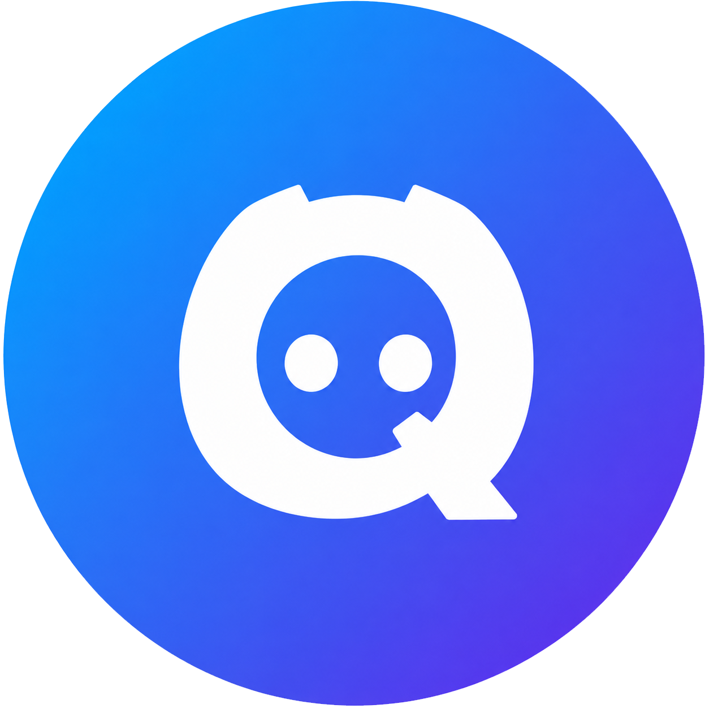
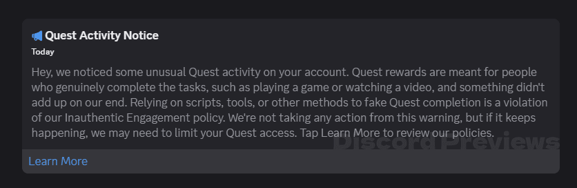
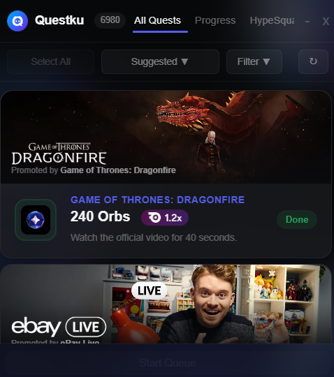
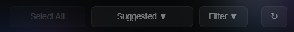
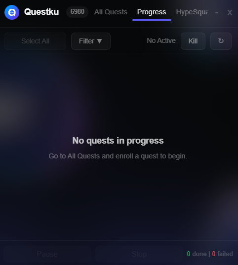

<p align="center">
  
</p>

<h1 align="center">Questku</h1>
<h3 align="center">Automation Quest Discord</h3>

<p align="center"><em style="font-family: Georgia, serif; font-size: 1.2em; color: #777;">Otomatis enroll dan selesaikan quest Discord — klaim reward kapan kamu siap.</em></p>

<p align="center">
  
  
  
  
</p>

> [!CAUTION]
> Per April 2026, Discord menyatakan niatnya buat menindak automasi penyelesaian quest. Sebagian user udah dapet pesan peringatan system.
>
> 

---

## Cara Kerja Questku

Questku jalan sebagai script di dalam tab Discord-mu dan ngomong langsung ke API Discord — tanpa install, tanpa server, tanpa perlu percaya pihak lain.

- **Discovery** — Questku nge-hook module loader webpack Discord, nyari module quest, game, streaming, dan API berdasarkan signature, lalu baca quest kamu langsung dari state Discord. (Kalau signature berubah, lihat `docs/fallback.md`.)
- **Enrollment** — quest yang belum di-accept di-enroll otomatis pas dashboard buka dan tiap refresh 30 detik. Cukup **Select All → Start Queue**.
- **Completion** — ditangani per tipe quest:
  - **Watch** — progress dikirim langsung ke target (`/video-progress {timestamp}`), jadi quest Watch kelar hampir instan. Kalau Discord nolak lompatannya, Questku balik ke cara lambat alami otomatis. Maksimal dua quest Watch jalan bareng.
  - **Play / Stream** — Questku daftarin game/stream palsu ke Discord, lalu heartbeat sampai target. Ini dihitung server, makanya butuh waktu asli.
  - **Activity** — diselesaikan lewat heartbeat di `stream_key` guild/call.
  - **Achievement** — tipe paling berisiko: Questku forge progress ke `discordsays.com` lewat relay lokal (`relay\start-relay.cmd`) memakai OAuth, dengan konfirmasi per quest dan revoke grant otomatis. Di web **Chromium** (Chrome/Edge), jalanin `relay\start-pna.cmd` sekali biar page bisa tembus relay; **Firefox** gak bisa tembus relay dari page web, jadi pakai desktop app.
- **Queue** — quest jalan satu per satu, kecuali quest Watch yang jalan dua bareng. Tiap item bisa di-pause, di-stop, di-retry kalau gagal sementara, dan nampilin progress bar live.
- **Claim** — quest kelar dapat badge **Unclaimed** + tombol Claim. Questku klaim lewat API (`/claim-reward`, header desktop) dan fallback ke klik tombol UI Discord kalau perlu. Captcha selalu kamu yang solve. Quest selesai-belum-claim tetap bisa di-claim walau lewat `expiresAt`; quest expired lain nampilin **Expired**.
- **Kill** — balikin module Discord yang asli (daftar game asli kamu normal lagi) dan nutup dashboard.

> Semuanya jalan di tab kamu. Gak ada data yang keluar kecuali API resmi Discord.

---

## Kenapa Questku

- **Lokal total** — token Discord kamu gak pernah keluar dari browser. Tanpa server eksternal, tanpa analitik, tanpa telemetri, tanpa login. Tutup tab → gak ada sisa.
- **Satu paste / satu extension** — tanpa install: paste script ke DevTools, atau load extension MV3. Dashboard yang sama di dua-duanya.
- **Auto** — enroll otomatis saat buka dan tiap 30s, quest Watch ke-grind cepat (turbo + paralel), dan opsional auto-claim saat quest kelar.
- **Semua tipe quest** — Watch · Play · Stream · Activity · Achievement dalam satu queue, dgn pause/stop/retry dan progress live.
- **UI yang nyaman** — dashboard melayang dengan filter/sort, HypeSquad manager, nilai orb sadar-Nitro, navigasi klik-anywhere (profile popout, quick minimize, back-to-top, glass tooltip).
- **Jujur soal risiko** — Discord gak suka automasi dan bisa ngasih peringatan/restriksi akun, paling agresif di quest Achievement. Pakai sesuai pertimbanganmu.

---

## Instalasi

Jalan di Discord **Web** (semua browser), **Desktop** (dgn DevTools aktif), **Chrome Extension**, dan **Android** (Chrome/Kiwi/Firefox dgn mode Desktop site).

### Opsi 1: Script (DevTools)

1. Buka Discord dan tekan **Ctrl + Shift + I** buat buka DevTools.
2. Buka tab **Console**, ketik `allow pasting`, terus Enter.
3. Copy `questku.js` terbaru dari [Releases](https://github.com/norvramis/questku/releases/latest) (atau [raw file](questku.js)) dan paste ke console.
4. Dashboard muncul — cukup **Select All** lalu **Start Queue**.

> [!IMPORTANT]
> Kalau DevTools Discord Desktop di-disable, double-click `tools\enable-devtools.cmd` (tanpa admin) dan restart Discord.

> [!NOTE]
> Buat quest **Achievement**, double-click `relay\start-relay.cmd` (window auto-minimize; biarin kebuka). Questku auto-detect relay di `127.0.0.1:43210`. Di web **Chromium** juga jalanin `relay\start-pna.cmd` sekali (UAC → Yes → Enter), terus restart Chrome; **Firefox** gak bisa tembus relay dari page web, kulai pakai desktop di situ.

### Opsi 2: Chrome Extension

1. Buka `chrome://extensions`, aktifin **Developer mode**.
2. Klik **Load unpacked** dan pilih folder `extension/`.
3. Buka Discord Web dan tekan **ON** dari popup Questku.
4. Extension butuh kamu jadi member server Questku (tombol Join Server di popup).

> [!NOTE]
> Extension pakai `rules.json` buat spoof User-Agent Electron. Kalau Discord update versi desktop, kamu mungkin perlu update UA string-nya.

### Opsi 3: Android (Mobile Browser)

1. Buka Discord Web di Chrome/Kiwi/Firefox dan login.
2. Aktifkan **Desktop site** dari menu browser.
3. Buka DevTools (`chrome://inspect` di Chrome, Developer tools di Kiwi, `about:debugging` di Firefox).
4. Ketik `allow pasting`, paste `questku.js`, pilih quest, terus jalankan queue.

---

## Struktur Project

```
src/                           Sumber asli (edit di sini, lalu npm run build)
  ├─ questku.js               Script utama (IIFE) — discovery, dashboard, queue, render
  └─ core/                    Helper pure yang di-inject build (rewards, quests, api)
scripts/
  ├─ build.js                 Build zero-dep: inject src/core ke src/questku.js
  └─ migrate.js               Sekali jalan: questku.js -> src/ (sudah dipakai)
package.json                   Script build + test (npm run build / npm test). Tanpa deps.
questku.js                     Hasil build — paste ke DevTools
extension/                     Chrome MV3 extension
  ├─ manifest.json             v1.1.0, deklarasi background + content scripts
  ├─ popup.html / popup.js     UI extension (ON/OFF/Kill, inject questku.js)
  ├─ background.js             Service worker relay buat discordsays.com (bebas CSP)
  ├─ content.js                Bridge MAIN↔SW buat bypass Achievement
  ├─ rules.json                Spoof User-Agent Electron
  └─ questku.js                Hasil build — copy identik script root
relay/
  ├─ relay.ps1                 Localhost HTTP relay di 127.0.0.1:43210 (Achievement)
  ├─ start-relay.cmd           Double-click buat start (window minimized)
  ├─ enable-pna.ps1            Tulis kebijakan Chrome biar web bisa akses 127.0.0.1
  └─ start-pna.cmd             Double-click buat apply kebijakan (UAC/Admin), terus restart Chrome
tools/
  ├─ enable-devtools.ps1       Nyalain DevTools Discord Desktop di Windows
  └─ enable-devtools.cmd       Double-click buat jalanin (tanpa admin)
tests/                         Test Node: helper core + security boundary relay
docs/
  ├─ fallback.md               Panduan recovery webpack
  ├─ ADR-001-module-build.md   Keputusan arsitektur (modular core + build)
  └─ runtime-probe.js          Snippet console buat verifikasi webpack/claim/profile
.github/workflows/
  ├─ ci.yml                    Windows: build → syntax → cek sync → tests
  └─ release.yml               Bikin GitHub Release pas tag v*
assets/                        Screenshot README
```

**Build & test (buat kontributor):** edit `src/` doang — `questku.js` dan `extension/questku.js` itu hasil build.
```powershell
npm run build
npm test
```

---

## Dashboard

Tiga tab dalam satu panel melayang — daftar quest, queue berjalan, dan Hype management.

### Tab All Quests



<details><summary>Referensi toolbar & kartu</summary>

**Toolbar:**



- **Memilih Semua** — toggle select/deselect semua quest
- **Sort** (radio) — Suggested, Most Recent, Expiring Soon, Started, Highest Reward, Alphabetical (A-Z)
- **Filter** (section checkbox) — layout khas Discord:
  - **Reward:** Orbs, Avatar Decoration, Profile Effect, In-Game Rewards
  - **Quest Type:** Play, Watch, Stream, Activity
  - **Status:** Available, In Progress, Completed, Expired
- **Refresh** (lingkaran panah) — ambil ulang daftar quest
- **Kartu:** banner + hover video, logo & nama (biru `#545ded`), orb reward (sadar Nitro), deskripsi tugas, badge status: Not Enrolled / Enrolled / Unclaimed / Done / Expired — yang selesai-belum-claim tetap **Unclaimed** & bisa claim walau expired — tombol Select/View, View Quest/Claim.
- Scroll list → muncul **tombol back-to-top** mengapung di atas **Start Queue**; footer (Enroll / Start Queue) cuma muncul kalau ada quest terpilih.

</details>

### Tab Progress



<details><summary>Referensi toolbar, aksi kartu & footer</summary>

**Toolbar:**

- **Select All** — toggle select quest yang bisa diapaapin
- **Filter** — dropdown tunggal gabungan sort & status
- **N Active / No Active** — indikator teks biasa
- **Settings (⋮)** — popup: **Auto Enroll**, **Auto Claim** (default off) dan **Kill** (hentikan semua, restore Discord internals, nutup dashboard)
- **Refresh** — render ulang panel

**Aksi kartu:** hover → progress bar; klik atas → detail; Select/Deselect.

**Footer:** **Pause/Resume**, **Stop** (jadi Stopped, bukan Failed), **Done/Failed counter**.

</details>

### Tab HypeSquad

- Tiga kartu house: Bravery, Brilliance, Balance
- **Auto-select badge** yang kamu punya pas tab dibuka
- **Apply Badge**, **Remove Badge**

### Minimize & Close

- **Minimize (-)** — sembunyiin toolbar, list, footer (tab tetap).
- **Quick minimize** — klik tab yang lagi aktif juga ngecilin panel; klik tab mana aja langsung buka.
- **Close (x)** — tutup dashboard dan restore internal Discord.

---

## Changelog

### v1.1.0
- **Satu alur claim** — tombol Claim manual dan auto-claim sekarang alur yang sama: claim API dulu, fallback auto-click tombol UI Discord kalau captcha/4xx ngeblokir.
- **Penargetan UI claim lebih aman** — `findClaimButton(qid)` scope ke container `.contentSection_*` sesuai quest.
- **Header desktop dinamis** — `x-super-properties` + `user-agent` dibangun dari webpack Discord + fallback.
- **Relay di-hardening** — SSRF guard, CORS whitelist Discord/extension, rate limit per-origin + limit koneksi.
- **Turbo & paralel watch** — quest Watch langsung target `video-progress` buat kelar cepat; maks 2 watch bareng.
- **Modular core + build** — sumber di `src/`; `npm run build` inject ke `questku.js` + `extension/questku.js`.
- **Test & CI** — `npm test` (core + relay security), CI Windows.
- **Profile popout** — klik user di hero buka account popout.
- **Tooltip glass** — orb (Total balance) & profil (Open profile).
- **Quick minimize** — klik tab aktif ngecilin panel.
- **Start Queue visibilitas** — footer cuma muncul kalau ada quest terpilih.
- **Back to top** — tombol bulat di atas Start Queue setelah scroll.
- **Hierarchy expire** — quest selesai-belum-claim tetap Unclaimed & bisa claim walau expired; expired lain → Expired.
- **Console bersih** — progress log milestone 10%, buang dead code + log debug.
- `extension/manifest.json` → `1.1.0`.

### v1.0.1
- **Quest Achievement** — dukungan `ACHIEVEMENT_IN_ACTIVITY` via bypass OAuth → discordsays dengan konfirmasi + revoke grant.
- **Tiga transport bypass** — relay (web+desktop), service worker extension, direct fetch.
- **Auto-enroll saat buka** — enroll otomatis tiap refresh 30 detik.
- **Hardening API** — `application_id` + `stream_key` asli; 4xx gak di-retry buta; blokir enrollment.
- Extension `manifest.json` → `1.0.1`.

### v1.0.0
Rilis awal.

---

## FAQ

Jawaban cepat buat pertanyaan umum.

- **Kill itu ngapain?** Ngehentiin semuanya, balikin perubahan Questku ke Discord, dan nutup dashboard.
- **Kenapa quest gak muncul?** Questku nampilin apa yang ada di store quest Discord (aktif, selesai, expired — semua dengan badge status). Kalau quest gak ada, mungkin belum ada di store-nya — refresh, atau accept dulu di tab Quests.
- **Bisa jalanin di background?** Bisa — queue jalan sendiri.
- **Bedanya Stop sama Kill?** Stop jeda quest lalu lanjut; Kill batalin seluruh queue + restore Discord.
- **Nilai Nitro orb keliatan salah?** Auto-detect tier Nitro; habis ganti, refresh.
- **Script + extension barengan?** Tidak — satu instance saja.
- **Tombol Claim di mana?** Quest selesai-belum-claim → tombol **Claim**; captcha manual; Auto Claim opsional di Settings.
- **"Unsupported"?** Tipe tugas gak dikenal Questku.
- **Mobile?** Bisa via Chrome/Kiwi/Firefox (Desktop site).
- **Extension kok minta join server?** Cuma untuk member server Questku — tombol Join, atau pakai script DevTools.
- **Script gak ngaruh?** Ketik `allow pasting`.

---

## Troubleshooting

Banyak masalah gara-gara halaman basi. Refresh dulu — 75% kasus kelar di sini.

| Masalah | Solusi |
|---|---|
| Enroll gak ngaruh | Refresh halaman, paste ulang script, cek console. |
| Extension gak inject | Reload di `chrome://extensions` + refresh tab. |
| Progress mentok | Re-enroll quest: stop → remove → add lagi. |
| "Rate limited" di console | Normal — questku nunggu & retry otomatis. |
| Rusak habis update | Baca `docs/fallback.md`, update webpack discovery di `src/questku.js`. |

---

## Lisensi

GPL-3.0. Lihat [LICENSE](LICENSE).