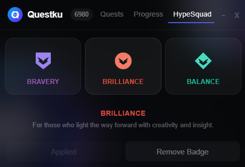
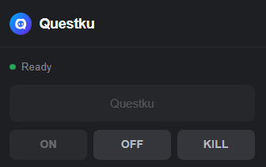
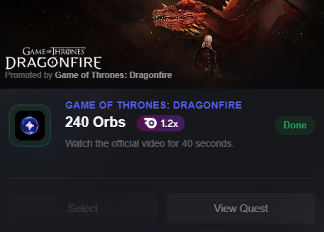
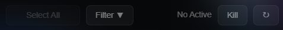

<p align="center">
  
</p>

<h1 align="center">Questku</h1>
<h3 align="center">Otomasi Quest Discord</h3>

<p align="center"><em style="font-family: Georgia, serif; font-size: 1.2em; color: #777;">Otomatis enroll, complete, dan claim quest Discord.</em></p>

<p align="center">
  
  
  
  
</p>

<p align="center">
  <a href="#cara-pakai">Cara Pakai</a> <text>•</text>
  <a href="#keamanan">Keamanan</a> <text>•</text>
  <a href="#screenshot">Screenshot</a> <text>•</text>
  <a href="#sorotan">Sorotan</a> <text>•</text>
  <a href="#fitur">Fitur</a> <text>•</text>
  <a href="#kompatibilitas">Kompatibilitas</a> <text>•</text>
  <a href="#perbandingan">Perbandingan</a> <text>•</text>
  <a href="#cara-kerja">Cara Kerja</a> <text>•</text>
  <a href="#instalasi">Instalasi</a> <text>•</text>
  <a href="#dashboard">Dashboard</a> <text>•</text>
  <a href="#faq">FAQ</a> <text>•</text>
  <a href="#troubleshooting">Troubleshooting</a>
</p>

---

> [!CAUTION]
> Per April 2026, Discord menyatakan akan menindak pengguna yang mengotomatiskan quest. Beberapa pengguna sudah mendapat peringatan.
>
> 

---

## Cara Pakai

1. Terima quest di tab Quests Discord.
2. Tekan **Ctrl + Shift + I** untuk membuka DevTools.
3. Buka tab **Console**.
4. Ketik `allow pasting` dan tekan Enter.
5. Ambil `questku.js` terbaru dari [Releases](https://github.com/norvramis/questku/releases/latest) — atau pakai [raw file](questku.js) buat kode paling baru — lalu salin kodenya.
6. Paste kode ke console dan tekan Enter.
7. Dashboard muncul. Pilih quest dan mulai queue.

---

## Keamanan

Token Discord kamu gak pernah keluar dari browser.

- **Tanpa server eksternal** — semua jalan di tab browser kamu.
- **Tanpa analytics & telemetry** — gak ada yang dilacak atau dikumpulin.
- **Tanpa login akun** — cukup paste script; Questku pake sesi Discord kamu sendiri.
- **Cuma API resmi Discord** — semua request ke discord.com.
- **Jalan lokal** — tutup tab, gak ada sisa apa pun.

---

## Screenshot

| | | |
|---|---|---|
|  |  |  |

---

## Sorotan

Questku ngerjain bagian ribet dari quest Discord, biar kamu cuma milih dan start.

```
Pilih quest
  → Select All (atau satu-satu)
  → Start Queue — auto-enroll
  → Watch → progress naik sendiri
  → Play / Stream → Discord ngeliat kamu "main"
  → Selesai → badge Unclaimed → Claim
```

**Kenapa Questku?**

- **Grinding quest itu manual dari sananya** — enroll, main, nonton, claim, ulang. Questku ngelakuin semua dalam satu klik.
- **Quest Play biasanya butuh game kebuka** — Questku bikin Discord ngeliat kamu "main" tanpa buka apa pun.
- **Reward sering kelewat gak di-claim** — quest kelar dapet badge Unclaimed + tombol Claim, jadi gak ada yang expired sia-sia.
- **Script lain mau token kamu di server mereka** — Questku jalan lokal dan cuma ngobrol sama Discord.
- **Tool lain patah tiap Discord update** — Questku cuma sekali paste; re-run dan balik jalan.

---

## Fitur

| Fitur | Gunanya buat kamu |
|-------|-------------------|
| Alur Quest Otomatis | Enroll + selesaikan dalam satu batch — pilih quest, klik sekali, tinggal jalan. |
| Dual Delivery | Script paste-to-DevTools atau Chrome extension. Dashboard yang sama di dua-duanya. |
| Dashboard In-Page | Panel melayang: drag, minimize, close. Semua jalan inline. |
| Filter & Sort | Filter reward, tipe quest, atau status. Sortir: Suggested, Most Recent, Expiring Soon, Started, Highest Reward, atau A-Z. |
| Queue Manager | Pause, resume, stop, atau kill seluruh queue. Quest kelar/gagal otomatis ngunci kontrolnya. |
| Progress Monitoring | Hover kartu buat progress bar live. Jumlah active keliatan sekilas. |
| HypeSquad | Pasang atau copot badge house. Auto-detect badge yang kamu punya. |
| Deteksi Nitro Orb | Deteksi tier Nitro kamu dan tampilin nilai orb yang bener. |
| View Quest / Claim | Buka detail quest tanpa reload. Quest kelar belum di-claim nampilin tombol Claim. |

---

## Kompatibilitas

| | |
|---|---|
| **Tipe quest** | Watch · Play · Stream · Activity |
| **Platform** | Windows · macOS · Linux · Android |
| **Browser** | Chrome · Edge · Firefox |
| **Discord** | Web (browser apa pun) · Desktop (Windows, via `enable-devtools.ps1`) |
| **Cara pakai** | Script paste-to-DevTools · Chrome extension |

---

## Perbandingan

| | Questku | Lainnya |
|---|---|---|
| Otomasi queue | ✅ | ❌ |
| Dashboard in-page | ✅ | ❌ |
| Chrome extension | ✅ | ❌ |
| Dukungan Android | ✅ | ❌ |
| Pelacakan claim | ✅ | ❌ |
| Manager HypeSquad | ✅ | ❌ |

---

## Cara Kerja

Questku jalan sebagai script di dalam tab Discord kamu dan ngobrol sama API Discord sendiri — tanpa install, tanpa server, tanpa perlu percaya apa pun.

**Yang terjadi di belakang layar:**

- **Discovery** — Questku nemuin module quest, game, dan streaming Discord dari signature-nya, lalu baca quest aktif kamu langsung dari state Discord.
- **Enrollment** — quest yang belum kamu accept di-enroll lewat endpoint resmi Discord.
- **Completion** — tiap tipe quest ditangani otomatis:
  - **Watch** — progress dilaporin ke Discord di background sampai 100%.
  - **Play / Stream** — Questku daftarin game yang "jalan" ke Discord, jadi keliatan kamu lagi main.
  - **Activity** — selesai sendiri.
- **Claim** — quest kelar nampilin badge Unclaimed + tombol Claim; satu klik buka quest buat klaim.

> Semua jalan di tab kamu. Gak ada data yang dikirim ke mana-mana kecuali API resmi Discord.

---

## Instalasi

Berfungsi di Discord **Web** (semua browser), **Desktop** (dengan DevTools aktif), **Chrome Extension**, dan **Android** (Chrome/Kiwi/Firefox dengan mode Desktop site).

### Opsi 1: Script (DevTools)

1. Ikuti [Cara Pakai](#cara-pakai).
2. Bekerja di Discord **Web** (browser) dan **Desktop** (dengan DevTools aktif).

> [!IMPORTANT]
> Jika DevTools dinonaktifkan di Discord Desktop, jalankan `enable-devtools.ps1` sebagai Administrator terlebih dahulu.

### Opsi 2: Chrome Extension

1. Buka Chrome dan buka `chrome://extensions`.
2. Aktifkan **Developer mode** (toggle kanan atas).
3. Klik **Load unpacked** dan pilih folder `extension/`.
4. Buka [Discord Web](https://discord.com/app) dan buka halaman quest mana pun.
5. Klik ikon extension Questku dan tekan **ON**.



> [!NOTE]
> Extension menggunakan `rules.json` untuk spoof User-Agent Electron. Jika Discord desktop update versi, kamu mungkin perlu memperbarui string UA di `rules.json`.

### Opsi 3: Android (Browser Mobile)

Questku juga bisa digunakan di perangkat Android melalui Chrome atau browser lain yang mendukung DevTools.

1. Buka **Chrome** (atau Kiwi Browser, Firefox) di perangkat Android kamu.
2. Navigasi ke [Discord Web](https://discord.com/app) dan login.
3. Ketuk menu browser (tiga titik) dan aktifkan **Desktop site**.
4. Buka halaman quest Discord dan tunggu hingga daftar quest muncul.
5. Buka DevTools:
   - **Chrome:** Navigasi ke `chrome://inspect`, aktifkan discovery, lalu gunakan dev tools Chrome desktop secara remote, atau akses console via shortcut browser.
   - **Kiwi Browser:** Ketuk menu tiga titik -> **Developer tools** -> **Console**. Ini memberikan antarmuka DevTools lengkap langsung di mobile.
   - **Firefox:** Navigasi ke `about:debugging` -> **Inspect** untuk mengakses console.
6. Ketik `allow pasting` di console dan tekan Enter.
7. Salin kode dari `questku.js` dan paste ke console.
8. Dashboard Questku akan muncul. Pilih quest dan mulai queue.

---

## Dashboard

Tiga tab dalam satu panel melayang — daftar quest, antrian berjalan, dan manager badge HypeSquad.

### Tab All Quests


<details><summary>Referensi toolbar & kartu</summary>

**Toolbar:**


- **Select All** — toggle select/deselect semua quest belum selesai
- **Sort** (radio) — Suggested, Most Recent, Expiring Soon, Started, Highest Reward, Alphabetical (A-Z)
- **Filter** (checkbox sections) — layout ala Discord:
  - **Reward:** Orbs, Avatar Decoration, Profile Effect, In-Game Rewards
  - **Quest Type:** Play, Watch, Stream, Activity
  - **Status:** Available, In Progress, Completed, Expired
  - **Clear** — reset semua filter
- **Refresh** (arrow circle) — ambil ulang daftar quest dari Discord

**Kartu Quest:**



- Banner image dengan hover video (jika tersedia)
- Logo game dan nama (biru `#545ded`)
- Reward orb (disesuaikan untuk Nitro)
- Deskripsi tugas
- Status badge: Not Enrolled / Enrolled / Unclaimed / Done / Expired
- Tombol Select / Deselect
- View Quest / Claim — buka detail quest via SPA routing; quest selesai yang belum di-claim nampilin Claim

</details>

### Tab Progress


<details><summary>Referensi toolbar, aksi kartu & footer</summary>

**Toolbar:**



- **Select All** — toggle select/deselect quest yang bisa dijalankan
- **Filter** — dropdown tunggal gabungan sort dan status:
  - **Sort By** (radio): Queue Position, Newest, Oldest, Alphabetical (A-Z)
  - **Status** (checkbox): Running, Pending, Paused, Done, Failed, Stopped
  - **Clear** — reset semua sort dan filter status
- **N Active / No Active** — indikator teks, tanpa background/border
- **Kill** — hentikan semua proses, restore internal Discord, tutup dashboard
- **Refresh** — render ulang panel progress

**Aksi Kartu:**

- Hover untuk lihat progress bar
- Klik area atas untuk buka detail kartu
- Select / Deselect untuk kontrol queue

**Kontrol Footer:**

- **Pause / Resume** — toggle pause quest yang berjalan
- **Stop** — tandai quest sebagai Stopped (bukan Failed), reset progress, lanjut ke quest berikutnya
- **Done / Failed count** — melacak quest selesai dan gagal

> [!WARNING]
> Stop menandai quest sebagai "Stopped" (bukan "Failed"). Penghitung terpisah untuk quest yang di-stop (`st.stopped`).

</details>

### Tab HypeSquad


- Tiga kartu house: Bravery, Brilliance, Balance
- **Auto-select badge yang dimiliki** saat tab dibuka
- **Apply Badge** — set house yang dipilih
- **Remove Badge** — hapus house saat ini

> [!TIP]
> Jika sudah memiliki badge, badge otomatis terpilih saat tab dibuka. Klik **Remove Badge** untuk menghapusnya.

### Minimize & Close

- **Minimize (-)** — sembunyikan toolbar, list, dan footer (nav tabs tetap terlihat). Klik tab mana pun untuk mengembalikan.
- **Close (x)** — tutup dashboard dan restore internal Discord.

---

## Console Output

Questku mencatat aktivitasnya ke console browser untuk debugging dan monitoring.

| Level | Prefix | Warna | Kapan |
|-------|--------|-------|-------|
| Info | `[..]` | Oranye | Enrolling, progress %, rate limit, retry, PID |
| OK | `[OK]` | Hijau | Enrolled, ringkasan queue selesai |
| Done | `[Done]` | Hijau | Quest selesai (dengan durasi) |
| Error | `[!!]` | Merah | Request gagal, error quest/heartbeat |
| Header | `[!]` | Biru | Kill, startup |

---

## FAQ

Jawaban cepat buat pertanyaan umum.

- **Kill itu ngapain?** Ngehentiin semuanya, balikin perubahan Questku ke Discord (daftar game asli kamu normal lagi), dan nutup dashboard.
- **Kenapa quest gak muncul?** Quest harus di-accept di tab Quests Discord dulu. Questku cuma nampilin quest aktif, belum expired, dengan tipe tugas yang didukung.
- **Bisa jalanin di background?** Bisa. Queue jalan sendiri — minimize dashboard, pindah tab, atau buka app lain.
- **Bedanya Stop sama Kill?** Stop ngejeda quest yang lagi jalan (ditandai Stopped) terus lanjut. Kill ngebatalin seluruh queue dan balikin Discord normal.
- **Nilai Nitro orb keliatan salah?** Questku deteksi tier Nitro otomatis. Habis ganti subscription, refresh daftar quest atau reload halaman.
- **Bisa pakai script dan extension barengan?** Nggak — cukup satu instance. Kill script dulu sebelum pindah ke extension.
- **Tombol Claim di mana?** Quest selesai yang belum di-claim, tombol View Quest berubah jadi **Claim**. Klik buat buka quest dan klaim reward di Discord.
- **Kenapa quest nampilin "Unsupported"?** Quest itu pake tipe tugas yang gak dikenal Questku, jadi gak bisa diproses otomatis.
- **Jalan di mobile?** Bisa — Android via Chrome, Kiwi, atau Firefox dengan mode Desktop site.
- **Kenapa extension minta join server?** Extension cuma jalan buat member server Questku. Pake tombol Join Server, atau cukup pake script DevTools aja.
- **Script gak ngaruh setelah paste?** Chrome nge-block paste buat keamanan. Ketik `allow pasting` di console dulu, baru paste. Masih gak jalan? Refresh halaman, coba lagi.

---

## Troubleshooting

Sebagian besar masalah dateng dari halaman yang basi. Sebelum muter otak: refresh halaman Discord, paste ulang script terbaru (atau reload extension), baru coba lagi.

| Masalah | Solusi |
|---------|--------|
| Tombol Enroll gak ngaruh | Refresh halaman dan paste ulang script. Cek console buat log error. |
| Extension gak inject | Reload extension di `chrome://extensions` dan refresh tab Discord. |
| Progress mentok di 0% | Quest biasanya perlu di-enroll ulang. Stop, hapus, terus tambah lagi. |
| Dashboard nampilin "No quests" | Accept quest di tab Quests Discord dulu. Cuma quest aktif yang muncul. |
| Muncul "Rate limited" di console | Normal. Questku nunggu dan retry otomatis. |
| Error pas paste script | Ketik `allow pasting` dan Enter, terus paste lagi. |
| Rusak habis Discord update | Cek `fallback.md` buat recovery webpack. Update bagian webpack discovery di atas `questku.js` kalo path berubah. |

---

## Lisensi

GPL-3.0. Lihat [LICENSE](LICENSE).


