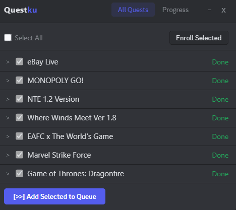

<p align="center">
  
</p>

<p align="center">
  <a href="#quick-start">Quick Start</a> •
  <a href="#features">Features</a> •
  <a href="#usage">Usage</a> •
  <a href="#enabling-devtools">Enabling DevTools</a> •
  <a href="#dashboard">Dashboard</a> •
  <a href="#how-it-works">How It Works</a> •
  <a href="#faq">FAQ</a> •
  <a href="#troubleshooting">Troubleshooting</a>
</p>

<p align="center">
  
  
  
</p>

---

Automatically enroll, complete, and claim Discord quests. Works as a script (paste to DevTools) or as a Chrome extension.

---

> [!CAUTION]
> As of April 2026, Discord has expressed their intent to crack down on automating quest completion. Some users have received a warning system message.
>
> 

---

## Quick Start

```
1. Accept a quest in the Quests tab
2. Press Ctrl+Shift+I to open DevTools
3. Go to the Console tab
4. Type: allow pasting  then press Enter (required by Discord)
5. Copy the entire questku.js file, paste into Console, press Enter
6. Dashboard appears → click Start
```

> [!TIP]
> If `Ctrl+Shift+I` does not work, see [Enabling DevTools](#enabling-devtools) below.

> [!IMPORTANT]
> You must type `allow pasting` before pasting the script. Discord blocks paste by default in the Console for security reasons.

That is it. No setup, no dependencies.

---

## Features

| Feature | Description |
|---------|-------------|
| **Dashboard UI** | Floating panel on Discord — quest list, checkbox selection, progress bar, start/stop controls |
| **Auto-enroll** | Discovers available quests and accepts them automatically before processing |
| **Auto-claim** | Claims rewards automatically when a quest reaches 100% completion |
| **Sequential queue** | Selected quests run one at a time. Pause, resume, or stop the queue at any point |
| **Batch enroll** | Select multiple quests or all quests and enroll them in one click |
| **Two-tab layout** | All Quests tab to browse and select. Progress tab to monitor active queue |
| **Rate limit handling** | Automatically retries with exponential backoff when Discord rate-limits API calls |
| **Collapsible console logs** | Each quest is grouped in DevTools console — click to expand or collapse |
| **Draggable panel** | Click and drag the panel header to reposition anywhere on screen |
| **Chrome Extension** | Inject via browser extension — no copy-paste required |
| **Android support** | Works on Kiwi Browser and Lemur Browser via the same extension |

---

## Usage

### Option A: DevTools (desktop app)

> [!NOTE]
> Game and stream quests require the Discord desktop app. Browser only supports video quests.

**Step by step:**

1. Open Discord and navigate to the **Quests** tab (Discover > Quests)
2. Look for quests you want to complete — they will appear in the dashboard regardless of enrollment status
3. Press `Ctrl+Shift+I` to open Developer Tools
4. Go to the **Console** tab
5. Type `allow pasting` and press Enter — Discord blocks paste by default, this unlocks it
6. Open [`questku.js`](questku.js) from this repository, select and copy the entire content
7. Paste into the Console and press Enter
8. A floating panel titled **Questku** appears in the bottom-right corner of Discord
9. In the **All Quests** tab, check the quests you want to complete
10. Click **Enroll Selected** if quests are not yet accepted (optional — auto-enroll can handle this)
11. Click **[>>] Add Selected to Queue**
12. Switch to the **Progress** tab to watch completion in real time

### Option B: Chrome Extension (browser)

> [!NOTE]
> You only need the `extension/` folder — not the entire repository. The extension uses user-agent spoofing to make Discord's web version behave like the desktop app, which is required for game and stream quests.

**Download the extension folder:**
- [`questku-extension.zip`](https://github.com/norvramis/questku/archive/refs/heads/main.zip) — extract and use the `extension/` folder
- Or clone the full repo: `git clone https://github.com/norvramis/questku.git`

**Install and use:**

1. Open Chrome → go to `chrome://extensions/`
2. Enable **Developer mode** (toggle in top-right corner)
3. Click **Load unpacked** → select the `extension/` folder
4. Open a new tab and navigate to `https://discord.com/quest-home`
5. Click the Questku icon (purple Q) in the Chrome toolbar
6. In the popup that appears, click the **Questku** button
7. The dashboard panel will appear on the Discord page

> [!TIP]
> On Android, install Kiwi Browser or Lemur Browser, then follow the same steps from inside the browser.

---

## Enabling DevTools

If `Ctrl+Shift+I` does not open Developer Tools in Discord, use one of these methods:

### Option 1: Run the enable script (recommended)

1. Right-click [`enable-devtools.ps1`](enable-devtools.ps1) → **Run with PowerShell**
2. Restart Discord
3. `Ctrl+Shift+I` will now work

> [!TIP]
> The script only modifies a Windows registry value. It does not modify Discord files or violate Discord's Terms of Service.

### Option 2: Discord PTB or Canary

Download [Discord PTB](https://discord.com/download) — Developer Tools are enabled by default in PTB and Canary builds.

### Option 3: Use Chrome Extension

You do not need DevTools at all if you use the [Chrome Extension method](#option-b-chrome-extension-browser). Load the extension, click the icon, and inject the script — no `Ctrl+Shift+I` required.

---

## Dashboard



The dashboard is a draggable floating panel with two tabs. Drag it by the header to move it around.

### All Quests Tab

This tab shows every available quest. Each quest displays:
- Quest name (truncated with ellipsis if too long)
- Current status: **Enrolled**, **Not Enrolled**, **Done**, or **Expired**
- Expandable detail row: click the arrow `>` to see task type, app name, and expiry date

Toolbar options:
| Control | Function |
|---------|----------|
| **Select All** checkbox | Toggle all quests on or off |
| **Enroll Selected** button | Accepts all checked quests via the Discord API |
| Per-quest checkbox | Select individual quests for the queue |
| Per-quest enroll toggle | Choose whether to auto-enroll a specific quest |

Quest filtering — quests that are already completed have a disabled checkbox and a "Done" label. Expired quests are marked "Expired". Only enrolled or enrollable quests can be added to the queue.

### Progress Tab

This tab shows the processing queue. Each queued quest displays:
- Quest name
- Current status: **Pending**, **Running**, **Done**, **Failed**, or **Paused**
- Visual progress bar with percentage
- Expandable detail row with elapsed time and task info

Toolbar options:
| Control | Function |
|---------|----------|
| **Pause / Resume** | Pause the current quest without stopping the queue. The current quest waits, then continues when resumed |
| **Stop** | Stops the queue entirely. All pending quests are cleared |
| Status counter | Shows number of completed and failed quests |

---

## How It Works

Questku interacts with Discord's internal API through webpack module injection — the same method Discord itself uses internally.

**Injection method:**
1. The script discovers Discord's internal modules by hooking into `webpackChunkdiscord_app`, Discord's module loader
2. It extracts references to QuestStore, RunningGameStore, FluxDispatcher, and the HTTP API client
3. These references are used to send API requests and listen for progress updates

**Quest completion per type:**

| Type | Technique |
|------|-----------|
| WATCH_VIDEO | Periodically sends `POST /quests/{id}/video-progress` with incremented timestamps |
| PLAY_ON_DESKTOP | Creates a fake game process object and dispatches it via Flux. Listens for heartbeat responses that indicate progress |
| STREAM_ON_DESKTOP | Overrides the stream metadata getter to return the quest's application ID. Progress arrives via heartbeat |
| PLAY_ACTIVITY | Sends periodic heartbeat requests to `POST /quests/{id}/heartbeat` with a voice channel stream key |

**Auto-enroll** calls `POST /quests/{id}/enroll` for each selected quest that has not been accepted yet.

**Auto-claim** calls `POST /quests/{id}/claim` after a quest reaches 100% completion.

The Chrome extension delivers the same script into the Discord page via `chrome.scripting.executeScript` with `world: 'MAIN'`, which runs it in the page's JavaScript context where the webpack modules are accessible.

---

## Quest Types

| Task | Method | Duration | Action Needed |
|------|--------|----------|---------------|
| WATCH_VIDEO | Fake video progress timestamps | 2-3 minutes | None |
| WATCH_VIDEO_ON_MOBILE | Same as WATCH_VIDEO | 2-3 minutes | None |
| PLAY_ON_DESKTOP | Fake process injection + heartbeat listening | 10-30 minutes | None |
| STREAM_ON_DESKTOP | Stream metadata spoofing + heartbeat | 10-30 minutes | Join a voice channel with someone else in it |
| PLAY_ACTIVITY | Voice channel heartbeat loop | 10-30 minutes | Join any voice channel |

**Example console output for a completed session:**

```
[!] 2 quest(s) found
[!] Play Game — Where Winds Meet — app: Where Winds Meet
[..] Play Game (900 min)
[..] wwm.exe (PID 29063)
[..] [ 34% ]  3m 12s
[..] [ 100% ]  12m 38s
[✓] Where Winds Meet Ver 1.8, 12m 38s
[!] Watch Video — Watch 3 Videos — app: Discord
[..] Watch Video (15s)
[..] [ 47% ]
[..] [ 100% ]
[✓] Watch 3 Videos, 28s
[OK] All done! Claim rewards in Quests tab.
```

Each quest is wrapped in a collapsible console group. You can expand or collapse individual quest output.

---

## Extension


The Questku Chrome Extension provides the same functionality without requiring DevTools access.

**Requirements:**
- Chrome 116 or newer (or any Chromium-based browser: Edge, Brave, Opera)
- Discord open in a browser tab at `discord.com/quest-home`

**Technical details:**
- Manifest V3
- `declarativeNetRequest` to override the User-Agent header, making Discord's web version identify as the desktop app
- `chrome.scripting.executeScript` to inject `questku.js` directly into the page's main JavaScript context
- No content scripts, no `web_accessible_resources`, no CSP bypass needed

The popup shows the current connection status (whether a Discord tab is detected) and a single button to inject the script.

---

## FAQ

**Q: Running the script does nothing or shows "undefined"**
A: Opening DevTools sometimes causes Discord's HTTP layer to stall temporarily. Wait 30-60 seconds and try again, or restart Discord completely.

**Q: Can I get banned for using this?**
A: There is always a risk when automating any platform. As of mid-2026, no confirmed bans have been reported for Quest Completion scripts, but Discord may flag accounts that use them. Use at your own risk.

**Q: Ctrl+Shift+I doesn't open DevTools**
A: Some Discord builds disable DevTools by default. Try using the PTB or Canary client, or enable DevTools via the Windows Registry. Alternatively, use the Chrome Extension method instead.

**Q: The script says "No quests found" but I have active quests**
A: The script filters quests by expiry date. If your quests have expired, they will not appear. Also ensure you are looking at the correct account.

**Q: Can I complete expired quests?**
A: No. Quests must have a valid (future) expiry date. Discord's API rejects progress updates for expired quests.

**Q: Does the script auto-accept quests?**
A: Yes, when "Auto-enroll" is enabled in the dashboard. You can also manually enroll quests using the **Enroll Selected** button in the All Quests tab.

**Q: Does the script auto-claim rewards?**
A: Yes, when "Auto-claim" is enabled. Rewards are claimed automatically after each quest reaches 100% completion.

**Q: Streaming quests are not progressing**
A: Streaming quests (STREAM_ON_DESKTOP) require at least one other person in the voice channel. The script can spoof the stream metadata, but Discord still requires a viewer for progress to count.

**Q: Can I run the script on Discord web (browser)?**
A: Video quests work on the web version. Game and stream quests require the desktop app or the Chrome Extension with user-agent spoofing.

**Q: Does the extension work on Firefox?**
A: No. The extension uses Manifest V3 APIs that are Chrome-specific (declarativeNetRequest, scripting.executeScript). Firefox does not support the same APIs.

**Q: The script stopped working — "Discord internals not found"**
A: Discord updates its internal modules frequently. See the [Fallback Guide](FALLBACK.md) for instructions on how to find the new module paths and fix the script.

---

## Troubleshooting

| Problem | Likely Cause | Solution |
|---------|--------------|----------|
| Dashboard does not appear | Discord blocked paste | Type `allow pasting` in the Console first, then paste the script |
| Script errors with "Discord internals not found" | Discord updated its internal modules | The webpack module paths may have changed. The script needs an update |
| "Rate limited" message appears | Too many API calls | The script handles this automatically with backoff. Wait for the retry |
| Quest stuck at 0% progress | Quest may require specific conditions | Some quests have region or platform requirements. Check the quest description |
| CAPTCHA appears | Discord detected automation | The script cannot bypass CAPTCHAs. Complete it manually |
| Extension does not inject | Browser blocks the script | Reload the Discord tab and try again. Make sure you are on `discord.com/quest-home` |
| Popup says "Open Discord first" | No Discord tab detected | Navigate to `discord.com/quest-home` and click the extension icon again |
| Auto-claim fails | Claim endpoint returns error | The quest may require manual claiming via the Quests tab UI |

---

## Credits

Based on [aamiaa/CompleteDiscordQuest](https://gist.github.com/aamiaa/204cd9d42013ded9faf646fae7f89fbb) — original concept and webpack module discovery.

Inspired by [power0matin/discord-quest-auto-completer](https://github.com/power0matin/discord-quest-auto-completer) — QuestMaster dashboard and auto-features.  
Extension structure inspired by [nvckai/Discord-Web-Auto-Quest-Extension](https://github.com/nvckai/Discord-Web-Auto-Quest-Extension).

---

## License

GPL-3.0. See [LICENSE](LICENSE).

<details>
<summary>Full license text</summary>

```
GNU GENERAL PUBLIC LICENSE
Version 3, 29 June 2007

Copyright (C) 2007 Free Software Foundation, Inc. <https://fsf.org/>
Everyone is permitted to copy and distribute verbatim copies
of this license document, but changing it is not allowed.

This program is free software: you can redistribute it and/or modify
it under the terms of the GNU General Public License as published by
the Free Software Foundation, either version 3 of the License, or
(at your option) any later version.

This program is distributed in the hope that it will be useful,
but WITHOUT ANY WARRANTY; without even the implied warranty of
MERCHANTABILITY or FITNESS FOR A PARTICULAR PURPOSE.  See the
GNU General Public License for more details.

You should have received a copy of the GNU General Public License
along with this program.  If not, see <https://www.gnu.org/licenses/>.
```

</details>

---

**AI Assistance.** This project was developed with the assistance of AI (LLMs) to structure the code and automate the setup process.
