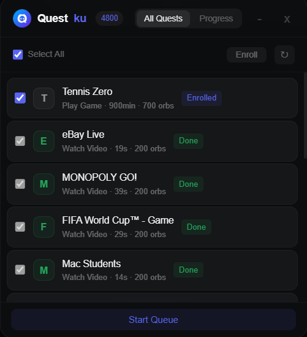
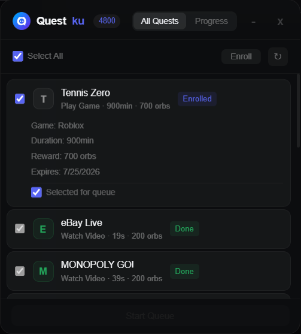
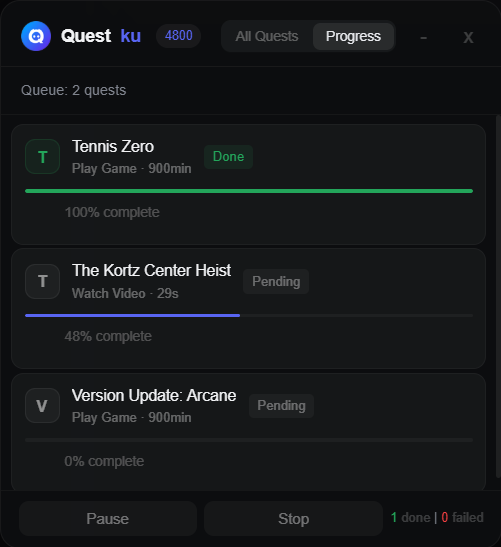
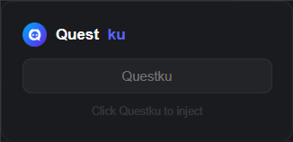

<p align="center">
  
</p>

<p align="center">
  <a href="#quick-start">Quick Start</a> •
  <a href="#whats-new">What's New</a> •
  <a href="#features">Features</a> •
  <a href="#usage">Usage</a> •
  <a href="#dashboard">Dashboard</a> •
  <a href="#faq">FAQ</a> •
  <a href="#troubleshooting">Troubleshooting</a>
</p>

<p align="center">
  
  
  
</p>

---

Automatically enroll, complete, and claim Discord quests. Works as a script (paste to DevTools) or as a Chrome extension.

---

> [!CAUTION]
> As of April 2026, Discord has expressed their intent to crack down on automating quest completion. Some users have received a warning system message.
>
> 

---

## Quick Start

```
1. Accept a quest in the Quests tab
2. Press Ctrl+Shift+I to open DevTools
3. Go to the Console tab
4. Type: allow pasting  then press Enter (required by Discord)
5. Copy the entire questku.js file, paste into Console, press Enter
6. Dashboard appears -> click Start
```

> [!TIP]
> If `Ctrl+Shift+I` does not work, use the Chrome Extension instead — no DevTools required.

> [!IMPORTANT]
> You must type `allow pasting` before pasting the script. Discord blocks paste by default.

---

## What's New

A complete visual overhaul. The script once output only plain text logs — now it runs a full floating dashboard with quest cards, real-time progress bars, auto-enrollment, and queue management.

| Before | After |
|:-----:|:-----:|
|  |  

## Features

| Feature | Description |
|---------|-------------|
| **Dashboard UI** | Floating panel with quest list, checkboxes, progress bars, and queue controls |
| **Auto-enroll** | Discovers and accepts quests automatically before processing |
| **Auto-claim** | Claims rewards automatically on completion |
| **Sequential queue** | Quests run one by one. Pause, resume, or stop anytime |
| **Two-tab layout** | All Quests tab to browse. Progress tab to monitor active queue |
| **Rate limit handling** | Exponential backoff when Discord rate-limits API calls |
| **Collapsible console logs** | Each quest grouped in DevTools console |
| **Chrome Extension** | No DevTools needed. One-click inject from browser toolbar |
| **Draggable panel** | Drag the header to reposition the dashboard |
| **Android support** | Works via Kiwi Browser or Lemur Browser |

---

## Usage

### Option A: DevTools (desktop app)

> [!NOTE]
> Game and stream quests require the Discord desktop app. The browser version only supports video quests, as it cannot inject fake game processes.

1. Accept quests under the Quests tab
2. Press `Ctrl+Shift+I` to open DevTools
3. Go to the **Console** tab
4. Type `allow pasting` and press Enter
5. Open [`questku.js`](questku.js), copy the entire content
6. Paste into Console and press Enter
7. Dashboard appears in the bottom-right corner
8. In **All Quests** tab, check the quests you want to complete
9. Click **Enroll Selected** if quests are not yet accepted
10. Click **Start Queue** to begin processing
11. Switch to **Progress** tab to monitor completion in real time

### Option B: Chrome Extension

> [!NOTE]
> You only need the `extension/` folder — not the entire repository. The extension uses user-agent spoofing to make Discord's web version behave like the desktop app, which is required for game and stream quests to function in the browser.

**Install:**

1. Open Chrome and go to `chrome://extensions/`
2. Enable **Developer mode** (top-right toggle)
3. Click **Load unpacked** and select the `extension/` folder
4. Open a new tab and navigate to `https://discord.com/quest-home`

**Use:**

1. Click the Questku icon (purple Q) in the Chrome toolbar
2. If a Discord tab is detected, the popup will show "Questku" as active
3. Click **Questku** to inject the script
4. The dashboard panel appears on the Discord page

> [!TIP]
> On Android, use Kiwi Browser or Lemur Browser, then follow the same steps.

---

## Dashboard

### All Quests Tab


View and manage all active quests from a single panel. Each card displays the quest name, task type, duration, and orb rewards. Use the toolbar to select quests, enroll them, or refresh the list.

**Expandable detail.** Click any quest card to reveal full information:



| Field | Description |
|-------|-------------|
| **Game** | The application associated with the quest |
| **Duration** | Time required to complete (e.g. 15s, 900min) |
| **Reward** | Orb amount awarded on completion |
| **Expires** | Deadline before the quest becomes unavailable |
| **Queue toggle** | Check to include this quest in the processing queue |
- **Status tag** — Enrolled, Not Enrolled, Done, Expired

Toolbar: **Select All** checkbox, **Enroll** button, **Refresh** button.

Click a card to expand and see Game, Duration, Reward, and Expiry details.

### Progress Tab



Track active quests in real time. The queue processes quests sequentially — each card shows the current progress percentage. Use Pause and Resume to control the queue, or Stop to clear all pending quests. Completed and failed counts are displayed in the footer.

### Console Output


The script also outputs progress to the DevTools console alongside the dashboard. Each quest is grouped in a collapsible block for easier navigation.

---

## How It Works

Questku interacts with Discord's internal API through webpack module injection.

**Injection method:**
1. Hooks into `webpackChunkdiscord_app`, Discord's module loader
2. Extracts QuestStore, RunningGameStore, FluxDispatcher, and HTTP API client
3. Sends API requests and listens for progress updates

**Quest completion per type:**

| Type | Technique |
|------|-----------|
| WATCH_VIDEO | Sends `POST /quests/{id}/video-progress` with incremented timestamps |
| PLAY_ON_DESKTOP | Creates a fake game process + listens for heartbeat responses |
| STREAM_ON_DESKTOP | Overrides stream metadata getter + heartbeat |
| PLAY_ACTIVITY | Sends heartbeat to `POST /quests/{id}/heartbeat` with voice channel stream key |

**Auto-enroll** calls `POST /quests/{id}/enroll`. **Auto-claim** calls `POST /quests/{id}/claim` on completion.

---

## Quest Types

| Task | Method | Duration | Action Needed |
|------|--------|----------|---------------|
| WATCH_VIDEO | Fake video progress timestamps | 2-3 minutes | None |
| WATCH_VIDEO_ON_MOBILE | Same as WATCH_VIDEO | 2-3 minutes | None |
| PLAY_ON_DESKTOP | Fake process injection + heartbeat | 10-30 minutes | None |
| STREAM_ON_DESKTOP | Stream metadata spoofing + heartbeat | 10-30 minutes | Join a voice channel |
| PLAY_ACTIVITY | Voice channel heartbeat loop | 10-30 minutes | Join any voice channel |

---

## Extension

The extension evolved from a basic toolbar injector to a streamlined popup with automatic Discord tab detection.

| Before | After |
|:-----:|:-----:|
|  |  |

The Chrome Extension provides the same functionality as the DevTools script without requiring developer tools. Click the Questku icon in your browser toolbar — if a Discord tab is detected, the inject button activates.

**Requirements:** Chrome 116+, Discord open in a browser tab at `discord.com/quest-home`.

**Technical:** Manifest V3, `declarativeNetRequest` for user-agent override, `chrome.scripting.executeScript` with `world: 'MAIN'` for direct page context injection.

---

## FAQ

**Q: Running the script does nothing or shows "undefined"**
A: DevTools can temporarily stall Discord's HTTP layer. Wait 30-60 seconds or restart Discord.

**Q: Can I get banned for using this?**
A: There is always a risk. No confirmed bans to date, but Discord may flag accounts. Use at your own risk.

**Q: Ctrl+Shift+I doesn't open DevTools**
A: Use Discord PTB/Canary, enable DevTools via `enable-devtools.ps1`, or use the Chrome Extension instead.

**Q: The extension popup says "Open Discord first"**
A: Open `discord.com/quest-home` in your browser tab, then click the extension icon again.

**Q: Extension doesn't inject**
A: Reload the Discord tab. Make sure you are on `discord.com/quest-home`, not Discord Desktop.

**Q: The script says "No quests found" but I have active quests**
A: The script only shows quests with valid (future) expiry dates. Expired quests are excluded.

**Q: Does the script auto-accept quests?**
A: Yes, when "Auto-enroll" is enabled. You can also manually enroll via the **Enroll Selected** button.

**Q: Does the script auto-claim rewards?**
A: Yes, when "Auto-claim" is enabled. Rewards are claimed automatically after each quest completes.

**Q: Streaming quests are not progressing**
A: STREAM_ON_DESKTOP requires at least one other person in the voice channel. The script spoofs stream metadata, but Discord needs a viewer for progress.

**Q: Can I run this on Discord web (browser)?**
A: Video quests work on web. Game and stream quests need the desktop app or the Chrome Extension.

**Q: Does the extension work on Firefox?**
A: No. Firefox does not support the required Manifest V3 APIs.

**Q: Does it work on mobile?**
A: Yes, via Kiwi Browser or Lemur Browser with the same extension. Android only.

**Q: The script stopped working — "Discord internals not found"**
A: Discord updates internal modules frequently. See [FALLBACK.md](FALLBACK.md) for instructions to find new module paths.

**Q: Can I complete expired quests?**
A: No. Discord's API rejects progress for expired quests.

**Q: Can I run multiple quests at once?**
A: Quests run sequentially in the queue. Select multiple quests and they will process one after another.

---

## Troubleshooting

| Problem | Cause | Solution |
|---------|-------|----------|
| Dashboard does not appear | Paste blocked by Discord | Type `allow pasting` in Console first |
| Script errors "Discord internals not found" | Module paths changed | See [FALLBACK.md](FALLBACK.md) |
| Rate limited message appears | Too many API calls | Backoff is automatic — wait for retry |
| Quest stuck at 0% | Region/platform requirements | Check quest description |
| CAPTCHA appears | Discord detected automation | Complete manually. Script cannot bypass |
| **Extension** does not inject | No valid Discord tab | Reload `discord.com/quest-home` and try again |
| **Extension** popup shows error | Script blocked by CSP | Reload page and re-inject |
| **Extension** opens Discord Desktop | OS protocol handler | Close Desktop app, make sure you are in browser tab |
| Auto-claim fails | Endpoint error | Claim manually via Quests tab UI |
| "You are being rate limited" API 429 | Too many requests in short time | Wait 5-10 minutes before retrying |
| Quest shows "Pending" but never runs | Queue stopped or paused | Click Resume or restart queue |

---

## Credits

Based on [aamiaa/CompleteDiscordQuest](https://gist.github.com/aamiaa/204cd9d42013ded9faf646fae7f89fbb) — original concept and webpack module discovery.

Inspired by [power0matin/discord-quest-auto-completer](https://github.com/power0matin/discord-quest-auto-completer) — QuestMaster dashboard and auto-features.  
Extension structure inspired by [nvckai/Discord-Web-Auto-Quest-Extension](https://github.com/nvckai/Discord-Web-Auto-Quest-Extension).

---

## License

GPL-3.0. See [LICENSE](LICENSE).

<details>
<summary>Full license text</summary>

```
GNU GENERAL PUBLIC LICENSE
Version 3, 29 June 2007

Copyright (C) 2007 Free Software Foundation, Inc. <https://fsf.org/>
Everyone is permitted to copy and distribute verbatim copies
of this license document, but changing it is not allowed.

This program is free software: you can redistribute it and/or modify
it under the terms of the GNU General Public License as published by
the Free Software Foundation, either version 3 of the License, or
(at your option) any later version.

This program is distributed in the hope that it will be useful,
but WITHOUT ANY WARRANTY; without even the implied warranty of
MERCHANTABILITY or FITNESS FOR A PARTICULAR PURPOSE.  See the
GNU General Public License for more details.

You should have received a copy of the GNU General Public License
along with this program.  If not, see <https://www.gnu.org/licenses/>.
```

</details>

---

**AI Assistance.** This project was developed with the assistance of AI (LLMs) to structure the code and automate the setup process.
