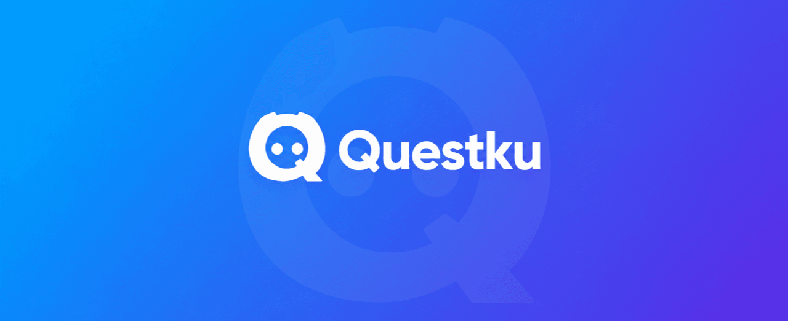

<p align="center">
  
</p>

<h1 align="center">Questku</h1>
<h3 align="center">Discord Quest Automation</h3>

<p align="center"><em style="font-family: Georgia, serif; font-size: 1.2em; color: #777;">Automatically enroll and complete Discord quests — claim rewards when you're ready.</em></p>

<p align="center">
  
  
  
  
</p>



> [!CAUTION]
> As of April 2026, Discord has expressed their intent to crack down on automating quest completion. Some users have received a warning system message.
>
> 

---

## How Questku Works

Questku runs as a script inside your Discord tab and talks to Discord's own APIs — no install, no server, nothing to trust.

- **Discovery** — Questku hooks Discord's webpack module loader, finds the quest, game, streaming, and API modules by signature, and reads your quests straight from Discord's own state. (If Discord changes those signatures, see `docs/fallback.md`.)
- **Enrollment** — quests you haven't accepted are enrolled automatically when the dashboard opens and on each 30s refresh. **Select All → Start Queue** is all you touch.
- **Completion** — handled per quest type:
  - **Watch** — progress is reported straight to the target (`/video-progress {timestamp}`), so Watch quests finish almost instantly. If Discord rejects the jump, Questku falls back to the slow natural grind automatically. Up to two Watch quests run at the same time.
  - **Play / Stream** — Questku registers a fake running game / stream with Discord, then heartbeats it until it hits the target. These are server-metered, so they take their real time.
  - **Activity** — completed via heartbeats on a guild/call `stream_key`.
  - **Achievement** — the highest-risk type: Questku forges progress to `discordsays.com` through the local relay (`relay\start-relay.cmd`) using OAuth, with explicit per-quest consent and automatic grant revocation. On web **Chromium** (Chrome/Edge), run `relay\start-pna.cmd` once so the page can reach the relay; **Firefox** can't reach the relay from the web page, so use the desktop app there.
- **Queue** — quests run one after another, except Watch quests which run two at a time. Each item can be paused, stopped, retried on transient failures, and reports a live progress bar.
- **Claim** — finished quests get an **Unclaimed** badge and a Claim button. Questku claims via the API (`/claim-reward`, desktop headers) and falls back to clicking Discord's UI button if needed. Captchas are always solved by you. Finished-but-unclaimed quests stay claimable even past their expiry; the other expired quests show **Expired**.
- **Kill** — restores Discord's original modules (your real games list comes back) and closes the dashboard.

> Everything runs in your tab. No data is sent anywhere except Discord's official API.

---

## Why Questku

Questku runs entirely in your browser — your Discord token never leaves your machine. There's no external server, no analytics, no telemetry, and no account to create. Close the tab and nothing remains. It's just one paste into DevTools, or a single extension install, and you get the same dashboard either way.

The script handles everything automatically: it enrolls you in available quests when the dashboard opens and on every 30-second refresh, grinds Watch quests to completion fast using turbo mode and parallel execution, and optionally auto-claims rewards when quests finish. It supports every quest type — Watch, Play, Stream, Activity, and Achievement — in a single queue with pause, stop, retry, and live progress tracking.

The UI is built for convenience: a floating dashboard with filters and sorts, a HypeSquad badge manager, Nitro-aware orb values, and click-anywhere navigation including a profile popout, quick minimize, back-to-top button, and glass-style hover tooltips.

We're honest about the risks: Discord discourages automation and may warn or restrict accounts, most aggressively for Achievement quests. Use Questku at your own discretion.

---

## Installation

Works on Discord **Web** (all browsers), **Desktop** (with DevTools enabled), **Chrome Extension**, and **Android** (Chrome/Kiwi/Firefox with Desktop site mode).

### Option 1: Script (DevTools)

1. Open Discord and press **Ctrl + Shift + I** to open DevTools.
2. Open the **Console** tab, type `allow pasting`, and press Enter.
3. Copy the latest `questku.js` from [Releases](https://github.com/norvramis/questku/releases/latest) (or the [raw file](questku.js)) and paste it into the console.
4. The dashboard appears — **Select All** then **Start Queue**.

> [!IMPORTANT]
> If DevTools are disabled in Discord Desktop, double-click `tools\enable-devtools.cmd` (no admin needed) and restart Discord.

> [!NOTE]
> For **Achievement** quests, double-click `relay\start-relay.cmd` (the window auto-minimizes; keep it open). Questku auto-detects the relay on `127.0.0.1:43210`. On web **Chromium** also run `relay\start-pna.cmd` once (UAC → Yes → Enter), then restart Chrome; **Firefox** can't reach the relay from the web page, so use desktop there.

### Option 2: Chrome Extension

1. Open `chrome://extensions`, enable **Developer mode**.
2. Click **Load unpacked** and select the `extension/` folder.
3. Open Discord Web and press **ON** from the Questku popup.
4. The extension needs you to be a member of the Questku server (Join Server button in the popup if not).

> [!NOTE]
> The extension uses `rules.json` to spoof an Electron User-Agent. If Discord updates its desktop version, you may need to update that UA string.

### Option 3: Android (Mobile Browser)

1. Open Discord Web in **Lemur Browser** (recommended), **Kiwi Browser**, or **Firefox** and log in.
2. Enable **Desktop site** from the browser menu.
3. Open DevTools:
   - **Lemur/Kiwi**: Settings → Developer tools
   - **Firefox**: `about:debugging` → Inspect
4. Type `allow pasting` in the console and press Enter.
5. Copy the latest `questku.js` from [Releases](https://github.com/norvramis/questku/releases/latest) (or the [raw file](questku.js)) and paste it into the console.
6. The dashboard appears — **Select All** then **Start Queue**.

> [!NOTE]
> For **Achievement** quests on mobile, the relay must run on a desktop machine. The mobile browser cannot reach the local relay. Use the desktop app for Achievement quests.

---

## Project Structure

```
src/                           Source of truth (edit here, then npm run build)
  ├─ questku.js               Main userscript (IIFE) — discovery, dashboard, queue, render
  └─ core/                    Pure helpers injected into the build (rewards, quests, api)
scripts/
  ├─ build.js                 Zero-dep build: injects src/core into src/questku.js
  └─ migrate.js               One-time: questku.js -> src/ (already run)
package.json                   Build + test scripts (npm run build / npm test). No deps.
questku.js                     Build output — paste into DevTools
extension/                     Chrome MV3 extension
  ├─ manifest.json             v1.1.0, declares background + content scripts
  ├─ popup.html / popup.js     Extension UI (ON/OFF/Kill, injects questku.js)
  ├─ background.js             Service worker relay for discordsays.com (CSP-free)
  ├─ content.js                MAIN↔SW bridge for the Achievement bypass
  ├─ rules.json                Electron User-Agent spoof
  └─ questku.js                Build output — identical copy of the root script
relay/
  ├─ relay.ps1                 Localhost HTTP relay on 127.0.0.1:43210 (Achievement)
  ├─ start-relay.cmd           Double-click to start it (window minimized)
  ├─ enable-pna.ps1            Writes the Chrome policy so web can reach 127.0.0.1
  └─ start-pna.cmd             Double-click to apply the policy (UAC/Admin), then restart Chrome
tools/
  ├─ enable-devtools.ps1       Enable DevTools for Discord Desktop on Windows
  └─ enable-devtools.cmd       Double-click to run it (no admin needed)
tests/                         Node tests: core helpers + relay security boundary
docs/
  ├─ fallback.md               Webpack path recovery guide
  ├─ ADR-001-module-build.md   Architecture decision record (modular core + build)
  └─ runtime-probe.js          Console probe to verify webpack/claim/profile at runtime
.github/workflows/
  ├─ ci.yml                    Windows: build → syntax → sync check → tests
  └─ release.yml               Builds GitHub Release on tag v*
assets/                        README screenshots
```

**Build & test (for contributors):** edit `src/` only — `questku.js` and `extension/questku.js` are build output.
```powershell
npm run build
npm test
```

---

## Dashboard

Three tabs in one floating panel — quest list, running queue, and HypeSquad badge manager.

### All Quests Tab


<details><summary>Toolbar & card reference</summary>

**Toolbar:**


- **Select All** — toggle select/deselect all uncompleted quests
- **Sort** (radio) — Suggested, Most Recent, Expiring Soon, Started, Highest Reward, Alphabetical (A-Z)
- **Filter** (checkbox sections) — Discord-style layout:
  - **Reward:** Orbs, Avatar Decoration, Profile Effect, In-Game Rewards
  - **Quest Type:** Play, Watch, Stream, Activity
  - **Status:** Available, In Progress, Completed, Expired
  - **Clear** — resets all filters
- **Refresh** (arrow circle) — re-fetches quest list from Discord

**Quest Cards:**


- Banner image with hover video (when available)
- Game logo and name (blue `#545ded`)
- Orb reward (auto-adjusted for Nitro)
- Task description
- Status badge: Not Enrolled / Enrolled / Unclaimed / Done / Expired. Finished-but-unclaimed quests stay **Unclaimed** and claimable even past expiry.
- Select / Deselect button
- View Quest / Claim — opens quest details via SPA routing; completed unclaimed quests show Claim instead
- Scrolling the list reveals a **bobbing back-to-top button** above Start Queue
- The footer (Enroll / Start Queue) only appears while at least one quest is selected

</details>

### Progress Tab


<details><summary>Toolbar, card actions & footer reference</summary>

**Toolbar:**


- **Select All** — toggle select/deselect actionable quests
- **Filter** — single dropdown merging sort and status:
  - **Sort By** (radio): Queue Position, Newest, Oldest, Alphabetical (A-Z)
  - **Status** (checkbox): Running, Pending, Paused, Done, Failed, Stopped
  - **Clear** — resets both sort and status filters
- **N Active / No Active** — plain text indicator
- **Settings (⋮)** — popup with **Auto Enroll**, **Auto Claim** (both off by default) and **Kill** (stops all processes, restores Discord internals, closes dashboard)
- **Refresh** — re-render progress panel

**Card Actions:**

- Hover to see progress bar
- Click top area to expand card details
- Select / Deselect for queue control

**Footer Controls:**

- **Pause / Resume** — toggles running quest's pause state
- **Stop** — marks quest as Stopped (not Failed), resets progress, continues to next quest
- **Done / Failed count** — tracks completed and failed quests

> [!WARNING]
> Stop marks the quest as "Stopped" (not "Failed"). The counter tracks stopped quests separately.

</details>

### HypeSquad Tab


- Three house cards: Bravery, Brilliance, Balance
- **Auto-selects owned badge** when tab is opened
- **Apply Badge** — sets selected house
- **Remove Badge** — removes current house

### Minimize & Close

- **Minimize (-)** — hides toolbar, list, and footer (nav tabs stay visible).
- **Quick minimize** — clicking the currently active tab also collapses the panel; clicking any tab re-opens it.
- **Close (x)** — closes dashboard and restores Discord internals.

---

## Changelog

### v1.1.0
- **Unified claim flow** — manual Claim button and auto-claim now share the same path: API claim (`/claim-reward` with desktop headers) first, then fall back to an auto-click of the Discord UI claim button when a captcha/4xx blocks the API. Manual claim no longer stops at an error message.
- **Safer UI claim targeting** — `findClaimButton(qid)` now scopes to the quest detail container (`.contentSection_*`) for the specific quest instead of grabbing any "Claim" button on the page.
- **Dynamic desktop headers** — `x-super-properties` and the Electron `user-agent` are now built from Discord's webpack modules (`getSuperProperties` / `getDeviceInfo`) with a fallback, instead of a hardcoded base64/UA that goes stale on every Discord update.
- **Relay hardening** — SSRF guard that validates the upstream URL (scheme/host/path) before any outbound call, CORS restricted to a Discord/extension origin whitelist, per-origin rate limit (100 req/min) and a 10-connection cap.
- **Turbo & parallel watch** — Watch quests report progress straight to the target (`/video-progress {timestamp}`) for near-instant completion, with the old slow grind as an automatic fallback; up to two watch quests run concurrently. Play/Stream/Activity times stay server-metered. Achievement already completes instantly.
- **Modular core + build** — source moved to `src/` (`src/questku.js` + pure `src/core/*`); `npm run build` injects the core into `questku.js` + `extension/questku.js`. Zero runtime deps.
- **Tests & CI** — `npm test` (Node `node:test`): core rewards/quests/api helpers + relay security boundary (SSRF, CORS, rate-limit, payload size). CI runs build → syntax → sync check → tests (Windows).
- **Profile popout** — clicking the user in the hero strip opens your Discord account popout ("Account popout" targeted by class/role; graceful fallback).
- **Glass hover tooltips** — orb ("Total balance") and profile ("Open profile") show a styled glass tooltip after ~0.7s, never clipped by the panel (fixed at viewport level).
- **Quick minimize** — clicking the active tab collapses the dashboard; any tab click re-opens it.
- **Start Queue visibility** — the footer (Enroll / Start Queue) only renders while at least one quest is selected.
- **Back to top** — a bobbing circular button above Start Queue appears after scrolling the quest list; click to smooth-scroll back to the top.
- **Expiry hierarchy** — finished-but-unclaimed quests stay Unclaimed and claimable even past `expiresAt`; the other expired quests show Expired (and filters/sorts follow the same rule).
- **Console cleanup** — progress is logged at 10% milestones instead of every change; removed debug logs and dead code (`progSortLabel`, unused `D.qc`).
- Extension `manifest.json` → `1.1.0`.

### v1.0.0
Initial release.

---

## FAQ

Quick answers to the usual questions.

- **What does Kill do?** Stops everything, undoes Questku's changes to Discord (your real games list comes back), and closes the dashboard.
- **Why don't my quests show up?** Questku lists whatever Discord exposes in its quest store (active, finished, and expired quests with a status badge). If a quest is missing, it's probably not in Discord's store yet — refresh, or accept it in the Quests tab first.
- **Can I run Questku in the background?** Yes. The queue runs on its own — minimize the dashboard, switch tabs, or use other apps.
- **What's the difference between Stop and Kill?** Stop pauses the current quest (marked Stopped) and moves on. Kill cancels the whole queue and restores Discord to normal.
- **Nitro orb values look wrong?** Questku detects your Nitro tier automatically. After changing your subscription, refresh the quest list or reload the page.
- **Can I use the script and extension at the same time?** No — only one instance. Kill the script before switching to the extension.
- **Where's the Claim button?** For a completed quest you haven't claimed, the View Quest button turns into **Claim**. Clicking it claims the reward for you — any Discord captcha is solved manually. You can also turn on **Auto Claim** in the Progress tab (Settings ⋮) to claim automatically when quests finish.
- **Why does a quest show "Unsupported"?** The quest uses a task type Questku doesn't recognize, so it can't process it automatically.
- **Does this work on mobile?** Yes — Android via Chrome, Kiwi, or Firefox with Desktop site mode.
- **Why does the extension ask me to join a server?** The extension only runs for members of the Questku server. Use the Join Server button, or just use the DevTools script instead.
- **Script does nothing after pasting?** Chrome blocks pasting by default. Type `allow pasting` in the console first, then paste again. Still nothing? Refresh the page and retry.

---

## Troubleshooting

Most problems come from a stale page. Before going deeper: refresh the Discord page, re-paste the latest script (or reload the extension), and try again.

| Problem | Fix |
|---------|-----|
| Enroll button does nothing | Refresh the page and paste the script again. Check the console for error logs. |
| Extension not injecting | Reload the extension in `chrome://extensions` and refresh the Discord tab. |
| Progress stuck at 0% | The quest usually needs re-enrolling. Stop it, remove it, and add it again. |
| Dashboard shows "No quests" | Accept quests in Discord's Quests tab first. Only active, unexpired quests appear. |
| "Rate limited" in the console | Normal. Questku waits and retries automatically. |
| Script error on paste | Type `allow pasting` and press Enter, then paste again. |
| Breaks after a Discord update | See `docs/fallback.md` for webpack recovery. Update the webpack discovery section at the top of `src/questku.js` if paths changed. |

---

## License

GPL-3.0. See [LICENSE](LICENSE).
